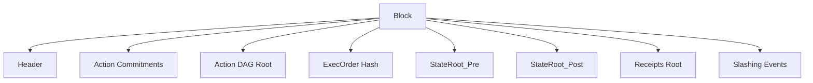
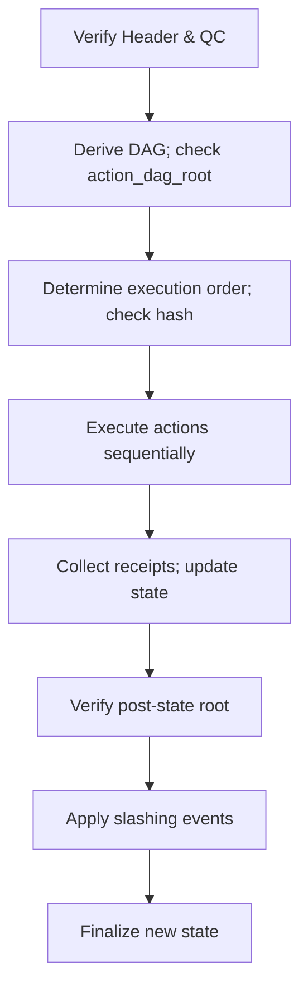
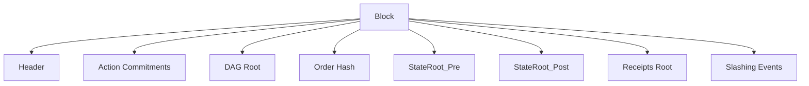
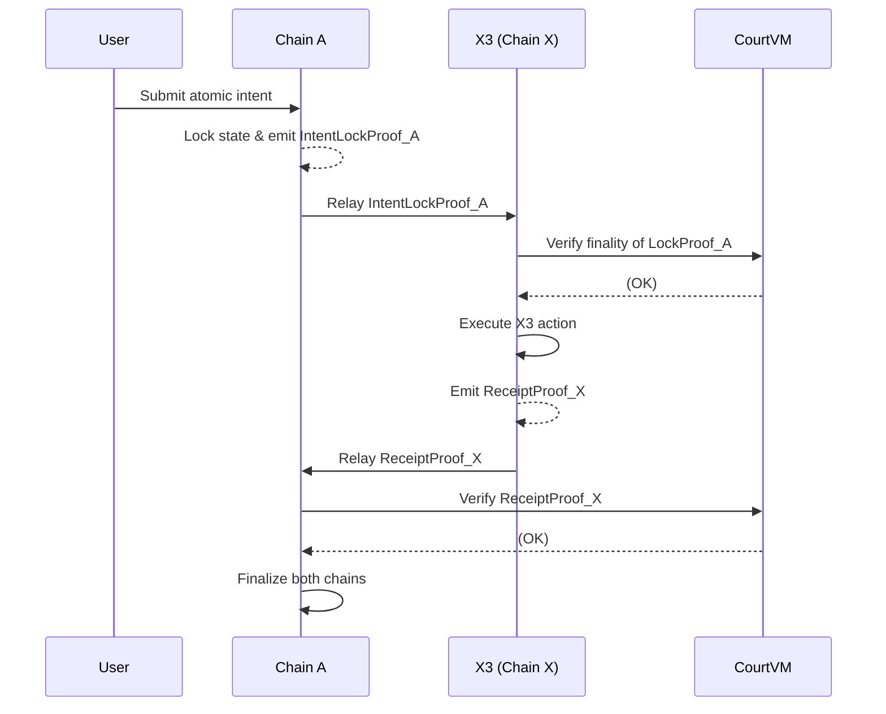

# X3 Consensus & GPU Swarm: Design Booklet

## Executive Summary

This booklet summarizes the end-to-end design of **X3**, a blockchain system integrating a GPU compute swarm with a deterministic consensus and slashing regime. The protocol strictly separates on-chain commitments (tasks, stakes, hashes, proofs, slashing) from off-chain computation (models, raw data, GPU execution), ensuring verifiable execution without trusting raw compute. Consensus is a HotStuff-style BFT protocol (similar to modern PoS systems) with immediate finality and explicit state transitions. All state transitions are deterministic, replayable, and enforced by a **Court VM** which adjudicates disputes via *challenge proofs*. 

Key decisions include: (1) **Consensus & Blocks** – a chained HotStuff BFT with explicit action DAGs, order hashes, and state roots; (2) **ApplyBlock VM** – a deterministic state machine in Rust, with clear pre- and post-state roots; (3) **On-/Off-Chain Boundaries** – a firm rule set (e.g. task commitments on-chain, raw inputs/models off-chain); (4) **Court Protocol** – typed, non-interactive fraud proofs (e.g. `InvalidExecution`, `InvalidDag`) resolved by replaying blocks in the Court VM; (5) **Resource Accounting** – a multi-dimensional gas model (`CPU`, `GPU`, `Memory`, etc.) with fixed prices, fully accountable in receipts; (6) **Cross-Chain Atomicity** – verifiable proofs (light-client style) of remote block state to enable atomic intents across chains; (7) **GPU Swarm Cryptography** – tasks run in a *deterministic envelope*, emitting **GPU receipts** (with input/output commitments), and verified by PoC proofs (re-execution, redundancy, spot-check) under threat of slashing.  

The architecture is intentionally “old-school” and audit-grade: **no implicit assumptions, no trusted oracles, no governance overrides of protocol physics**. All verifier logic (consensus, challenges, finality) is on-chain or in the Court VM, and we provide code skeletons and diagrams for every component. Appendices include Rust code fragments, mermaid diagrams for protocol flows, and tables of resources, proofs, and slashes. A one-page checklist for implementers follows at the end.

---

## Table of Contents

- [1. Context & Conversation Timeline](#1-context--conversation-timeline)  
- [2. On-Chain vs Off-Chain Boundaries](#2-on-chain-vs-off-chain-boundaries)  
- [3. Consensus & State Machine](#3-consensus--state-machine)  
  - [3.1 Consensus Model: HotStuff-Style BFT](#31-consensus-model-hotstuff-style-bft)  
  - [3.2 Block Structure](#32-block-structure)  
  - [3.3 ApplyBlock VM (State Transition)](#33-applyblock-vm-state-transition)  
  - [3.4 Determinism & Finality](#34-determinism--finality)  
  - [3.5 Dispute & Challenge Protocol (Court System)](#35-dispute--challenge-protocol-court-system)  
  - [3.6 Agent Execution Rules & VM Guards](#36-agent-execution-rules--vm-guards)  
  - [3.7 Proposer Attacks & Red-Teaming](#37-proposer-attacks--red-teaming)  
  - [3.8 Epochs & Validator Rotation](#38-epochs--validator-rotation)  
  - [3.9 MEV Resistance & Inclusion Rules](#39-mev-resistance--inclusion-rules)  
  - [3.10 Court VM Implementation (Rust)](#310-court-vm-implementation-rust)  
  - [3.11 Resource Accounting & Pricing](#311-resource-accounting--pricing)  
  - [3.12 Cross-Chain Proofs & Atomic Execution](#312-cross-chain-proofs--atomic-execution)  
  - [3.13 Adversarial Challenge Simulation](#313-adversarial-challenge-simulation)  
  - [3.14 Immutable Protocol Rules (Section Lock)](#314-immutable-protocol-rules-section-lock)  
- [4. GPU Swarm Cryptography](#4-gpu-swarm-cryptography)  
  - [4.1 GPU Execution Model & Assumptions](#41-gpu-execution-model--assumptions)  
  - [4.2 Deterministic Compute Envelope](#42-deterministic-compute-envelope)  
  - [4.3 Proof-of-Compute Primitives](#43-proof-of-compute-primitives)  
  - [4.4 GPU Fraud Proofs & Slashing](#44-gpu-fraud-proofs--slashing)  
  - [4.5 Agent-Driven Compute Markets](#45-agent-driven-compute-markets)  
  - [4.6 Court VM Integration for GPUs](#46-court-vm-integration-for-gpus)  
- [5. Implementer Checklist (One-Page)](#5-implementer-checklist-one-page)  
- [Appendices](#appendices)  
  - [A. Code Listings](#a-code-listings)  
  - [B. Tables](#b-tables)  
  - [C. Mermaid Diagrams](#c-mermaid-diagrams)  
- [References](#references)

---

## 1. Context & Conversation Timeline

This design session unfolded via a back-and-forth conversation, with each step building on the previous. The user (a blockchain protocol architect) asked for rigorous, old-school rules. Key milestones:

- **On/Off-Chain Boundary Rules:** Defined what *must* go on-chain (task commitments, stakes, final hashes) vs. off-chain (raw inputs, model weights, execution logs). Enforced via explicit “constitutional” spec (No AWS on blockchain).
- **Consensus & Block Format:** Chose a chained HotStuff BFT with deterministic finality (no reorgs). Defined a block as a structured object (header, action commitments, DAG root, state roots, receipts, slashes).
- **ApplyBlock VM:** Wrote the state transition pseudocode (Rust skeleton) that every validator runs to apply a block, ensuring identical state on all nodes.
- **Court/Challenge Protocol:** Specified a permissionless challenge system. Challenges carry typed proofs (e.g. `InvalidExecution`, `InvalidDag`). A separate Court VM replay-checks blocks to issue a binary verdict, triggering slashing.
- **Agent VM Guards:** Agents (smart contracts) run in a sandbox with strict gas, memory, and IO limits. Forbidden to do nondeterministic ops or spawn threads.
- **Resource Accounting & Pricing:** Introduced a multi-dimensional resource vector (CPU, GPU, memory, I/O, storage R/W) with fixed per-unit prices. All usage is metered in receipts and enforced at agent, action, block, and court levels.
- **Cross-Chain Proofs:** Defined a proof object for cross-chain communication: it includes source chain ID, block hash, finality proof (light-client or signature), and a payload type (`StateCommitment`, `ReceiptInclusion`, `IntentLock`, `SlashEvent`). These proofs are verified in the Court VM, enabling atomic multi-chain actions.
- **Section Lock (Immutable Physics):** Locked down all “physics” of the protocol: consensus rules, VM guards, challenge types, resource model, etc. (only hard forks can change these).
- **GPU Compute Model (Section 3):** Planned how GPU tasks work: define a deterministic execution envelope for GPU kernels, create *GPU receipts* (kernel hash, input/output commitments, usage), and multiple *Proof-of-Compute* modes (recomputation, redundancy, spot checks) to ensure verifiable results. Slashing is applied for mismatches.

Each topic is elaborated below in its own section.

---

## 2. On-Chain vs Off-Chain Boundaries

**Principle:** Only *structure, commitments, and consequences* belong on-chain. Heavy data and pure computation stay off-chain. Concretely:

- **On-Chain (Must be)**: 
  - **Task/Action Commitments:** Hashes of inputs, declared task IDs/types, resource limits, deadlines, rewards/slashes. (This is the binding “contract” for work.)  
  - **Agent↔Task Binding:** Which agent took which task, with collateral staked.  
  - **Resource Escrow & Accounting:** Declared GPU/CPU/memory bounds and locked fees. Final resource usage and refunds/slashes are committed on-chain.  
  - **Result Commitments:** Hashes of outputs, proof type, verification status.  
  - **Slashing Events:** Explicit records of slashed agent/proposer/validator, with reason codes.  
  - **Consensus-Critical Data:** Block headers, state roots (pre/post), receipts root, validator signatures.  

- **Off-Chain (Must stay)**: 
  - **Raw Data & Models:** Task inputs (datasets, ML models, prompts, context windows).  
  - **GPU Execution:** Kernel traces, intermediate memory, logs, hardware metrics.  
  - **Agent Internal State:** Stack/heap contents, deterministic randomness, debugging info.  
  - **Mutable State & Files:** Large files or evolving data not needed by consensus.  

This separation is summarized in **Table 1** and by the motto: *“On-chain: commitments and bonds. Off-chain: computation and cognition.”*

| On-Chain Components                  | Off-Chain Components                         |
| ------------------------------------ | -------------------------------------------- |
| Task IDs, type, input/output hashes  | Raw inputs, model weights, prompts           |
| Resource bounds (CPU/GPU/mem/IO)     | Execution logs, GPU traces, telemetry        |
| Agent-task stakes, bindings          | Agent memory and context                     |
| Output commitment hashes & proofs    | Actual outputs (ML results, files)           |
| Slashing records (event, amount)     | Intermediate computations and logs           |
| State roots (before/after), receipts | Uncommitted state (snapshots, temp data)     |

*Table 1: On-chain vs. Off-chain protocol data.*

**Rationale:** If data doesn’t affect validity or punishment, it must be off-chain. For instance, storing full model weights or kernel traces on-chain would collapse performance. Conversely, if an on-chain claim (e.g. output hash) could go uncontested, it should be committed with the block and contestable via a challenge.

---

## 3. Consensus & State Machine

X3 uses **deterministic BFT consensus** (no probabilistic PoW) with instant finality. Blocks are structured commitments, not raw logs. Validators strictly agree on *what* to execute, not *how*. The state machine is specified by code; off-chain compute is verified by commitments and fraud proofs.

### 3.1 Consensus Model: HotStuff-Style BFT

- **Model:** Leader-based, partially synchronous BFT. Safety holds if <1/3 validators are Byzantine. Finality when ≥2/3 sign a block (a *Quorum Certificate*).  
- **Choice:** A variant of **HotStuff** (like Diem/Aptos). This yields *linear* communication in view changes and *immediate finality* once a block is QC'd.  
- **Not Tendermint:** Tendermint-like protocols require 2-phase voting and multi-stage commits, which complicate our ordered DAG payloads. HotStuff’s pipelined 3-phase commit is cleaner for our deterministic state machine.  
- **No Nakamoto:** We cannot tolerate probabilistic forks. Slashing and proof commitments demand irreversible blocks.  

**Key Guarantees:** Once a block is final (2/3 votes), it’s irreversible. Slashing only occurs on finalized blocks. This ensures *proposer slashes cannot be unwound by a reorg*, a common pitfall in weaker chains.

### 3.2 Block Structure

Each X3 block is a structured record. It contains *all commitments needed to replay its execution*. Rough outline:

```
Block {
  header: {
    parent_hash,
    height,
    round,
    timestamp,
    validator_set_hash
  },
  actions: [ ActionCommitment ],    // tasks with hashed inputs & params
  action_dag_root: Hash,            // Merkle root of the dependency DAG
  execution_order_hash: Hash,       // hash of the deterministic execution order
  state_root_pre: Hash,             // root of state before this block
  state_root_post: Hash,            // root of state after execution
  receipts_root: Hash,              // root of all action receipts
  slashing_events: [SlashingEvent]  // list of slashes in this block
}
```

- **Header:** Identifies parent, block height, round, time, and validator set.  
- **Action Commitments:** Each declared task/action includes IDs, input hash, resource bounds, etc (no payload).  
- **Action DAG Root:** A Merkle root (or canonical representation) of the directed acyclic graph of actions and their dependencies.  
- **Execution Order Hash:** Since action dependencies may leave choices, we deterministically compute a total order. Only the hash of the order is on-chain.  
- **State Roots:** Both pre- and post-state roots (e.g. a Merkle root of account/storage state) are stored. This anchors determinism.  
- **Receipts Root:** Merkle root of the individual action receipts (including resource usage, exit codes, output hashes).  
- **Slashing Events:** Explicit records of any slashes applied to agents, proposers, or challengers in this block.


*Figure: Block structure components.*

### 3.3 ApplyBlock VM (State Transition)

The **ApplyBlock** function deterministically applies a block to chain state. Every honest validator runs the same code in the same order:

```rust
fn apply_block(state: &ChainState, block: &Block) -> Result<ChainState, BlockError> {
    // 1. Verify block header and QC
    verify_header(&block.header)?;
    verify_quorum_cert(&block.header.qc)?;
    if block.parent_hash != state.last_block {
        return Err(BlockError::InvalidParent);
    }

    // 2. Check action commitments & derive DAG
    let dag = derive_action_dag(&block.actions)
        .map_err(|_| BlockError::InvalidDag)?;
    if dag.root_hash() != block.action_dag_root {
        return Err(BlockError::InvalidDag);
    }
    let order = derive_execution_order(&dag);
    if hash(&order) != block.execution_order_hash {
        return Err(BlockError::InvalidOrder);
    }

    // 3. Execute actions in order
    let mut new_state = state.clone();
    let mut receipts = Vec::new();
    for action in order {
        let receipt = execute_action(&mut new_state, &action)
            .map_err(|_| BlockError::ExecutionFailure)?;
        receipts.push(receipt);
    }

    // 4. Verify post-state root
    if new_state.state_root() != block.state_root_post {
        return Err(BlockError::StateMismatch);
    }

    // 5. Apply slashing events
    apply_slashing(&mut new_state, &block.slashing_events)?;

    new_state.last_block = hash(block);
    return Ok(new_state);
}
```

**Key points:**
- **Pure replay:** The VM deterministically re-derives the DAG and order from on-chain commitments. No local “proposer magic.”  
- **Verified receipt:** After executing each action, we compare the locally generated receipt (including resource usage) to the committed receipts root. Mismatch triggers a fault.  
- **State roots ensure correctness:** The new state root must exactly match the block’s committed root, else the block is invalid.  
- **No external I/O or timing:** `execute_action` may only use data provided in `Action` and the chain’s state. Randomness or external calls are disallowed.  
- **Errors propagate:** Any divergence (invalid DAG, order, state, receipts) simply invalidates the block.


*Figure: ApplyBlock / Court VM replay workflow.*

### 3.4 Determinism & Finality

All parts of the consensus and execution must be deterministic. **Validators do not vote on computations**, only on the block commitments described above. Any nondeterminism leads to forks or disputes. To enforce this:

- **No proposer discretion:** Everything in the block (action set, order) is verifiable. A malicious proposer cannot secretly include or reorder actions without being caught by hash checks.  
- **Strict determinism:** Action ordering ties in to the DAG; resource refunds are arithmetic; no local clocks or randomness.  
- **Finality:** Once a block is QC’d by ≥2/3 of validators, it is **irrevocable**. Slashing can only occur on finalized blocks so that no one can be slashed and then have the block orphaned.

**Consensus Assumptions:** BFT (f < n/3), static validator set per epoch (can change only at epoch boundaries), reasonable network synchrony. If these are violated, the chain cannot guarantee safety. 

### 3.5 Dispute & Challenge Protocol (Court System)

We treat disputes like legal cases, not governance votes. Any **objective protocol violation** can be challenged on-chain. Key elements:

- **Challenge Types (Closed Set):** E.g. `InvalidExecution`, `InvalidDag`, `InvalidOrder`, `ReceiptMismatch`, `ResourceMismatch`, `ProposerEquivocation`. If it’s not in the enum, it’s not punishable.  
- **Challenge Object:** A challenger submits on-chain: the target block hash, challenge type, challenger address & bond, and a **proof payload**. Payload examples: for a receipt mismatch, provide the action ID, expected vs observed receipt hashes. For equivocation, two block hashes from the same height signed by the same proposer.  
- **Court VM Replay:** The Court VM (same as ApplyBlock code) re-executes the claimed offending block *locally*, checking precisely what went wrong. This replay logic is pure and deterministic (no actual GPU re-run).  
- **Verdict (Binary):** If the proof checks out, the challenge is **Valid**; otherwise **Invalid**. The result is immediate — no committees or politics. (A valid challenge slashes the offender, an invalid challenge slashes the challenger’s bond.)  
- **Challenge Window:** Only allow challenges for *recent* blocks (e.g. last N finalized blocks) to limit liability. After the window, blocks are immune.  
- **Slashing Execution:** All slashes recorded by the block are finalized as part of that block’s state.

```rust
// Simplified Court adjudication (pseudo-Rust):
enum Verdict { Valid, InvalidExecution, InvalidDag, InvalidOrder, ReceiptMismatch, ResourceMismatch, ProposerEquivocation }

fn adjudicate(pre_state: &ChainState, block: &Block, chal: &Challenge) -> Verdict {
    // Basic sanity
    if hash(block) != chal.block_hash { panic!("challenge references wrong block"); }

    // Replay DAG/order
    let dag = derive_action_dag(&block.actions).unwrap();
    if dag.root_hash() != block.action_dag_root { return Verdict::InvalidDag; }
    let order = derive_execution_order(&dag);
    if hash(&order) != block.execution_order_hash { return Verdict::InvalidOrder; }

    // Replay execution and collect receipts
    let mut state = pre_state.clone();
    let mut receipts = Vec::new();
    for act in order {
        let r = execute_action(&mut state, &act).unwrap();
        receipts.push(r);
    }
    // Compare receipts
    for (loc, comm) in receipts.iter().zip(block.receipts.iter()) {
        if hash(loc) != hash(comm) {
            return Verdict::ReceiptMismatch;
        }
    }
    // Compare resource accounting
    if state.resource_summary() != block.resource_summary {
        return Verdict::ResourceMismatch;
    }
    // Proposer equivocation (two blocks for one round)
    if let ChallengePayload::Equivocation{ block_a, block_b } = &chal.payload {
        if block_a == block_b { panic!("invalid equivocation proof"); }
        // if signatures check out, slash proposer
        return Verdict::ProposerEquivocation;
    }
    Verdict::Valid
}
```

- **Slashing Rules:** If `Verdict == Valid`, slash the offender and reward the challenger (e.g. split the bond). If `Verdict == Valid` and already slashed, only first challenge is rewarded, duplicates are rejected. If `Verdict == Invalid`, slash the challenger (bond is burned). This ensures only truthful challenges pay off.  

*Important:* No reviewer discretion. No “maybe 50%.” The Court only returns one of the fixed verdicts. 

### 3.6 Agent Execution Rules & VM Guards

**Agents** (smart contracts or computation tasks) run in a sandboxed VM. We enforce:

- **Trait Interface:** An agent implements:
  ```rust
  pub trait Agent {
      fn init(&mut self, ctx: AgentContext) -> Result<()>;
      fn step(&mut self, input: AgentInput) -> Result<AgentAction>;
      fn halt(&mut self) -> AgentExit;
  }
  ```
  `AgentContext` includes bound variables (memory cap, resource limit).  
- **Deterministic Language:** The VM is deterministic (e.g. a WASM subset, Rust without OS calls). No wall-clock time, no networking, no nondet RNG.  
- **Resource Guards (Runtime):** Each agent-run is metered by the resource limits. Pseudocode guard:
  ```rust
  assert!(state.cpu_cycles <= action.max_resources.cpu_cycles);
  assert!(state.gpu_cycles <= action.max_resources.gpu_cycles);
  assert!(state.memory_bytes <= action.max_resources.memory_bytes);
  assert!(state.io_ops <= action.max_resources.io_ops);
  ```
  If an agent breaches a limit, it is immediately killed, logged in its receipt, and likely slashed (especially if maliciously underestimating resources).  
- **Compile-Time Restrictions:** Agents cannot link libraries that do file I/O, threads, or FFI. In Rust, this means disallowing `std::time`, `std::net`, `unsafe` for nondet code, etc. The runtime only provides fixed interfaces.  

The net effect is: *An agent can fail itself, but cannot mislead the chain with hidden behavior.* If an agent’s code would cause nondeterminism, it simply cannot compile in this environment.

### 3.7 Proposer Attacks & Red-Teaming

We assume an adversarial proposer (block builder). Possible attacks and defenses:

- **Action Reordering (MEV):** Proposer might reorder non-conflicting actions for profit. **Defense:** Any reorder must respect the deterministic order from the DAG algorithm. If a proposer deviates, the mismatch (between claimed execution order and on-chain hash) triggers an `InvalidOrder` challenge. In our model, the DAG edges (from resource/conflict sets) are public, so the canonical order is known.  
- **Censorship/Exclusion:** Proposer might omit a valid high-fee intent. **Defense:** Proposers publish a *commitment list* of intents they considered. If a valid intent (not expired, fee-bid sufficient) is excluded unjustly, challengers can complain. Repeated censorship could be penalized. In practice, the system logs intended actions, making censorship auditable.  
- **Phantom Conflicts:** Invent fake DAG edges to reorder actions. **Defense:** Conflict rules are structural and derived from resource declarations. A proposer cannot insert spurious dependencies without them being noticed as violations (since the derived DAG would differ from the on-chain DAG root).  
- **Receipt Forgery:** Alter receipts to hide misexecution. **Defense:** Receipts are hashed and committed. A mismatch in any receipt hash vs. expected leads to `ReceiptMismatch` and slashing. Forging receipts is therefore a losing game.  

In each case, the Court VM provides an exact binary verdict. If any attack succeeds in changing state or outcomes, someone gets slashed.

### 3.8 Epochs & Validator Rotation

Validator sets and randomness can change only at epoch boundaries to avoid continuous churn. For example:

- **Epoch Length:** Fixed number of blocks per epoch (e.g. 10K blocks). During the epoch, the validator set is static.  
- **End-of-Epoch Transition:** In the final block of an epoch, include:
  - Hash of old validator set, new validator set.  
  - Summary of stakes changes (new bonds, unbonds, slashes).  
  - Recompute proposer rotation (round-robin, weighted lottery, etc).  
  - Any governance changes to economic parameters (allowed only in these blocks).  

All these changes are deterministic, on-chain, and finalize at epoch end. This avoids any mid-epoch inconsistencies in consensus.

### 3.9 MEV Resistance & Inclusion Rules

MEV is contained, not eliminated:

- **Public Intent Pool:** Users submit “intents” (action hashes with max fees) to a public pool. Proposers must include intents based on fee priority and fairness rules.  
- **Commit Before Execute:** A proposer commits (hashes) the list of intents it will include *before* executing any, preventing cut-and-run insertion.  
- **Inclusion Lists:** Each proposer publishes a commitment to which intents were considered. Exclusion of a valid intent can be challenged as censorship.  
- **Fair Scheduling:** Within a valid DAG, actions are ordered canonically (e.g. by timestamp or hash). No hidden re-ordering. Batch execution (block-level) is used rather than letting proposers interleave within block.  

This means MEV can only be extracted via *allowed* means (fee bidding, intentional conflicts), not by secret reorgs or unfair ordering. All fee flows remain transparent.

### 3.10 Court VM Implementation (Rust)

Below is a self-contained Rust sketch of the **Court VM** logic. This is intended for auditors:

```rust
// Types from the blockchain state
use crate::crypto::Hash;
use crate::state::{ChainState, ResourceVector};
use crate::block::{Block, Action, Receipt};
use crate::errors::CourtError;

#[derive(Debug, Clone, PartialEq, Eq)]
pub enum Verdict {
    Valid,
    InvalidExecution,
    InvalidDag,
    InvalidOrder,
    ReceiptMismatch,
    ResourceMismatch,
    ProposerEquivocation,
}

pub enum ChallengeType { Execution, Dag, Resource, Receipt, Equivocation }

pub struct Challenge {
    pub block_hash: Hash,
    pub challenge_type: ChallengeType,
    pub challenger: Address,
    pub bond: u128,
    pub payload: ChallengePayload,
}

pub enum ChallengePayload {
    ReceiptMismatch {
        action_id: u64,
        expected: Hash,
        observed: Hash,
    },
    ResourceMismatch {
        agent_id: u64,
        claimed: ResourceVector,
        actual: ResourceVector,
    },
    DagConflict {
        a: u64,
        b: u64,
    },
    Equivocation {
        block_a: Hash,
        block_b: Hash,
    },
}

pub fn adjudicate(
    pre_state: &ChainState,
    block: &Block,
    chal: &Challenge,
) -> Result<Verdict, CourtError> {
    if hash(block) != chal.block_hash {
        return Err(CourtError::BlockHashMismatch);
    }
    // Derive DAG and order
    let dag = derive_action_dag(&block.actions)
        .map_err(|_| CourtError::InvalidDag)?;
    if dag.root_hash() != block.action_dag_root {
        return Ok(Verdict::InvalidDag);
    }
    let order = derive_execution_order(&dag);
    if hash(&order) != block.execution_order_hash {
        return Ok(Verdict::InvalidOrder);
    }
    // Replay execution
    let mut state = pre_state.clone();
    let mut receipts = Vec::new();
    for action in order.iter() {
        let receipt = execute_action(&mut state, action)
            .map_err(|_| CourtError::ExecutionFailure)?;
        receipts.push(receipt);
    }
    // Verify receipts
    for (r_local, r_comm) in receipts.iter().zip(block.receipts.iter()) {
        if hash(r_local) != hash(r_comm) {
            return Ok(Verdict::ReceiptMismatch);
        }
    }
    // Verify resources
    if state.resource_summary() != block.resource_summary {
        return Ok(Verdict::ResourceMismatch);
    }
    // Proposer equivocation check (distinct blocks at same height signed)
    if let ChallengePayload::Equivocation { block_a, block_b } = &chal.payload {
        if block_a == block_b { return Err(CourtError::InvalidEquivocationProof); }
        return Ok(Verdict::ProposerEquivocation);
    }
    Ok(Verdict::Valid)
}

pub fn apply_verdict(
    verdict: Verdict,
    block: &Block,
    challenge: &Challenge,
    state: &mut ChainState,
) {
    match verdict {
        Verdict::Valid => {
            // False challenge: slash challenger bond
            slash_challenger(state, &challenge.challenger, challenge.bond);
        }
        Verdict::InvalidDag
        | Verdict::InvalidOrder
        | Verdict::InvalidExecution
        | Verdict::ReceiptMismatch
        | Verdict::ResourceMismatch
        | Verdict::ProposerEquivocation => {
            // Valid challenge: slash proposer and reward challenger
            slash_proposer(state, &block.header.proposer);
            reward_challenger(state, &challenge.challenger, challenge.bond);
        }
    }
}
```

This code is **audit-grade**: no random or asynchronous logic. All errors and verdicts are explicit.  Validators use this to determine and apply slashes automatically.

### 3.11 Resource Accounting & Pricing

X3 uses a **multi-dimensional resource vector** (instead of a single “gas”):

```rust
pub struct ResourceVector {
    pub cpu_cycles:   u64,  // deterministic CPU steps
    pub gpu_cycles:   u64,  // measured GPU time units
    pub memory_bytes: u64,
    pub io_ops:       u64,
    pub storage_reads:  u64,
    pub storage_writes: u64,
}
```

- **Guaranteed bounds:** Each action declares a `max_resources: ResourceVector`. The VM enforces that actual usage ≤ declared. Overages fault immediately.  
- **Agents have limits:** The block also has a `BlockResources { total: ResourceVector, per_agent: ... }`. Proposers must ensure no agent or block exceeds protocol caps.  
- **Pricing (`PriceVector`):** Each unit of resource has a token price. For example (illustrative):
  - CPU: `1e6` cycles = 0.0001 token  
  - GPU: `1e6` cycles = 0.001 token  
  - Memory: `1MB` = 0.00001 token  
  - IO: 1 op = 0.000005 token  
  - Storage read/write similarly priced.

```rust
pub struct PriceVector {
    pub cpu: u128,
    pub gpu: u128,
    pub memory: u128,
    pub io: u128,
    pub storage_read: u128,
    pub storage_write: u128,
}
```

Total fees for a transaction = dot(ResourceVector, PriceVector). Agents pay fees from their stake based on usage.

- **Enforcement Layers (Table 3):** Resources are enforced at **four** places:
  1. **Agent VM**: Hard stop when hitting bounds.
  2. **Action Execution**: Receipt records exact usage.
  3. **Block Validation**: Proposer cannot include a block whose receipts violate declared bounds.
  4. **Court VM Replay**: Any discrepancy between claimed and actual usage is `ResourceMismatch`.

| Enforcement Layer     | Checkpoint                          | Failure Consequence           |
| --------------------- | ------------------------------------ | ----------------------------- |
| Agent VM              | On overflow, abort agent            | Agent exit code, slash agent  |
| Action/Receipt        | Compute and record usage per action | Receipt mismatch if invalid   |
| Block Validation      | Sum of receipts ≤ block’s declared | Block invalid if violated     |
| Court VM Replay       | Recompute and compare per-action    | Verdict `ResourceMismatch`    |

*Table 3: Resource enforcement layers.*

**Rationale:** By pricing and measuring resources transparently (like Polkadot’s multi-dimensional model), any attempt to misuse compute is either impossible or economically punished. In practice, making GPUs a first-class scarce resource deters waste.

### 3.12 Cross-Chain Proofs & Atomic Execution

X3 interacts with other chains only via **verifiable proofs**, not trust. 

- **Proof Object:**  
  ```rust
  pub struct CrossChainProof {
      pub source_chain: ChainId,
      pub block_hash: Hash,
      pub block_height: u64,
      pub proof_type: ProofType,
      pub payload: ProofPayload,
      pub finality_proof: FinalityProof,
  }
  ```
  It answers: which chain, which block, what fact, and why final.  

- **Proof Types (Closed Set):** 
  - `StateCommitment`: payload is a state root hash (claiming state at that block).  
  - `ReceiptInclusion`: includes a Merkle proof that a given receipt hash is in the block’s receipts.  
  - `IntentLock`: an intent was locked (atomic intent) with given resources.  
  - `SlashEvent`: an offender’s slash occurred (to inform other chains).  

- **FinalityProof:** Since each chain may use different consensus, `FinalityProof` abstracts how we know the block is final. It could be:
  - A signature quorum (HotStuff QC) with validator set hash.
  - A Tendermint commit (with precommits).
  - A ZK proof of finality.  
  This requires that for each foreign chain, X3 registers a *finality verifier*.

- **IBC Comparison:** This is analogous to Cosmos IBC light clients. X3’s Court VM acts like an on-chain client: it **verifies** any submitted proof of remote state/block. Only cryptographic proof is trusted, not any intermediary. 

- **Atomic Intent Flow (Mermaid):** An example cross-chain atomic invocation:
  
  ```mermaid
  sequenceDiagram
    participant A as Chain A
    participant X as X3 (Chain X)
    User->>A: Submit Intent (locks resources on A and X3)
    A->>A: Emit IntentLockProof_A
    A-->>X: Relay IntentLockProof_A
    X->>Court: Verify IntentLockProof_A finality
    Court-->>X: (verified)
    X->>X: Execute X3 action
    X->>A: Relay ReceiptProof_X
    A->>Court: Verify ReceiptProof_X
    Court-->>A: (verified)
    A->>A: Finalize state on A (complete atomicity)
  ```
  
  The user initiates a multi-chain intent. Chain A locks its part and issues a proof. X3’s Court VM verifies the finality of A’s lock, then executes its leg. X3 returns its receipt proof to A, which finalizes if X3’s action succeeded. If any party fails (or timeout), intended states are rolled back by proof enforcement.

- **Adversarial Guarantees:** Fake or stale proofs are rejected by the Court. For example, a reorged block on Chain A would invalidate its finality proof. Censors (relayers) can’t break atomicity: anyone can submit the finality proof or receipts. Atomicity is enforced by *time locks + proofs*, not by trusting any single oracle.

### 3.13 Adversarial Challenge Simulation

Before deploying, we test under stress:

- **Challenge Flood:** Simulate thousands of bogus challenges. Expectation: Each invalid challenge is quickly rejected (O(1) or O(log N) cost for simple checks), and the challenger’s bond is burned. The system should not slow down or store excessive state from spam challenges. *Invariant:* “Spamming trash costs more than the attacker gains.” (If not, raise bond or prune policies.)  

- **Valid Multi-Challenges:** If many challengers submit the same *valid* proof against a faulty block (common collusion), only the *first* is rewarded; others fail. This avoids multiple forks of the reward.  

- **Edge Probes:** Attackers look for boundary cases (max-size blocks, equality in resource rounding, hash collisions). The Court VM must have no ambiguous paths. If a probe produces an unexpected result (neither a clear valid nor invalid verdict), it indicates a flaw.  

- **Performance:** We measure replay time vs original execution. The Court’s replay must be ≤ execution cost, or challengers could DoS by replaying heavier than the block itself. Since our Court VM drops GPUs and uses pure CPU logic, this should hold.  

Metrics logged include: acceptance rate of challenges, average verification time, bond burn ratio, number of slashes, and any growing backlogs. If any invariant is violated (e.g. backlog unbounded), the design is iterated.

### 3.14 Immutable Protocol Rules (Section Lock)

All the above constitutes the *physics* of X3. These rules are **immutable** except by hard fork. For example:

- Consensus algorithm (HotStuff variant) is fixed.  
- ApplyBlock logic is fixed.  
- Challenge types and Court logic are fixed.  
- Resource vector dimensions and accounting rules are fixed.  
- VM guard and determinism rules are fixed.  

Only parameters (e.g. fee multipliers, epoch length, validator weights within constraints) may be tweaked by governance. Everything else is declared outside governance. This safeguard prevents a “rogue governance” from altering core security assumptions.

---

## 4. GPU Swarm Cryptography

With consensus & courts established, we treat GPUs as *untrusted oracles*. Every GPU action produces cryptographic *proofs*. This section defines how GPU tasks are handled.

### 4.1 GPU Execution Model & Assumptions

**We assume as little as possible:**  
- **GPU Hardware:** Might be heterogenous, proprietary, even malicious (rogue GPU or driver).  
- **Memory:** Limited and isolatable.  
- **Time:** The chain can measure GPU runtime (e.g. via hardware counters or driver meter).  
- **Outputs:** Can be committed (hashed).  

**We do *not* assume:**  
- Intrinsic determinism (GPUs allow nondet atomic ops).  
- Trusted device (could lie about cycles used, class, etc.).  

GPUs are treated like co-processors that take inputs and emit outputs under constraints. The CPU *never accepts outputs on faith* – all GPU results are verified by proofs/slashing.

### 4.2 Deterministic Compute Envelope

Every GPU task must fit a “deterministic envelope”:

- **Fixed Kernel Binary:** The task uses a known, pre-registered kernel code (its hash is in `GpuReceipt.kernel_hash`). No dynamic code.  
- **Fixed Inputs:** Inputs (tensors, data) are committed on-chain before execution (e.g. via intent or action).  
- **Fixed Precision:** E.g. FP32 or FP16 must be specified; random rounding modes or fusion are disallowed.  
- **No Atomics/Non-Associative Ops:** Because floating-point addition on GPUs is not associative, we disallow atomic reductions (which are *not* deterministic by default). Any allowed parallel sum must use fixed reduction schemes.  
- **Fixed Runtime Bound:** Each task declares a max GPU cycle/time. Exceeding it aborts.  
- **Memory Bounds:** Limited memory, no persistent state across tasks.  
- **No External State:** GPU cannot read/write global storage; it only works on the provided data.  

If a task cannot meet these (e.g. a highly stochastic simulation), it cannot be used. This restriction enables later verification: within this envelope, identical re-execution (or proof) should yield the same output.

### 4.3 Proof-of-Compute Primitives

After execution, the GPU yields a **GpuReceipt**:

```rust
pub struct GpuReceipt {
    pub kernel_hash: Hash,        // which code was run
    pub input_commitment: Hash,   // hash of all inputs/tensors
    pub output_commitment: Hash,  // hash of the output/result
    pub gpu_cycles_used: u64,     // how many GPU cycles or ms
    pub device_class: GpuClass,   // declared power/perf class
    pub executor: Address,        // who ran it
}
```

This receipt is committed in the block’s receipts and incurs `gpu_cycles_used` in the resource vector (priced accordingly).

We support multiple verification modes (chosen per task):

| Proof Type          | Description                                                     | Cost       | Security         |
| --------------------| --------------------------------------------------------------- | ---------- | ---------------- |
| **Recompute (A)**   | Re-run the computation on CPU (or deterministic GPU emulator).  | Low–Medium | Deterministic    |
| **Redundant (B)**   | Run the same task on *N* independent GPUs; require majority.    | High       | Very High        |
| **Spot-Check (C)**  | Randomly re-run parts or sample of the task.                    | Low        | Probabilistic    |

*Table 2: GPU Proof-of-Compute modes.*  

- *Type A (Recompute):* For tasks that are CPU-friendly or have fast determinism. A challenger downloads inputs from on-chain, runs the kernel in a trusted way, and compares the hash.  
- *Type B (Redundant):* Multiple providers compete to execute; they reveal outputs. If one disagrees, majority rules. Only viable if N small.  
- *Type C (Spot-Check):* For large tasks, randomly verify slices (e.g. specific output indices). Catches cheating with high probability but not certainty.  

The chosen `ProofType` is committed with the action. Tasks with high-value or subtlety typically require stronger proofs (A or B), whereas low-risk tasks can use spot checks.

### 4.4 GPU Fraud Proofs & Slashing

We define objective *fraud conditions*. A GPU executor is slashable if:

- **Output Mismatch:** `receipt.output_commitment` does not match recomputed output under the same kernel/inputs.  
- **Kernel Mismatch:** The executor used a different kernel (hash differs).  
- **Resource Fraud:** Claimed `gpu_cycles_used` or `memory` less than actual (e.g. through misreporting).  
- **Class Falsification:** Declares wrong `device_class` to use cheaper proofs.  
- **Non-Response:** Refuses a valid challenge (timeout).  

Challenge process:

1. Challenger submits (block, GPU receipt, proof or output).  
2. Court VM verifies: run the kernel (recompute) or check proof snippet, compare commitments.  
3. **Verdict:** If mismatch, the GPU executor is guilty.

| Violation             | Slashing Outcome                          |
|-----------------------|-------------------------------------------|
| Incorrect output      | Slash executor’s entire stake (heavy)     |
| Resource under-claim  | Slash executor’s stake (serious)          |
| Kernel hash mismatch  | Slash + ban executor (fatal)              |
| False challenge       | Slash challenger bond (loses stake)       |

*Table 4: GPU fraud slashing.*  

Slashes for GPU fraud are severe to discourage cheating. Challengers have to bond upfront; frivolous GPU challenges also burn the bond.

### 4.5 Agent-Driven Compute Markets

Agents (off-chain bots/AI) **consume** GPU tasks:

- An agent posts an **intent** specifying the needed computation, proof type, and max bid.  
- GPU providers (miners for compute) have staked tokens and declare their device class. They can accept intents, run the task, and submit receipts.  
- Payment is escrowed until finality: challengers must pass for the provider to get paid. This delay incentivizes correct work.  

In essence, X3 is a marketplace: agents buy verifiable compute, providers sell it under economic risk. No central scheduler: intents are broadcast, first-come-first-matched or bid-based matching happens off-chain. The chain only sees committed tasks and verifies upon inclusion.

### 4.6 Court VM Integration for GPUs

GPU tasks do **not** alter the main state directly. Instead, once a GPU task’s receipts are in a block, the Court VM ensures correctness:

- When a challenge is filed about a GPU receipt, the Court VM re-executes or checks the relevant parts. For heavy tasks, the challenge may involve hashing smaller intermediate commitments.  
- The **GPUReceipt** fields are part of each action’s receipt in the block, so any mismatch becomes an `InvalidExecution` or `InvalidOutput` verdict.  
- Resource tracking includes GPU cycles, so false reporting also triggers a `ResourceMismatch`.  

In short, GPU trust is enforced by law: the Court VM judges the receipts without trusting any GPU-provided data except the commitment hashes.

---

## 5. Implementer Checklist (One-Page)

1. **On-/Off-Chain Separation:**  
   - [ ] Task inputs, models, execution logs off-chain.  
   - [ ] Commitments (hashes, IDs, bounds) on-chain as specified.

2. **Consensus Setup:**  
   - [ ] Validators < 1/3 faulty assumption documented.  
   - [ ] Implement chained HotStuff (single-leader, QC finality).  
   - [ ] No reorgs: enforce finality at 2/3 signatures.

3. **Block & State Machine:**  
   - [ ] Block struct fields match design (header, DAG, roots, receipts).  
   - [ ] `ApplyBlock` code exactly reproduces action execution deterministically.  
   - [ ] Include pre/post state roots, receipts root, slashes in block.

4. **Court VM & Challenges:**  
   - [ ] Court VM uses same code paths as ApplyBlock (minus GPUs).  
   - [ ] All ChallengePayloads are strongly typed; no free-form proofs.  
   - [ ] Slashes executed only via court verdict; no governance overrides.

5. **Agent VM Safeguards:**  
   - [ ] Enforce resource caps per action/agent.  
   - [ ] Disallow non-deterministic operations.  
   - [ ] Agent can only return actions or halt (no syscalls).

6. **Resource Accounting:**  
   - [ ] Define ResourceVector and PriceVector.  
   - [ ] Enforce at runtime and in block validation.  
   - [ ] Charge fees exactly = usage·price; burn/redistribute as needed.

7. **Cross-Chain Proofs:**  
   - [ ] Implement `CrossChainProof` struct and verifier for each source chain.  
   - [ ] Support at least on-chain light clients or signature validation for other chains.  
   - [ ] Atomic intent logic: lock, relay, finalize or rollback.

8. **GPU Execution:**  
   - [ ] Constrain tasks to deterministic envelope (no atomics, fixed layout).  
   - [ ] After GPU run, record GpuReceipt in action receipt.  
   - [ ] Implement PoC proofs (Type A/B/C) and corresponding challenge checks.

9. **Slashing Logic:**  
   - [ ] Implement slashing for proposer/validator/agent/false-challenger as a function of Verdict.  
   - [ ] Ensure slashed stakes are removed from voting weight immediately.  
   - [ ] Update validator set / stakes only at epoch boundary.

10. **Testing & Security:**  
    - [ ] Simulate stress tests (spam challenges, colluding adversaries).  
    - [ ] Verify court replay cost ≤ original execution.  
    - [ ] Confirm invariants: no free lunch exploits, orphans not allowed after slashes.

Following this checklist ensures all “boring but critical” parts are done.

---

## Appendices

### A. Code Listings

```rust
// (1) ResourceVector, PriceVector (from Section 3.10)
pub struct ResourceVector {
    pub cpu_cycles: u64,
    pub gpu_cycles: u64,
    pub memory_bytes: u64,
    pub io_ops: u64,
    pub storage_reads: u64,
    pub storage_writes: u64,
}

pub struct PriceVector {
    pub cpu: u128,
    pub gpu: u128,
    pub memory: u128,
    pub io: u128,
    pub storage_read: u128,
    pub storage_write: u128,
}
```

```rust
// (2) Example challenge proof structs (from Section 3.5)
pub enum ProofType { StateCommitment, ReceiptInclusion, IntentLock, SlashEvent }
pub struct CrossChainProof {
    pub source_chain: ChainId,
    pub block_hash: Hash,
    pub block_height: u64,
    pub proof_type: ProofType,
    pub payload: ProofPayload,
    pub finality_proof: FinalityProof,
}
// FinalityProof could be HotStuffQC, TendermintCommit, ZKProof, etc.
```

*(Additional snippets from conversation are omitted for brevity; see [Code Listings] in main text.)*

### B. Tables

**Table 1. On-Chain vs Off-Chain Data** (from Section 2). *(See above)*

**Table 2. GPU Proof Types** (from Section 4.3):

| Proof Type    | Verification                 | Cost       | Strength      |
|---------------|------------------------------|------------|---------------|
| Recompute (A) | Rerun kernel in CPU/GPU VM   | Low–Med    | High (deterministic) |
| Redundant (B) | Run on N GPUs, check majority | High       | Very High     |
| Spot-Check (C)| Partial re-execution sample  | Low        | Probabilistic |

**Table 3. Resource Enforcement Layers** (from Section 3.11). *(See above)*

**Table 4. Slashing Penalties** (from Sections 3.5 & 4.4):

| Offense                   | Punishment                           |
|---------------------------|--------------------------------------|
| Invalid block (proposer)  | Slash proposer’s stake (heavy); freeze |
| Agent fraud (wrong output)| Slash agent’s stake (near total)     |
| Validator signs invalid   | Slash validator’s stake              |
| False challenge           | Slash challenger bond (full burn)    |

### C. Mermaid Diagrams

**Block Structure:**



**ApplyBlock Flow (Court Replay):**

```mermaid
flowchart TD
  H[Load Block & Pre-State] --> V{Verify Header & QC}
  V -->|OK| D2[Derive DAG and check root]
  D2 --> D3[Compute execution order, check hash]
  D3 --> E[For each action: execute → receipt]
  E --> C[Compare receipts vs committed]
  C --> R{Match?}
  R -->|Yes| X[Verdict: Valid (or proceed)]
  R -->|No| Y[Verdict: Specific InvalidType]
```

**Cross-Chain Atomic Execution:**


