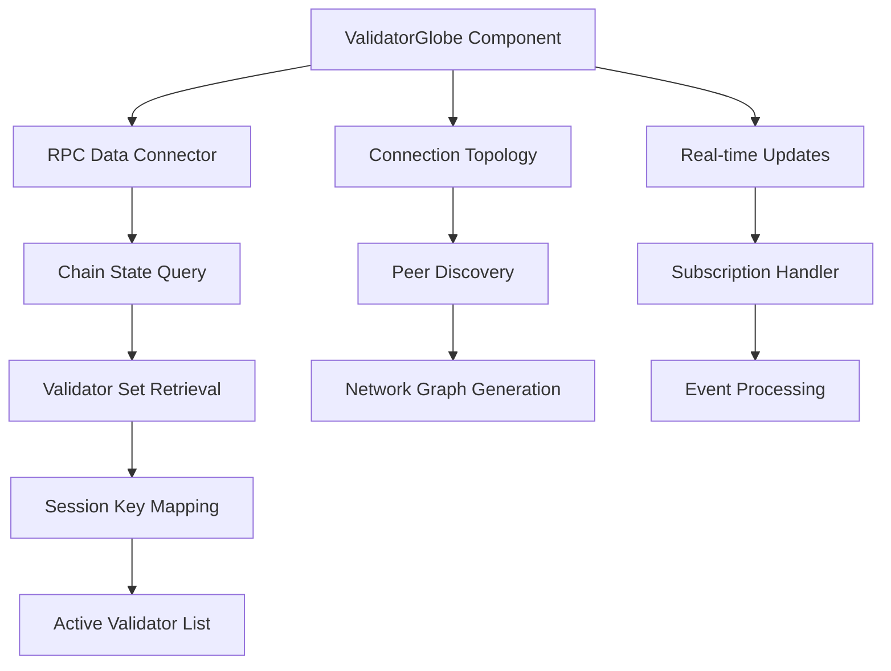
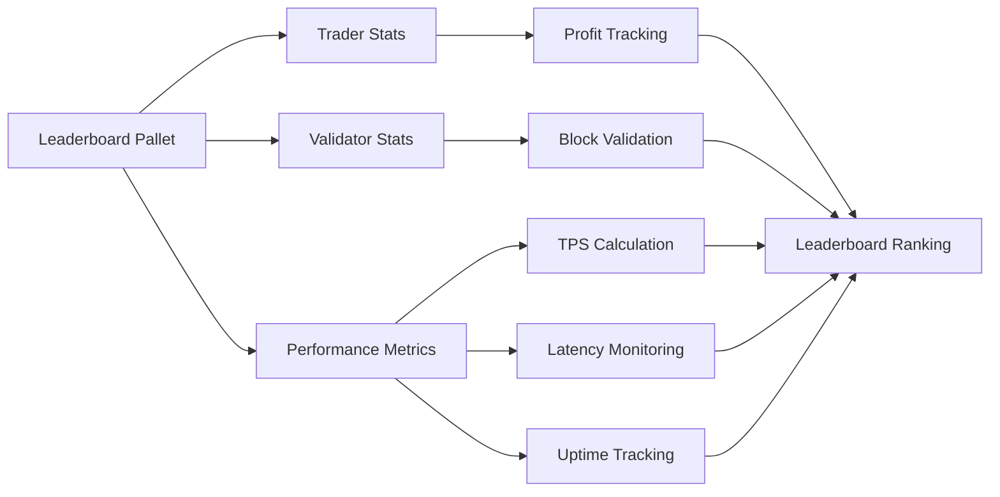
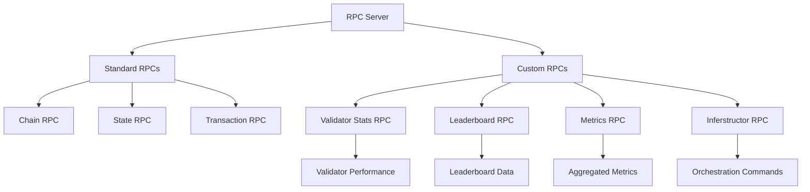
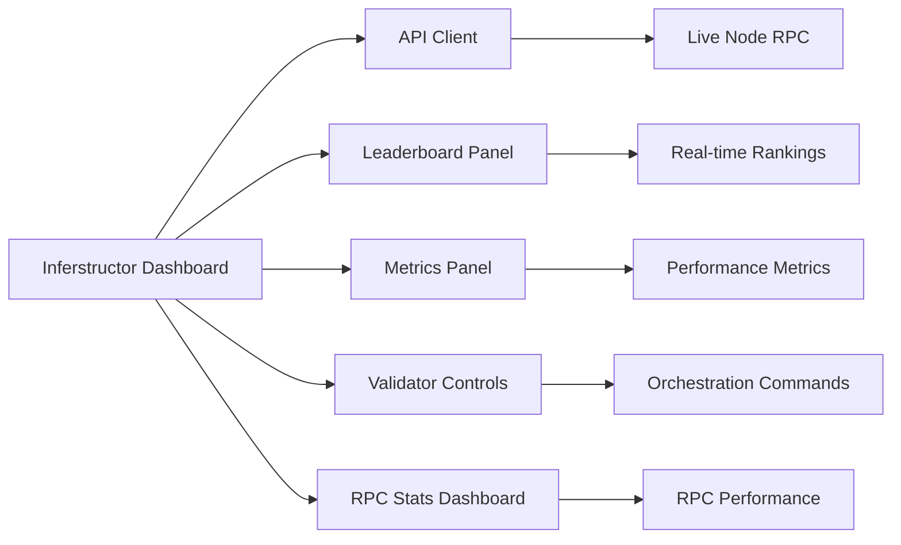
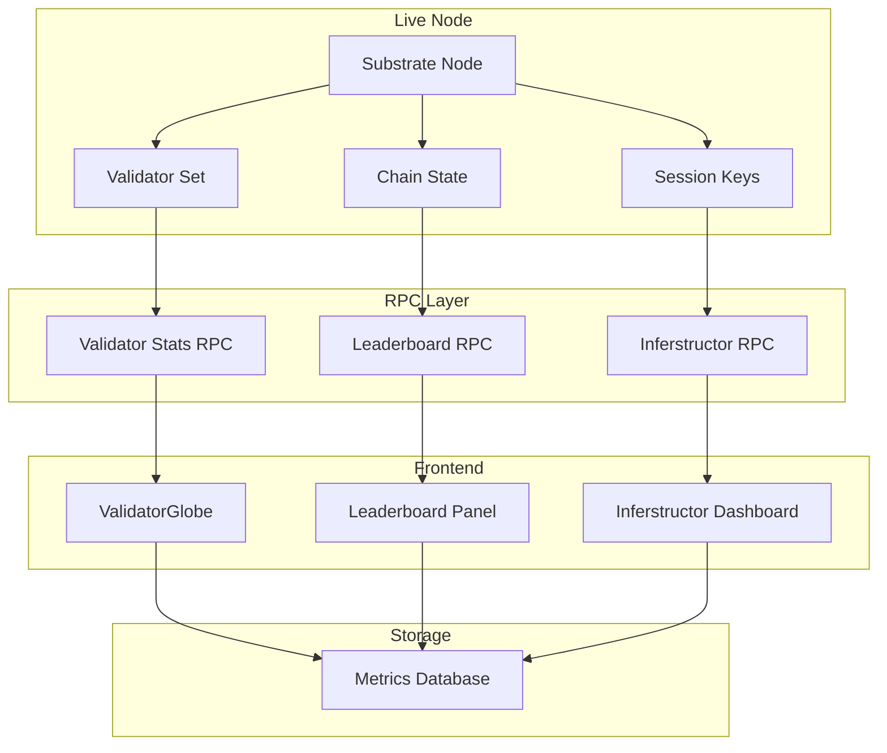
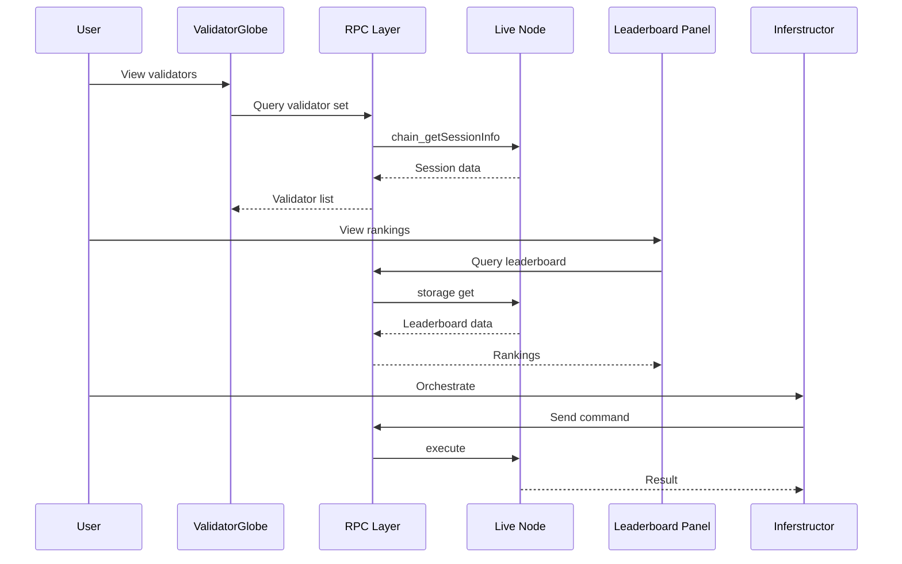

# Phase 5 - Validators & Infrastructure Implementation Plan

**Version:** 1.0  
**Date:** 2026-05-03  
**Status:** 📋 Implementation Planning  
**Epic:** 430a1783-f328-493d-b560-a9e9d6314a1e  
**Ticket:** a67abc87-8165-4466-8f20-75e78e9025aa

---

## Executive Summary

This plan details the implementation of Phase 5 - Validators & Infrastructure for the X3 Atomic Star project. The phase focuses on implementing the Globe, Leaderboard, RPC Stats, and Inferstructor components to provide comprehensive validator infrastructure and monitoring capabilities.

### Current State Assessment

| Component | Status | Notes |
|-----------|--------|-------|
| ValidatorGlobe | ✅ Implemented | React/Three.js component with 3D globe visualization |
| Leaderboard | ✅ Implemented | Meme Overlord pallet with trader leaderboard |
| Inferstructor Dashboard | ✅ Implemented | Tauri desktop app with metrics and telemetry |
| RPC Stats | ⚠️ Partial | Basic RPC endpoints exist, needs enhancement |
| Validator Infrastructure | ✅ Operational | 3-validator testnet running |

### Target State

- ✅ Globe visualization with real validator data
- ✅ Leaderboard with comprehensive metrics
- ✅ RPC Stats with detailed performance tracking
- ✅ Inferstructor with full orchestration capabilities
- ✅ All components integrated with live node

---

## Component Analysis

### 1. ValidatorGlobe (`apps/validators`)

**Current Implementation:**
- React/Three.js 3D globe visualization
- Static city-based validator placement
- Mock data for status, score, blocks, uptime
- Real-time status updates via polling

**Requirements:**
- Connect to live RPC endpoints for real validator data
- Display actual validator nodes from the network
- Show real-time consensus status
- Display connection topology between validators

**Implementation Tasks:**

**Tasks:**
1. Create RPC connector for validator data
2. Implement chain state queries for validator set
3. Add session key mapping for validator identification
4. Build connection topology visualization
5. Implement real-time subscription updates

### 2. Leaderboard (`pallets/meme-overlord`)

**Current Implementation:**
- Meme Overlord pallet with trader leaderboard
- Top 100 traders by profit
- Trade statistics tracking
- Achievement system

**Requirements:**
- Expand to validator leaderboard
- Add performance metrics (TPS, latency, uptime)
- Implement multi-chain leaderboard
- Add validator scoring system

**Implementation Tasks:**

**Tasks:**
1. Extend leaderboard to include validators
2. Add performance metrics storage
3. Implement scoring algorithm
4. Create multi-chain leaderboard support
5. Add validator-specific achievements

### 3. RPC Stats (`node/src/rpc.rs`)

**Current Implementation:**
- Basic RPC endpoints defined
- Substrate standard RPCs implemented

**Requirements:**
- Add validator performance RPCs
- Implement metrics collection endpoints
- Add leaderboard query endpoints
- Create Inferstructor integration points

**Implementation Tasks:**

**Tasks:**
1. Create custom RPC module for validator stats
2. Implement leaderboard query endpoints
3. Add metrics collection endpoints
4. Create Inferstructor integration RPCs
5. Add performance monitoring endpoints

### 4. Inferstructor (`apps/inferstructor-dashboard`)

**Current Implementation:**
- Tauri desktop app
- Leaderboard and metrics panels
- Admin controls
- TPS leaderboard

**Requirements:**
- Connect to live node RPCs
- Implement real-time data streaming
- Add validator orchestration controls
- Create RPC stats dashboard

**Implementation Tasks:**

**Tasks:**
1. Connect to live node RPC endpoints
2. Implement real-time data subscriptions
3. Add validator orchestration controls
4. Create RPC stats dashboard
5. Implement admin orchestration features

---

## Implementation Roadmap

### Phase 5a: Core Infrastructure (Week 1-2)

| Task | Priority | Dependencies | Status |
|------|----------|--------------|--------|
| RPC Connector for ValidatorGlobe | P0 | None | Pending |
| Chain State Queries | P0 | RPC Connector | Pending |
| Session Key Mapping | P0 | Chain State Queries | Pending |
| Connection Topology | P1 | Validator Set | Pending |
| Real-time Subscriptions | P1 | Connection Topology | Pending |

### Phase 5b: Leaderboard Expansion (Week 2-3)

| Task | Priority | Dependencies | Status |
|------|----------|--------------|--------|
| Validator Stats Storage | P0 | None | Pending |
| Performance Metrics | P0 | Validator Stats | Pending |
| Scoring Algorithm | P0 | Performance Metrics | Pending |
| Multi-chain Support | P1 | Scoring Algorithm | Pending |
| Validator Achievements | P1 | Multi-chain Support | Pending |

### Phase 5c: RPC Enhancement (Week 3-4)

| Task | Priority | Dependencies | Status |
|------|----------|--------------|--------|
| Validator Stats RPC | P0 | None | Pending |
| Leaderboard RPC | P0 | Validator Stats RPC | Pending |
| Metrics RPC | P0 | Leaderboard RPC | Pending |
| Inferstructor RPC | P1 | Metrics RPC | Pending |
| Performance Monitoring | P1 | Inferstructor RPC | Pending |

### Phase 5d: Dashboard Integration (Week 4-5)

| Task | Priority | Dependencies | Status |
|------|----------|--------------|--------|
| Live Node Connection | P0 | None | Pending |
| Real-time Streaming | P0 | Live Node Connection | Pending |
| Validator Controls | P1 | Real-time Streaming | Pending |
| RPC Stats Dashboard | P1 | Live Node Connection | Pending |
| Admin Orchestration | P2 | Validator Controls | Pending |

---

## Technical Architecture

### Data Flow

### Component Interaction

---

## Success Criteria

### Phase 5a: Core Infrastructure
- ✅ ValidatorGlobe displays real validator data
- ✅ Connection topology shows actual network structure
- ✅ Real-time updates working with subscriptions

### Phase 5b: Leaderboard Expansion
- ✅ Leaderboard includes validator rankings
- ✅ Performance metrics calculated correctly
- ✅ Multi-chain leaderboard functional

### Phase 5c: RPC Enhancement
- ✅ All custom RPC endpoints operational
- ✅ Performance metrics collection working
- ✅ Inferstructor integration complete

### Phase 5d: Dashboard Integration
- ✅ Inferstructor dashboard connected to live node
- ✅ Real-time data streaming functional
- ✅ Admin orchestration controls working

---

## Risk Assessment

| Risk | Impact | Mitigation |
|------|--------|------------|
| RPC latency affecting UI | Medium | Implement caching and optimistic updates |
| Validator set changes | Medium | Use subscriptions for real-time updates |
| Data consistency | High | Implement transactional updates |
| Performance degradation | Medium | Add performance monitoring and optimization |

---

## Next Steps

1. **Review and approve this plan** with stakeholders
2. **Assign team members** to each phase
3. **Create GitHub issues** for each task
4. **Set up monitoring** for the new infrastructure
5. **Schedule regular reviews** to track progress

---

## Appendix A: Key Files & Components

### Core Components
- `apps/validators/src/components/ValidatorGlobe.tsx` - 3D globe visualization
- `pallets/meme-overlord/src/lib.rs` - Leaderboard pallet
- `node/src/rpc.rs` - RPC endpoints
- `apps/inferstructor-dashboard/src/` - Dashboard application

### RPC Endpoints
- `validator_stats` - Validator performance metrics
- `leaderboard_query` - Leaderboard data
- `metrics_collect` - Metrics collection
- `inferstructor_command` - Orchestration commands

---

## Appendix B: References

- [X3 Chain Architecture](docs/X3_ATOMIC_EXCHANGE_ARCHITECTURE.md)
- [Mainnet RC-1 Scope](MAINNET_RC1_SCOPE.md)
- [Phase 5 Session Complete](archive/sessions/PHASE_5_SESSION_COMPLETE.md)
- [Master Status](MASTER_STATUS.md)

---

*This document is part of the X3 Chain implementation planning process. Last updated: 2026-05-03.*
