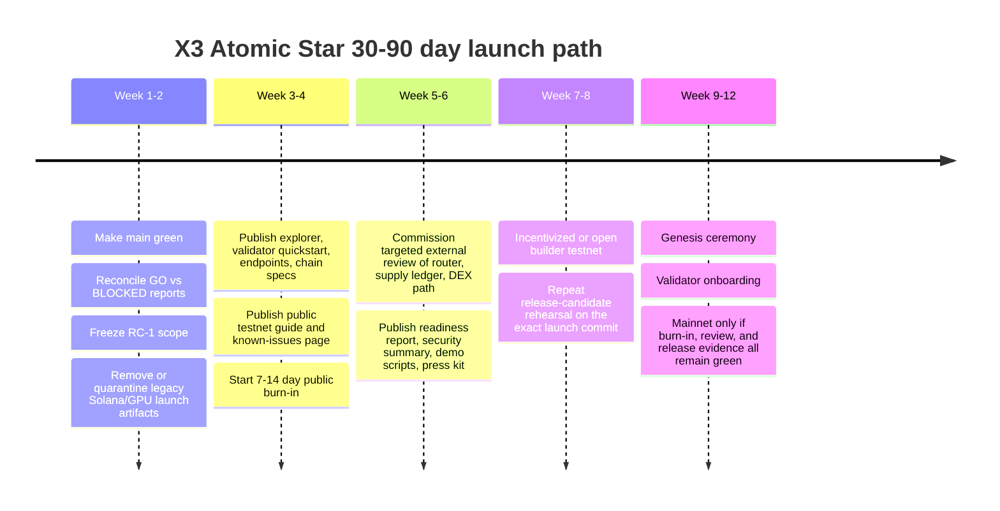

# X3 Atomic Star vs feature parity and mainnet-readiness report

## Executive summary

Enabled connector inventory for this review: `github`.

X3 currently appears stronger in raw engineering breadth, while QC currently appears stronger in public-facing launch packaging. X3’s repository contains a large Substrate-based runtime, extensive pallet/crate wiring, strict CI gates, proof tooling, runtime rehearsal workflows, benchmarking, fuzzing, EVM/SVM RPC scaffolding, and explicit mainnet gate documents. The runtime manifest wires consensus, asset-kernel components, cross-VM routing, DEX, oracle, VRF, automation, launchpad, supply ledger, and SVM/EVM features, while the node code exposes Ethereum-compatible, SVM-compatible, wallet, validator, and DEX RPC methods. fileciteturn37file0 fileciteturn38file0 fileciteturn28file0 fileciteturn29file0 fileciteturn30file0 fileciteturn31file0 fileciteturn47file0

However, X3 does not look ready for a public mainnet reveal today. Three issues are decisive. First, the latest reviewed head commit explicitly says the build is currently failing because of a legacy atlas-node import path. fileciteturn20file0 Second, the repository contains **mutually inconsistent readiness artifacts**: `docs/CURRENT_MAINNET_STATUS.md` says “GO FOR MAINNET RC-1” with 100% score, while `proof/reports/feature_status.json` says `BLOCKED`, `built_count: 0`, and lists many missing, unwired, and untested mainnet-critical features. fileciteturn41file0 fileciteturn42file0 Third, some default testnet material is still mixed with an older Solana/GPU-validator workstream: the canonical testnet config says `network: "solana-testnet"` and points to `testnet-entrypoint.solana.com`, while other scripts assume a Substrate-style RPC validator mesh. fileciteturn33file0 fileciteturn34file0

QC, by contrast, has a stronger **public discovery surface**: an official website, docs site, public GitHub organization, tokenomics page, roadmap, whitepapers, and a public testnet claim with explorer branding. The docs site states a public testnet chain ID `qorechain-diana`; the homepage says the testnet is live; and the public GitHub organization exposes `qorechain-core`, `qorechain-lightnode`, `qore-web3`, and wallet-provider repositories. citeturn4view0turn3view0turn4view1turn5view0

However, **QC’s public evidence still stops short of a clean mainnet-ready verdict**. Its official roadmap still lists a third-party security audit, public validator onboarding, IBC relayer activation, DeFi primitive deployment, and mainnet launch as future items. citeturn1search2turn2search1 Its materials also conflict with one another: the roadmap says target mainnet is **Q4 2026**, while the April 22, 2026 press release says mainnet was advanced to **Q2 2026**; the docs landing page says version **v1.3.0**, the homepage says blockchain version **v2.11.0**, and the press release says production testnet **v2.19.0**. citeturn1search2turn0search2turn4view0turn3view0 The homepage’s “live testnet data” also rendered as placeholders (`Syncing...`, `--`, `Connecting...`) in the crawl used for this review, which is not independent confirmation of a healthy public network telemetry surface. citeturn3view0

My bottom-line judgment is:

- **Engineering depth today:** X3 leads.
- **Public verifiability and investor-facing readiness today:** QC leads.
- **Conservative public-mainnet readiness today:** **neither project is convincingly ready for a fully trusted public mainnet launch from the evidence reviewed**. X3 is closer to an **internal RC with substantial code**, while QC is closer to a **market-facing public testnet with unresolved verification gaps**. fileciteturn41file0 fileciteturn42file0 citeturn1search2turn0search2turn3view0

## What X3 has actually shipped in the selected repository

Connector metadata shows the selected repo as a **private** repository on `main`, with substantial size and a broad branch surface. Sampled branches include `main`, `gh-pages`, `substrate-upgrade-stable2603`, `sprint-0/foundation/kernel-audit`, `agents/feature-prioritization-and-execution-plan`, and multiple dependency-update branches.

The highest-confidence evidence of shipped code, tests, and launch machinery is summarized below.

### Repository state, code surface, and shipped artifacts

| Area | What is verifiably present in repo | Assessment |
|---|---|---|
| Runtime core | `runtime/Cargo.toml` wires Aura, GRANDPA, session/offences, balances/payment, `pallet-x3-kernel`, `pallet-x3-atomic-kernel`, `pallet-x3-asset-registry`, `pallet-x3-supply-ledger`, `pallet-x3-cross-vm-router`, `pallet-x3-dex`, `pallet-x3-oracle`, `pallet-x3-vrf`, `pallet-x3-automation`, `pallet-x3-launchpad`, `pallet-svm-runtime`, and many other X3 pallets/crates. The `frontier` EVM path is present but explicitly gated and off by default for RC-1. The `pq` feature exists but is native-only and not available in WASM. fileciteturn37file0 | Strong code breadth; scope suggests a real chain, not a concept repo. |
| Node and consensus service | `node/src/service.rs` uses Aura + GRANDPA, includes startup gates, tuned tx pool sizing, optional parallel proposer, optional flash finality, optional PoH, optional GPU validator orchestration, and explicit notes that experimental features default off for mainnet-v1. fileciteturn40file0 | Real service code exists, but several advanced features are clearly experimental or disabled by default. |
| RPC surface | `node/src/rpc.rs` merges Substrate RPC, transaction-payment RPC, Frontier-compatible ETH RPC, SVM-compatible RPC, chain subscriptions, wallet RPCs, validator RPC, and DEX swap estimate/execute methods. A default X3/USDC AMM pool is registered in RPC. `rpc_frontier.rs` adds runtime-backed Ethereum methods such as `eth_getBalance`, `eth_getCode`, `eth_getStorageAt`, `eth_getTransactionCount`, `eth_call`, `eth_estimateGas`, `eth_sendRawTransaction`, log queries, and receipt methods. fileciteturn38file0 fileciteturn39file0 | Good evidence of usable JSON-RPC scaffolding across EVM/SVM/custom surfaces. |
| Atomic kernel and asset kernel | `pallet-x3-atomic-kernel` exists, with explicit description for bundle orchestration and proof anchoring. The runtime also wires asset-kernel types, asset registry, supply ledger, token factory, and cross-VM router. Proof receipts for rollback and terminal-state claims are present by path. fileciteturn55file0 fileciteturn37file0 fileciteturn36file27 fileciteturn36file29 | This is one of X3’s strongest differentiators in code. |
| CI and quality gates | There are multiple workflows: `build.yml`, `full-ci.yml`, `v04-ship-gate.yml`, `release-candidate-rehearsal.yml`, and `proof-gates.yml`. These cover fmt/clippy/tests, proof receipts, E2E tests, frame benchmarks, fuzzing, sanitizers, coverage, dependency checking, SBOM generation, chain-spec validation, mainnet/testnet gates, and dashboard publication. fileciteturn28file0 fileciteturn29file0 fileciteturn30file0 fileciteturn31file0 fileciteturn47file0 | This is materially stronger than a typical early-stage L1 repo. |
| Test scripts and advanced validation | `scripts/run-all-tests.sh` includes unit tests, proptest, fuzzing, Kani, Loom, Miri, sanitizers, mutation testing, benchmark validation, Zombienet/Chopsticks checks, try-runtime checks, and multi-pallet unit tests. `scripts/run-frame-benchmarks.sh` handles weight generation and verification for four pallets. fileciteturn43file0 fileciteturn44file0 | Strong internal engineering discipline. |
| Testnet and launch artifacts | `.x3/X3_MAINNET_GATES.md` sets explicit P0/P1 gates, including disabled external bridges by default. There are testnet verification scripts and launch-gate docs, plus validator/public testnet runbooks by path. fileciteturn26file0 fileciteturn32file0 fileciteturn56file1 fileciteturn56file2 fileciteturn56file13 | Good launch discipline on paper. |
| Explorer and front-end deployment | Explorer deployment documentation exists with Helm/Kubernetes instructions for `apps/explorer`, including image build/push, ingress, TLS, rollbacks, autoscaling, and canary flow. fileciteturn45file0 | Explorer/public ops work has clearly begun. |
| Validator/GPU sidecar surface | GPU validator operator docs and validator infra docs exist by path, and node service contains GPU-sidecar health logic and optional GPU validator orchestration. fileciteturn40file0 fileciteturn56file0 fileciteturn56file10 fileciteturn56file17 | Shipped as code/docs, but not credible as consensus-critical mainnet path yet. |

### The key X3 blockers that matter more than the feature list

The problem is **not lack of code**. The problem is **coherence**.

The latest reviewed head commit explicitly says the build is failing. That alone blocks any clean public readiness claim. fileciteturn20file0

The repo also contains a serious truth-source conflict. `docs/CURRENT_MAINNET_STATUS.md` says all quality gates passed and launch is authorized for “mainnet RC-1 (v0.4 internal-only),” with 21/21 valid receipts and zero blockers, tied to a verified commit from May 2, 2026. fileciteturn41file0 fileciteturn52file0 But `proof/reports/feature_status.json` says the repo is `BLOCKED`, with `total_features: 59`, `built_count: 0`, and many core areas marked `MISSING`, `UNWIRED`, or `UNTESTED`, including consensus, finality, validator set, genesis config, fee market, and multiple asset-kernel elements. fileciteturn42file0

There is also visible **workstream contamination**. The testnet verification path assumes Substrate-style RPC validators, but the supplied `docs/testnet-config/testnet-config.json` still identifies `solana-testnet`, points to `testnet-entrypoint.solana.com:8001`, and configures Solana-style validator identities and GPU devices. fileciteturn32file0 fileciteturn33file0 fileciteturn34file0 That does not mean the Substrate chain is fake; it means the public/default launch story is still mixed with older or parallel system work, and that is fatal during diligence.

### My X3 conclusion

X3 already has enough code to justify a serious claim that it is **building a real chain with differentiated architecture**. It does **not** yet have enough **coherent, externally defensible evidence** to support a surprise public mainnet reveal. The project is much closer to an **internal release candidate plus engineering proof stack** than to a clean public mainnet package. fileciteturn37file0 fileciteturn40file0 fileciteturn41file0 fileciteturn42file0

## What QC publicly claims and what is publicly shipped

For table brevity, I abbreviate urlQoreChainturn1search0 as **QC** below.

### Public claims vs public evidence

| Dimension | Official/public claim | Publicly verifiable evidence from this review | Confidence |
|---|---|---|---|
| Chain status | QC says a public testnet is live, chain ID `qorechain-diana`. citeturn3view0turn4view0 | Docs landing page lists `qorechain-diana`; homepage says “Live Testnet”; roadmap marks testnet and multi-node deployment complete. But the homepage crawl showed live telemetry placeholders such as `Syncing...`, `--`, and `Connecting...`, which is not independent proof of current health. citeturn4view0turn3view0turn1search2 | Moderate |
| Mainnet timing | Public materials conflict: roadmap says **target Q4 2026**, while the April 22, 2026 press release says mainnet was advanced to **Q2 2026**. citeturn1search2turn0search2 | No public mainnet confirmation was verified in this review. | High |
| Consensus narrative | QC describes “AI-native PRISM consensus optimization,” but other public materials describe Combined Proof of Stake with reputation scoring and BFT finality, and the community whitepaper frames the chain around Tendermint/BFT-style finality. citeturn0search2turn2search3turn1search8 | The public codebase is a Cosmos-SDK-derived chain, which supports the BFT base-layer interpretation; the exact role of PRISM in live consensus vs advisory optimization remains publicly ambiguous. citeturn5view0turn4view0 | Moderate |
| Triple VM | QC claims a single unified state supporting EVM, CosmWasm, and SVM with atomic cross-VM calls. citeturn3view0turn4view0turn0search2 | Public site/docs clearly make this claim. In public code, the repo includes `contracts/interfaces`, app code, sidecar, indexer, and Cosmos-SDK structure, but this review did not independently verify full triple-VM execution from public code alone. citeturn5view0 | Moderate |
| Post-quantum crypto | QC claims ML-DSA-87 / FIPS 204, ML-KEM-1024 / FIPS 203, SHAKE-256, and “full-stack PQC.” citeturn3view0turn4view0turn0search2 | The public narrative is consistent that PQC is core to the product. Public code evidence in this review did not verify every consensus/bridge/signature path end to end. | Moderate |
| Bridges | QC claims 25 direct chains plus 120+ via IBC. citeturn3view0turn2search2 | Public bridge page exists, but the roadmap still lists IBC relayer activation as an upcoming milestone. That means bridge architecture is publicly claimed, but not every bridge path is publicly evidenced as active from this review. citeturn2search2turn1search2 | Moderate |
| Validator and light-node stack | QC claims validator revenue from bridge operations and a light-node network. citeturn3view0turn2search3 | Public GitHub org contains `qorechain-lightnode`, updated March 29, 2026, and the main core README describes a light-node module and a license-gated validator bridge. citeturn4view1turn5view0 | High for code existence; moderate for production maturity |
| Public code | QC says protocol definitions are open source. citeturn3view0 | Public GitHub org exists with eight repos. `qorechain-core` is public, shows 186 commits, and was updated April 9, 2026. Its root contains `.github`, `app`, `cmd/qorechaind`, `config`, `docs`, `indexer`, `proto`, `sidecar`, `scripts`, and `x` modules. citeturn4view1turn5view0 | High |
| Audit status | QC presents itself as production-grade testnet. citeturn0search2 | The public roadmap still lists “Security audit (third-party)” as a future item. I did not verify a completed third-party audit report from official sources in this review. citeturn1search2turn2search1 | High |
| Versioning | Official materials cite `v1.3.0` in docs, `v2.11.0` on homepage, and `v2.19.0` in press release. citeturn4view0turn3view0turn0search2 | This weakens confidence in public release hygiene. | High |

### My QC conclusion

QC has **more public market readiness than X3 today**, because outsiders can find the story, docs, tokenomics, repos, and a public testnet narrative immediately. But the strongest conservative statement supported by the evidence is: **QC has shipped a public-facing testnet stack and a public codebase, not a fully verified mainnet-ready stack**. The unresolved items are third-party audit status, mainnet date consistency, consensus-role clarity for PRISM, and hard public evidence for all of the bridge and triple-VM claims. citeturn4view0turn3view0turn1search2turn0search2turn5view0

## Feature parity comparison

### Side-by-side feature matrix

| Dimension | X3 current state | QC current public state | Edge today |
|---|---|---|---|
| Consensus | Real Substrate node/service code with Aura + GRANDPA; flash finality, PoH, and parallel proposer code exist but are experimental and default-off for mainnet-v1. fileciteturn40file0 | Publicly framed as Cosmos-SDK/BFT-based chain with PRISM AI optimization, but public materials conflict on whether PRISM is optimizer, consensus layer, or policy overlay. citeturn4view0turn2search3turn0search2 | **X3** on code clarity |
| VM support | Internal X3Native + SVM + EVM scaffolding exists; Frontier real EVM execution is post-RC1 and off by default. fileciteturn37file0 | Claims EVM + CosmWasm + SVM in one shared-state runtime. Public claim is clearer than public proof. citeturn3view0turn4view0 | **X3** on inspectable code breadth; **QC** on public narrative |
| Native DEX / orderbook | `pallet-x3-dex` is wired, DEX RPC exists, swap estimate/execute exists, and AMM pool registration is visible. Public orderbook/perps proof not yet verified. fileciteturn37file0 fileciteturn38file0 | Roadmap still lists DeFi primitive deployment as upcoming. citeturn1search2 | **X3** |
| Universal contracts / bridge model | X3 has packet standard, IXL, cross-VM router, asset registry, supply ledger, and proofs; external bridges are explicitly disabled by default until audit gate passes. fileciteturn26file0 fileciteturn29file0 fileciteturn37file0 | QC claims 25 direct bridges and 120+ via IBC; public bridge page is strong, but roadmap still treats IBC relayer activation as future work. citeturn2search2turn1search2 | **X3** for safer engineering stance; **QC** for public bridge marketing |
| Asset kernel / canonical accounting | One of X3’s strongest layers in code: asset-kernel types, supply ledger, registry, router, receipts, and launch gates. But one machine-generated report still says the feature suite is blocked/unwired in places. fileciteturn37file0 fileciteturn26file0 fileciteturn42file0 | QC claims shared-state triple-VM execution, but I did not find a publicly explicit canonical-supply accounting model equivalent to X3’s asset-kernel language. | **X3** |
| Parallel execution / intelligent scheduling | X3 has a parallel proposer and contention predictor in node code, but it is explicitly feature-gated and not yet a core launch claim. fileciteturn40file0 | QC’s PRISM claims cover mempool ordering and optimization, but public evidence is still more conceptual than operational. citeturn0search2turn2search3 | **Tie**, both unfinished as proven public differentiators |
| MEV protections | X3 has replay/deadline/rollback gates and DEX anti-rug / sandwich test requirements in launch docs, but I did not verify full shipped MEV-hardening as public reality. fileciteturn26file0 | QC talks about AI anomaly detection and ordering optimization, but public MEV-specific mechanisms were not clearly documented in this review. citeturn2search2turn0search2 | **No clear leader** |
| Oracle / VRF / automation | `pallet-x3-oracle`, `pallet-x3-vrf`, and `pallet-x3-automation` are wired into the runtime. fileciteturn37file0 | I did not verify equivalent native oracle/VRF/automation modules from QC public material. | **X3** |
| Validator / GPU acceleration | X3 has optional GPU-validator/orchestrator code and operator docs, but node service clearly treats this as experimental and non-default. fileciteturn40file0 fileciteturn56file0 | QC publicly emphasizes validator economics and light nodes; I did not verify GPU-validator acceleration in public QC materials. citeturn3view0turn4view1turn5view0 | **X3** on feature ambition; **QC** on public validator packaging |
| PQ roadmap | X3 has an optional `pq` runtime feature and a `quantum-crypto` crate hook, but it is native-only and not launch-default. fileciteturn37file0 | PQ security is the center of QC’s brand, docs, whitepaper, and press release. citeturn3view0turn4view0turn0search2turn1search7 | **QC** |
| SDKs / tooling | X3 has a serious proof toolchain, CI dashboard publishing, CLI references, launch rehearsals, explorer deployment docs, and validator runbooks. fileciteturn30file0 fileciteturn45file0 fileciteturn47file0 fileciteturn56file13 | QC has public docs, a public GitHub org, `qore-web3`, wallet provider, and dashboard/explorer UX. citeturn4view0turn4view1 | **Tie**: X3 stronger internally, QC stronger publicly |
| Testnet artifacts | X3 has many testnet scripts and guides, but some are contaminated by legacy Solana/GPU config and status drift. fileciteturn32file0 fileciteturn33file0 fileciteturn41file0 fileciteturn42file0 | QC has a cleaner public testnet story, but observed live telemetry proof was weaker than the marketing language. citeturn4view0turn3view0 | **QC** for public presentation; **X3** for deeper internal artifacts |
| Explorer / faucet / validator docs | X3 has explorer deployment docs and validator docs by path; faucet was unspecified in reviewed evidence. fileciteturn45file0 fileciteturn56file1 fileciteturn56file13 | QC has a public docs site and explorer, but faucet was unspecified and validator-doc verification was limited in this review. citeturn4view0turn4view3 | **Tie** |
| Security audits | I did not verify a completed external third-party audit for X3; only internal gates, audit-engagement docs, and security workflows. fileciteturn47file0 fileciteturn56file20 | QC roadmap still lists third-party audit as upcoming. citeturn1search2turn2search1 | **Neither** |

### Comparative verdict

If a technical allocator, validator operator, or protocol engineer looked only at **code and engineering machinery**, X3 would likely look more serious than QC today. If that same person looked only at **public launch posture**, QC would look more mature than X3 today. That is the core strategic truth of this comparison. fileciteturn37file0 fileciteturn40file0 citeturn4view0turn5view0

## Mainnet readiness assessment

### Scorecard

These scores are my inference from the evidence above, not a mechanical output.

| Project | Engineering depth | Public verifiability | Public-mainnet readiness today | Why |
|---|---:|---:|---:|---|
| X3 | 8/10 | 4/10 | **4.5/10** | Large real code surface and strong CI/proof stack, but latest-head build break, contradictory readiness sources, and mixed launch artifacts block a clean public-mainnet claim. fileciteturn20file0 fileciteturn41file0 fileciteturn42file0 |
| QC | 6/10 | 8/10 | **5/10** | Better public launch packaging and a public testnet narrative, but no verified mainnet, no verified completed external audit in reviewed sources, and contradictory dates/versioning reduce confidence. citeturn4view0turn3view0turn1search2turn0search2turn5view0 |

### P0, P1, and P2 gaps for X3

| Priority | Gap | Why it is launch-blocking | Realistic time if focused |
|---|---|---|---:|
| P0 | Make `main` green again and prove current-head build/test status | A repo that says “build currently fails” cannot support a public reveal. fileciteturn20file0 | 3–7 days |
| P0 | Reconcile truth sources into one signed machine-readable readiness report | “GO” and “BLOCKED” cannot coexist in public. fileciteturn41file0 fileciteturn42file0 | 2–5 days |
| P0 | Freeze RC-1 scope and quarantine legacy Solana/GPU/Atlas artifacts from default launch path | Mixed launch stories kill credibility. fileciteturn33file0 fileciteturn27file0 | 3–7 days |
| P0 | Publish a coherent public testnet artifact stack | Minimum: explorer, endpoints, validator quickstart, chain spec, faucet or token distribution method, known-issues page, uptime window. fileciteturn45file0 fileciteturn56file13 | 7–14 days |
| P0 | Run a public 7–14 day burn-in for the exact release candidate | You need observable stability, not just internal scripts. | 7–14 days |
| P1 | External review or targeted audit of atomic kernel, router, and DEX path | Your differentiator is also your highest-risk area. | 2–4 weeks |
| P1 | Produce a public readiness/security report with receipts and clear scope boundaries | This converts CI into market trust. | 3–5 days |
| P1 | Public faucet / onboarding / incident runbooks | Required for external validators, builders, and users. | 3–7 days |
| P2 | PQ path usable in actual launch architecture | Current `pq` feature is a hook, not a proven network-default capability. fileciteturn37file0 | 4–8 weeks |
| P2 | GPU validator alpha as optional sidecar, not consensus-critical path | Nice differentiator, wrong thing to block launch on. fileciteturn40file0 | 2–6 weeks |
| P2 | External bridges after audits | Keep them off until reviewed. That is already the right design choice. fileciteturn26file0 | Post-public-testnet |

### Recommended 30–90 day war-mode checklist

My realistic recommendation is:

- **Public testnet reveal:** in roughly **2–3 weeks**, but only if the P0 list is completed and public artifacts are synchronized.
- **Public mainnet:** **not before 6–10 weeks after that**, and only after either a targeted external review or some equivalent third-party verification of the critical kernel/router/DEX surfaces.

## Launch timing, messaging, and competitive posture

### When to reveal

Do **not** “pop out of nowhere” with a mainnet claim.

Instead, reveal in two steps:

1. **Public testnet reveal first**, once you can show:
   - green `main`
   - one canonical readiness report
   - public explorer
   - validator quickstart
   - clear endpoints
   - public testnet uptime evidence
   - one simple demo that actually runs

2. **Mainnet reveal second**, only after the public testnet survives real users and outside scrutiny.

That sequence is safer and also strategically smarter against QC. QC’s advantage right now is that outsiders can see it. X3 wins by showing **evidence discipline**, not by trying to out-hype an AI/PQ narrative before your public artifact stack is coherent. fileciteturn20file0 fileciteturn41file0 fileciteturn42file0 citeturn3view0turn4view0

### The right public message

The strongest message for X3 is not “AI quantum blockchain.”

It is:

> **X3 Atomic Star is a verifiable multi-VM execution chain with atomic cross-domain settlement, explicit launch gates, and a production-minded asset accounting model.**

That positioning exploits a weakness in both your repo and QC’s public materials: hype is cheap, but **coherent launch evidence is rare**.

Good message pillars:

- **Deterministic multi-VM execution**
- **Atomic asset accounting**
- **External bridges disabled until reviewed**
- **Proof-backed readiness, not brochure readiness**
- **Public testnet first, measured mainnet second**

Avoid these until they are truly shipped and defensible:

- “quantum-safe chain” as a primary front-page claim
- “AI-native consensus” as if AI decides finality
- “millions of TPS” without current public measurements
- “production-ready” unless all public artifacts confirm it

### Safe competitive actions

Do these:

- Publish a **dated comparison matrix** stating clearly what is “shipped,” “publicly verified,” “internal-only,” and “roadmap.”
- Publish one **independent-proof launch report** that outsiders can reproduce.
- Run a **public builder challenge** on testnet.
- Publish **benchmark reproducibility instructions**.
- Host a **validator onboarding session** with real endpoints and docs.

Do **not** do these:

- make blanket claims that QC “doesn’t have” a feature unless you say “not publicly verified in this review”
- imply audits exist when they do not
- use attack-style messaging
- interfere with a competitor’s infrastructure, users, or communities

## Paperwork and public materials to sync before you launch

### Highest-priority materials

| Priority | Artifact | What it must contain | Minimal template |
|---|---|---|---|
| Highest | Whitepaper v1 | Scope-frozen architecture, consensus actually used at launch, VM scope, asset-kernel invariants, bridge policy, security model, governance, roadmap, known deferrals | **Problem → Architecture → Launch Scope → Security Model → Economics → Roadmap** |
| Highest | One-pager | What X3 is, why it matters, what is live now, what is intentionally off, proof links | **What it is / Why now / What’s live / What’s next / Where to verify** |
| Highest | Public readiness report | commit SHA, build status, CI summary, receipts, known issues, what passed, what is excluded from scope | **Version / Evidence / Remaining risk / Launch decision** |
| Highest | Validator guide | hardware, install, bootnode, chain spec, keys, telemetry, rollback, incident path | **Prereqs / Install / Join / Verify / Recover / Contacts** |
| High | Explorer and endpoints page | RPC/WS URLs, explorer URL, chain ID, address format, faucet/token procedure, rate limits | **Endpoints / Chain details / Wallets / Limits / Status** |
| High | Security summary | threat model, audit status, external review status, what is disabled by design | **Risks / Controls / Reviews / Open items** |
| High | Demo scripts | exact commands for wallet creation, asset movement, swap, cross-VM flow | **Setup / Run / Expected output / Troubleshooting** |
| Medium | Press kit | logo pack, founder blurb, architecture diagram, screenshots, launch quote, FAQ | **Brand / Facts / Visuals / Contacts** |
| Medium | Audit summary page | named reviewer, scope, date, findings, remediation status | **Scope / Findings / Fixes / Residual risk** |

### Minimal example templates

#### Whitepaper structure

- **Executive overview**
- **Launch scope**
- **Consensus and finality**
- **Execution environments**
- **Universal asset kernel**
- **Cross-VM router and packet model**
- **Security model and disabled-by-default surfaces**
- **Economics and validator model**
- **Operational rollout plan**
- **Known limitations and deferred features**

#### Public readiness report structure

- Release candidate name and commit SHA
- What was tested
- What passed
- What is disabled
- What remains risky
- External review status
- Final go / no-go decision
- Reproduction commands

#### Validator guide structure

- Hardware requirements
- Operating system baseline
- Binary verification / checksum
- Chain spec and genesis
- Key generation
- Bootnode and peer config
- Telemetry / Prometheus / Grafana
- Upgrade and rollback
- Incident contact and escalation

## Risk, legal, and ethical checklist

Before you publish any competitive comparison, keep this checklist in front of you:

- **Label every claim** as one of: shipped, publicly verified, internal-only, roadmap, or unspecified.
- **Date every comparison.** Both projects are moving targets.
- **Do not say “audited”** unless you name the auditor and the scope.
- **Do not say “mainnet-ready”** if the latest public evidence says otherwise.
- **Do not imply QC lacks something** if the honest statement is “I did not verify it from public evidence.”
- **Avoid trademark confusion.** Compare technology; do not mimic branding.
- **Do not publish private or non-public competitor material.**
- **Do not take any hostile action** against a competitor’s systems, users, relayers, community, or infrastructure.

The clean legal formulation is:

> “Based on the public sources reviewed on May 9, 2026, and the selected X3 repository, this report compares currently verifiable features and readiness evidence. Some items remain unspecified or only internally evidenced.”

## Open questions and limitations

A few important things remain unresolved from the evidence available in this review.

I could not independently verify:
- current successful CI run status for the latest X3 head beyond the repo artifacts already present
- a live, healthy public X3 network endpoint
- a QC faucet or a complete public validator onboarding flow
- a completed third-party security audit for either project
- full public-code proof of QC’s triple-VM and 25-bridge claims end to end

That means the safest final conclusion is:

**X3 should not reveal public mainnet now.**  
**X3 should reveal public testnet after a fast coherence cleanup.**  
**If you execute that cleanup well, X3 can plausibly out-rank QC on technical seriousness within one launch cycle, because your internal engineering evidence is already stronger than your current public packaging.**