# X3 ATOMIC STAR: THE ROAD TO MAINNET
Evidence-Based Architecture Audit, Gap Analysis, and Production Completion Blueprint
Audit date: 2026-09-05 | Commit: 6a24d8cf38f2522ddf9ae0b47011fd59a9984208 | Dirty working tree


## 1  Executive Command Brief

DECISION / EVIDENCE / PRIORITIES

X3 Atomic Star is a substantial Substrate-based protocol codebase with Aura/GRANDPA node wiring, a FRAME runtime, internal asset representations, atomic orchestration, external proof routes, language tooling and multiple applications. The inspected state is an internal development candidate. It is not ready for an open public testnet or a mainnet handling value.

> PUBLIC TESTNET: NO-GO  |  MAINNET: NO-GO  |  READINESS: 20/100. Three Critical findings remain open. This evidence score is not a percentage of code written or a probability of safety.

### If you read nothing else

The most serious problem is misplaced trust at protocol boundaries: header, finality-anchor and rollback-receipt paths accept caller assertions where authenticated evidence is required. Runtime cross-chain header validation ignores the expected root (C01); unsigned nonzero hashes can become finality anchors (C02); unsigned callers can supply the prior state used during rollback (C03). These findings are grounded in reachable runtime wiring, not merely dormant example code.

An isolated test harness compiled the unchanged proof-router source with its production feature. All three rejection tests failed because unverified payloads were accepted (H01). A separate four-test RPC algorithm harness passed. Selected Python DSL tests returned 6 passed and 4 failed. Whole-workspace check/test/clippy and the release/testnet feature builds all failed in the WASM build with E0152 duplicate core. No live transaction, finalized network, contract deployment or restore was demonstrated in this audit.

The register contains 29 findings: 3 Critical, 18 High, 7 Medium and 1 Low. Confidence is high in the NO-GO decision, high in directly observed helper/gate failures, and moderate in broader system completeness because full node execution was blocked. Findings are not a claim that every file has been manually reviewed or every possible vulnerability discovered.

Five strongest foundations
| Foundation | Evidence and exact limit |
|---|---|
| Real standard consensus wiring | node/src/service.rs:534, :1059, :1136: Aura import/authoring and GRANDPA voting are present; live safety/liveness not verified. |
| Native transaction controls | runtime/src/lib.rs:850: nonce, genesis, era, weight and transaction-payment extensions are explicitly wired. |
| Accounting and recovery intent | Supply-ledger checked arithmetic and economic-halt paths exist; C03/H16 and multi-node verification remain open. |
| Executable language and RPC units | Parser/typechecker/CLI and four middleware unit tests executed; this does not prove cross-chain swaps. |
| Useful operational assets | Pinned Rust toolchain, systemd hardening, explicit scopes and lockfiles provide a basis for reproducible delivery; current gates/build fail. |

Five most dangerous weaknesses
| Risk cluster | Consequence |
|---|---|
| C01 + H01/H02/H03 | Unauthenticated external truth can be treated as proof. |
| C02 + C03 | Finality and rollback claims have untrusted inputs. |
| H04/H05/H06 | Validator penalties, rotation and experimental finality are incomplete or unsafe. |
| H07/H08/H09/H11/H12 | Execution, submission, gateway and SDK paths do not consistently deliver the advertised protocol. |
| H13/H14/H15/H18 | Build/gate/advisory evidence can be missing, stale, suppressed or misleading. |

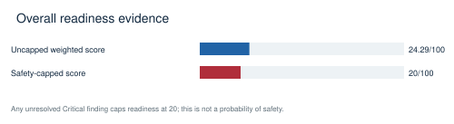

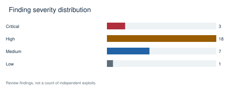

### Fastest credible route forward

Freeze this source state, repair the build without skipping WASM, fix failure propagation, and close C01–C03 before spending effort on throughput or public launch. Demonstrate one signed native transfer through finality and restart. Then add one internal atomic route with conservation and rollback proof. External chains should be separate gated milestones after authenticated proof implementations and independent review. No public-network signing or deployment was performed.

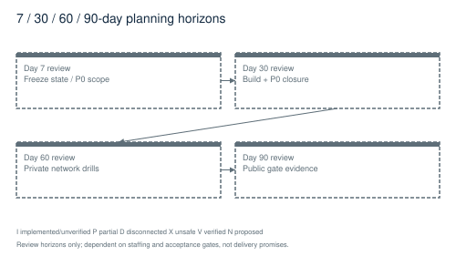

The 7/30/60/90 labels are review horizons, not promises. Planning assumes access to at least protocol, security, build/release and distributed-test expertise; no team size or committed allocation was supplied. Re-estimate after the first build and adversarial closure milestone. Feature expansion must not outrun proof quality.

## 2  System Architecture

CODE PATHS / TRUST BOUNDARIES

Architecture is reconstructed from Cargo metadata, binary entrypoints and inspected runtime configuration. Solid boxes represent code/wiring; they do not mean successful execution. Dashed boxes mark disconnected or proposed paths. All diagrams are reusable SVG/PDF assets in assets/.

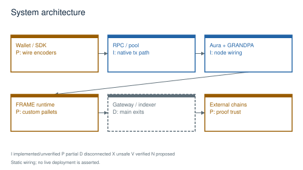

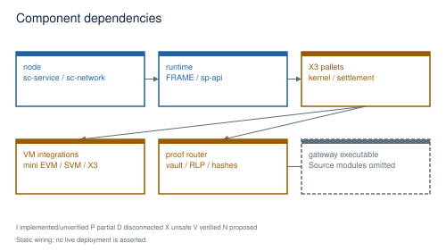

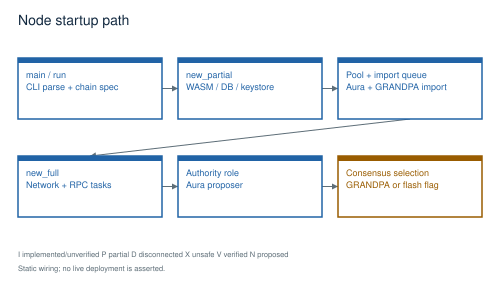

Startup begins at node/src/main.rs:4, delegates to x3_chain_node::run, parses CLI in command.rs, selects/generates a chain spec and invokes service factories. new_partial constructs the WASM executor, backend, keystore, pool, longest-chain selector, GRANDPA block import and Aura queue. new_full builds network/RPC tasks and starts Aura for authority roles. Default finality is GRANDPA; experimental Flash opt-in changes that choice (H06).

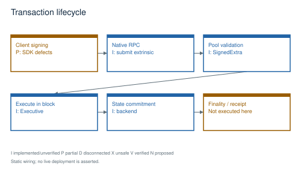

The ordinary native path is a signed SCALE extrinsic submitted through author RPC to the transaction pool, validated through runtime APIs and SignedExtra, executed by Executive during block production/import, committed into FRAME storage and then finalized by GRANDPA. Receipt/event/indexer consumers are a separate path. This is a static trace: the full transaction lifecycle could not be executed because the current runtime build fails. The Ethereum-named submission method deviates from this lifecycle (H08).

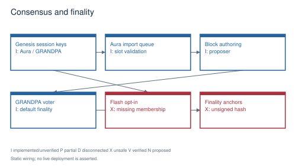

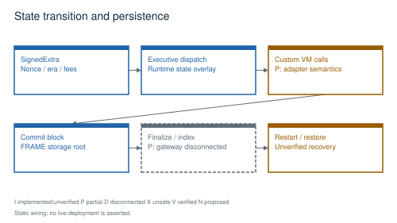

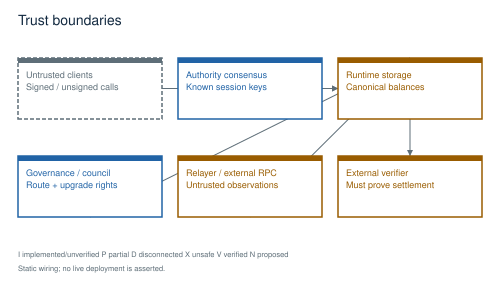

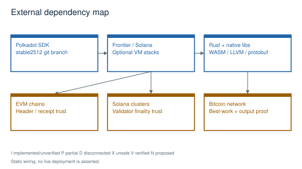

External trust includes Polkadot SDK/Frontier/Solana dependencies, configured session authorities, governance/council decisions, relayer/custody services, RPC observations and contract verifier owners. A root/half-council origin currently guards gateway proof operations (runtime/src/lib.rs:2479); this limits direct unprivileged access but is not a cryptographic substitute for verification. The older cross-chain header pallet still exposes signed submission, and atomic anchors/diffs expose unsigned calls.

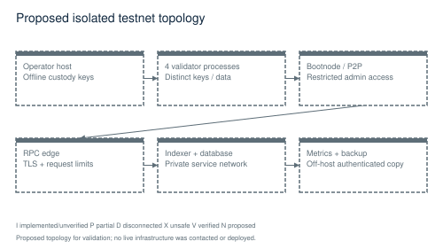

## 3  Repository Anatomy

INVENTORY / BUILD GRAPH / REACHABILITY

The first-party inventory contains 11,620 paths, 375 manifests and 145 Cargo workspace packages. Cargo.lock resolves 1,996 package records. Inventory coverage and manual review are distinct. Vendored dependency source, legacy snapshots, credential files and build/install outputs were not treated as first-party implementation evidence.

Repository groups and responsibilities
| Path/group | Responsibility / evidence |
|---|---|
| node/ | x3-chain-node executable: CLI, chain specs, service, network and RPC. |
| runtime/ | x3-chain-runtime WASM, FRAME pallet composition, signed extensions, runtime APIs and migrations. |
| pallets/ | Consensus metadata, balances/asset representations, kernel, settlement, governance, wallet, DEX, supply and bridge state machines. |
| crates/ | Off-chain services and libraries: VM/compiler, proof routes, relayer, gateway, attestation, finality and health tooling. |
| x3-lang/ | Separate Python DSL and Rust language workspace; source-of-truth claims differ from experimental root compiler track. |
| X3-contracts/; programs/svm/ | Separate Foundry/Anchor workspaces and additional SVM programs. They are not covered by a root workspace test alone. |
| apps/; packages/ | Desktop/Tauri, web frontends, wallets, SDKs and transport adapters; root npm scripts chain many package commands. |
| services/; swarm/; infra*/ | Sidecars, Python services, infrastructure and database consumers. Deployment examples are not evidence of deployed services. |
| scripts/; proof-forge/; proving/ | Launch gates, integrity scanners, proof-generation tools and proving harnesses. Their claims must be compared with executable behavior. |

Code exists versus code runs
| Component | Exists | Runtime reachability |
|---|---|---|
| Node core | Yes: service/consensus/backend source | Build blocked in this audit; no node launch claimed. |
| Gateway REST/GraphQL | Yes: rest.rs, db.rs and schema modules | Binary main logs and exits; modules are not declared/served (H11). |
| Proof router | Yes; compiled by isolated harness | Unsafe production alternatives accepted invalid proof bytes (H01). |
| Legacy EVM structural verifier | Yes, compiled with production feature | Not the selected production EVM gateway route; exposed library remains unsafe. |
| Node bootstrap helper | Yes: BootstrapConfig | No demonstrated service consumer of this helper; actual sc_network configuration is separate. |
| Python parser/typechecker | Yes | CLI and relevant tests executed successfully. |
| Two-node finalized bridge test | Yes | Ignored; no new network-level proof supplied. |

Complete component-map.json records package targets/features/dependencies; inventory.json records standalone manifests/scripts and path categories. These machine-readable inventories cover more components than can be usefully typeset as an architecture diagram. The feature scorecard scopes the behaviors actually assessed, while unreviewed minor code remains unknown rather than silently receiving credit.

Migration and configuration inventory
| Category | Observed scope / next proof |
|---|---|
| Runtime migrations | runtime/src/lib.rs:826 wires kernel, treasury, agent-memory and agent-accounts migrations. Other migration.rs files require per-pallet hook/version review; presence alone does not prove they are scheduled. |
| Gateway SQL | Database query/migration source exists but gateway main is disconnected. Need fresh schema + prior schema upgrade against disposable PostgreSQL. |
| Python migrations | tests/test_migrations.py imports alembic and swarm.db. Collection failed at missing alembic; no schema operation was run. |
| Config flow | CLI/sc_service config to node; live authorities/council/treasury/escrows from environment into chain spec; relayer YAML/env fallback in its binary; gateway config currently disconnected. |
| CI | 39 workflow paths inventoried. H13 demonstrates swallowed recipe failure and missing workflow target; hosted required-status settings were not queried. |
| Deployment | 232 first-party deployment-category paths and additional systemd/compose assets inventoried; no cluster or live service was contacted. |

## 4  Feature Completion Scorecard

TRANSPARENT CRITERIA / NO DOCUMENTATION CREDIT

Each feature = 20*(implemented + wired + tested + executed + reproducible), indicators 0/1. Tested means a passing applicable test observed in this audit. Scoped algorithm/DSL verification is not whole-network verification. Overall = weighted subsystem mean, capped at 20 while any Critical finding is open.

An indicator gets 1 only for the stated feature scope. Implementation means meaningful behavior exists for that scope; wiring means the inspected entrypoint calls it. Passing tests, executed behavior and reproducibility need current audit evidence. Missing/blocked evidence gets 0 without implying code is absent. Two VERIFIED rows have deliberately narrow scopes: RPC limiter algorithms and Python parsing/typechecking. Whole-node RPC protection and complete language execution are separate incomplete rows.

The uncapped weighted mean is 24.29/100. The published readiness score is 20/100 after applying the explicit safety cap of 20 for any open Critical finding. This policy prevents numerous peripheral features from outweighing broken safety boundaries. Weights sum to 100. All feature indicators, weights, references and uncertainty appear in scorecard.json and the full CSV.

Subsystem scoring weights and raw evidence
| Subsystem | Weight / 100 | Raw score / 100 |
|---|---|---|
| Consensus | 14 | 26.67 |
| Transactions | 10 | 30.0 |
| State | 12 | 28.0 |
| Crypto | 10 | 26.67 |
| Networking | 7 | 40.0 |
| VM | 8 | 36.67 |
| Cross-chain | 14 | 18.75 |
| Tests | 5 | 20.0 |
| Operations | 5 | 13.33 |
| Observability | 3 | 10.0 |
| Deployment | 4 | 0.0 |
| Performance | 2 | 0.0 |
| Governance | 3 | 33.33 |
| Documentation | 1 | 0.0 |
| Proof gates | 2 | 10.0 |

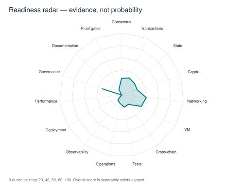

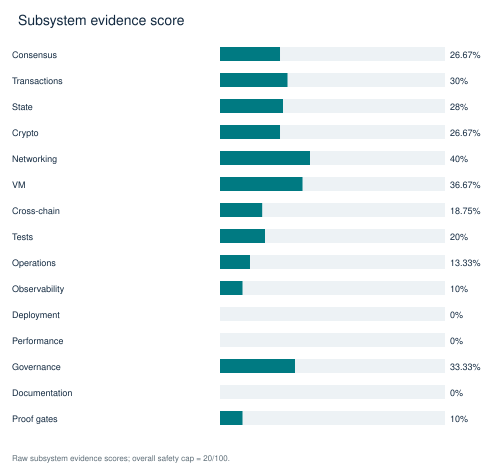

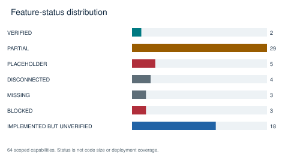

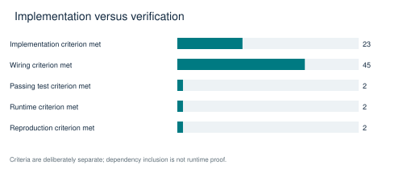

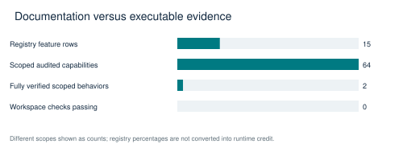

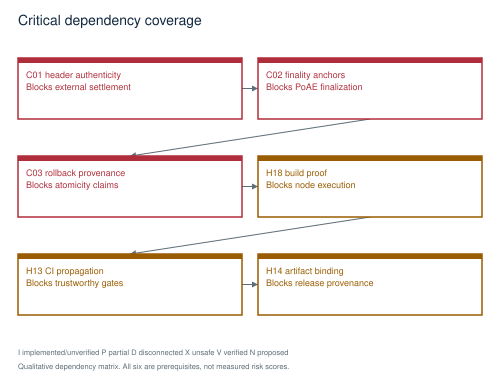

Feature matrix overview
| ID / capability | Status / score | Evidence |
|---|---|---|
| FT01 Aura block production | IMPLEMENTED BUT UNVERIFIED / 40% | node/src/service.rs:1059 |
| FT02 GRANDPA finality and fork choice | IMPLEMENTED BUT UNVERIFIED / 40% | node/src/service.rs:601; node/src/service.rs:1136 |
| FT03 Validator rotation | PARTIAL / 20% | pallets/x3-consensus/src/lib.rs:412 |
| FT04 Validator bonded stake and slashing | PARTIAL / 20% | pallets/x3-consensus/src/lib.rs:263 |
| FT05 Flash finality | PARTIAL / 0% | crates/flash-finality/src/lib.rs:389; node/src/service.rs:656 |
| FT06 Genesis construction and live-seed validation | IMPLEMENTED BUT UNVERIFIED / 40% | node/src/chain_spec.rs:760 |
| FT07 Signed native transaction path | IMPLEMENTED BUT UNVERIFIED / 40% | runtime/src/lib.rs:850; node/src/rpc.rs:1050 |
| FT08 Nonce, genesis, era replay checks | IMPLEMENTED BUT UNVERIFIED / 40% | runtime/src/lib.rs:850 |
| FT09 Transaction pool limits and ordering | PARTIAL / 20% | node/src/service.rs:589; node/src/service.rs:371 |
| FT10 Fee charging and refunds | IMPLEMENTED BUT UNVERIFIED / 40% | runtime/src/lib.rs:1091 |
| FT11 Ethereum raw transaction RPC | PARTIAL / 20% | node/src/rpc_frontier.rs:457 |
| FT12 Canonical FRAME storage | IMPLEMENTED BUT UNVERIFIED / 40% | node/src/service.rs:567; runtime/src/lib.rs:834 |
| FT13 Storage upgrade migrations | BLOCKED / 40% | runtime/src/lib.rs:826 |
| FT14 Supply conservation ledger | PARTIAL / 20% | pallets/x3-supply-ledger/src/lib.rs:158 |
| FT15 Snapshot backup and restoration | PARTIAL / 20% | scripts/snapshot-restore.sh:130 |
| FT16 Atomic rollback state provenance | PARTIAL / 20% | pallets/x3-atomic-kernel/src/lib.rs:1030 |
| FT17 Signature primitives and key custody | IMPLEMENTED BUT UNVERIFIED / 40% | node/src/service.rs:323; runtime/src/lib.rs:141 |
| FT18 Dependency advisory handling | PARTIAL / 20% | .cargo/audit.toml:1; evidence/advisories-unfiltered.json |
| FT19 P2P networking and sync | IMPLEMENTED BUT UNVERIFIED / 40% | node/src/service.rs:881 |
| FT20 Bootstrap helper configuration | DISCONNECTED / 20% | node/src/network.rs:9 |
| FT21 PoH import verification | PARTIAL / 0% | node/src/service.rs:943 |
| FT22 RPC limiter algorithm (narrow scope) | VERIFIED / 100% | node/src/rpc_middleware.rs:395; evidence/rpc-harness.log |
| FT23 WASM mini-EVM persistent execution | PARTIAL / 20% | crates/evm-integration/src/mini_evm.rs:102 |
| FT24 SVM execution and account context | PARTIAL / 20% | pallets/x3-kernel/src/wasm_adapters.rs:86 |
| FT25 X3 VM runtime | IMPLEMENTED BUT UNVERIFIED / 40% | pallets/x3-kernel/src/wasm_adapters.rs:182 |
| FT26 X3 Python parser and typechecker | VERIFIED / 100% | x3-lang/cli.py:1; evidence/dsl-tests.log; evidence/dsl-cli.log |
| FT27 X3 emitter and execution pipeline | PARTIAL / 20% | x3-lang/emitter/x3.py:60 |
| FT28 Rust compiler tracks | IMPLEMENTED BUT UNVERIFIED / 20% | crates/x3-compiler/Cargo.toml:1; x3-lang/compiler/src/lib.rs:1 |
| FT29 Internal cross-VM representation router | IMPLEMENTED BUT UNVERIFIED / 40% | pallets/x3-cross-vm-router/src/lib.rs:1 |
| FT30 Atomic bundle orchestration / Atomic Lock | PARTIAL / 20% | pallets/x3-atomic-kernel/src/lib.rs:839 |
| FT31 Settlement timeout and refund engine | PARTIAL / 20% | pallets/x3-settlement-engine/src/lib.rs:1350 |
| FT32 External header finality oracle | PLACEHOLDER / 20% | pallets/cross-chain-validator/src/lib.rs:332 |
| FT33 Production EVM receipt proof route | PARTIAL / 20% | crates/x3-verification-router/src/evm_receipt.rs:737 |
| FT34 Solana finalized proof route | PLACEHOLDER / 20% | crates/x3-verification-router/src/lib.rs:355 |
| FT35 Validator quorum proof route | PLACEHOLDER / 20% | crates/x3-verification-router/src/lib.rs:323 |
| FT36 Bitcoin SPV route | PARTIAL / 20% | crates/x3-verification-router/src/lib.rs:545 |
| FT37 Bitcoin vault approvals | PLACEHOLDER / 0% | crates/x3-bitcoin-vault/src/lib.rs:324 |
| FT38 Relayer binary delivery | PARTIAL / 20% | crates/x3-relayer/src/main.rs:1442 |
| FT39 Relayer typed submission library | PARTIAL / 20% | crates/x3-relayer/src/submitter.rs:568 |
| FT40 EVM HTLC contract | IMPLEMENTED BUT UNVERIFIED / 20% | X3-contracts/evm/contracts/AtlasHTLC.sol:99 |
| FT41 SVM HTLC contract | IMPLEMENTED BUT UNVERIFIED / 20% | X3-contracts/svm/programs/x3_htlc/src/lib.rs:1 |
| FT42 External EVM proof verifier contract | PARTIAL / 0% | X3-contracts/evm/contracts/EvmReceiptVerifier.sol:205 |
| FT43 Solver marketplace and intent routing | IMPLEMENTED BUT UNVERIFIED / 20% | crates/x3-intent/Cargo.toml:1; pallets/atomic-trade-engine/src/lib.rs:1 |
| FT44 Validator attestation / proof ledger | PARTIAL / 20% | crates/x3-validator-attestation/src/lib.rs:1; pallets/x3-atomic-kernel/src/lib.rs:1416 |
| FT45 REST/GraphQL gateway | DISCONNECTED / 0% | crates/x3-gateway/src/main.rs:1 |
| FT46 SQL indexer and migrations | DISCONNECTED / 20% | crates/x3-gateway/src/db.rs:1 |
| FT47 Metrics / chain health monitoring | PARTIAL / 20% | node/src/metrics.rs:1; crates/x3-gateway/src/rest.rs:248 |
| FT48 Security and accounting event consumers | DISCONNECTED / 0% | runtime/src/lib.rs:11 |
| FT49 DEX, Forge and LP locker | IMPLEMENTED BUT UNVERIFIED / 40% | pallets/x3-dex/src/lib.rs:1; pallets/x3-token-factory/src/lib.rs:1; pallets/x3-lp-locker/src/lib.rs:1 |
| FT50 Sentinel and economic halt | PARTIAL / 20% | pallets/x3-sentinel/src/lib.rs:1; pallets/x3-invariants/src/lib.rs:618 |
| FT51 Council / treasury / upgrades | IMPLEMENTED BUT UNVERIFIED / 40% | runtime/src/lib.rs:543; runtime/src/lib.rs:826 |
| FT52 Wallet / biometric / recovery pallet | PARTIAL / 20% | pallets/x3-wallet-pallet/src/lib.rs:263 |
| FT53 TypeScript SDK encoding | PLACEHOLDER / 20% | packages/ts-sdk/src/evm.ts:154; packages/ts-sdk/src/svm.ts:230 |
| FT54 Desktop / Tauri OS network integration | PARTIAL / 20% | apps/x3-desktop/src/blockchain/ChainManager.ts:59; apps/tauri-os/package.json:1 |
| FT55 GPU / swarm orchestration | PARTIAL / 0% | node/src/service.rs:1244; crates/x3-swarm-core/Cargo.toml:1 |
| FT56 CI test quality and coverage | PARTIAL / 20% | Makefile:19; node/src/service.rs:2664 |
| FT57 Workspace build / release reproducibility | BLOCKED / 0% | evidence/check-complete.log; rust-toolchain.toml:3 |
| FT58 Fresh-machine bootstrap | BLOCKED / 0% | scripts/fresh_machine_check.sh:5; Makefile:61 |
| FT59 Deployment isolation and validator services | IMPLEMENTED BUT UNVERIFIED / 40% | packaging/systemd/x3-validator.service:1 |
| FT60 Sustained finalized TPS evidence | MISSING / 0% | crates/x3-bench/src/runner.rs:251 |
| FT61 Mainnet / ProofGate enforcement | PARTIAL / 20% | scripts/mainnet_release_gate.py:84; Makefile:19 |
| FT62 Documentation accuracy / scoreboard | PARTIAL / 0% | CURRENT_MAINNET_STATUS.md:3; FEATURE_REGISTRY.toml:18 |
| FT63 Public testnet recovery drill evidence | MISSING / 0% | node/src/service.rs:2664; scripts/snapshot-restore.sh:130 |
| FT64 Independent launch approval evidence | MISSING / 0% | LAUNCH_SCOPE.md:1 |

Appendix A expands every scored row with missing work and an acceptance/verification path. The CSV additionally provides all requested business/protocol value, dependencies, security significance, effort and priority fields. Percentages express satisfied evidence criteria, not engineering time remaining. Registry claims are not used as scores.

## 5  Mainnet Blockers

FINDINGS / FAILURE SCENARIOS / CORRECTIONS

The following mini-briefs are the complete confirmed finding register for this review. Severity ranks the failure consequence under stated preconditions. Static scenarios are not represented as executed attacks. Only H01, H13, H15, H18 and selected Python/gate observations have direct execution evidence. No live funds, signatures or public-network broadcasts were used.

> MAINNET KILL LIST: close all Critical and applicable High findings; require a clean full build, real multi-node finalized execution, authenticated external proofs, exact rollback, custody drills and source-bound gate evidence. No waiver is allowed for fund safety, consensus safety, key management or state integrity.

### C01  External header validation accepts unproved claims

> CRITICAL / Confirmed by static inspection / Public testnet and mainnet

Evidence and root cause: Any signed origin can submit headers. Merkle verification ignores _expected_root; quorum is derived from the length of untrusted bytes. Settlement comparison only compares stored fields. BaseCallFilter is Everything.

Failure scenario and blast radius: A signed user can poison LastEvmHeader/LastSvmHeader, including with a far-future height, defeating the authenticity assumption and blocking later legitimate headers. Fund-release exploitation also depends on settlement-state and secret/leg checks; no live theft was attempted.

Immediate containment: Keep the affected path disabled and do not authorize real-value use until its acceptance criteria pass.

Production correction: Use authenticated chain-specific finalized-header clients with trusted validator/checkpoint transitions, verified signatures, bounded proofs, and authenticated parent links. Reject unsupported chains.

Acceptance criteria / required tests: Arbitrary hashes, duplicate signers, self-selected validator sets, future heights and invalid membership proofs are rejected without writes; canonical external fixtures pass.

Files and lines: pallets/cross-chain-validator/src/lib.rs:181; pallets/cross-chain-validator/src/lib.rs:332; pallets/cross-chain-validator/src/lib.rs:279; runtime/src/lib.rs:2412; runtime/src/lib.rs:980

Dependencies: None identified; build proof is required before runtime validation. | Priority: P0 | Owner: Protocol security | Complexity: L (ordinal estimate).

```text
cargo test -p pallet-cross-chain-validator --features std
```

Verification note: this command is a remediation validation entrypoint, not a claim that the missing adversarial tests already exist. Add the named acceptance cases and retain logs, roots, receipts and source hash. For H01 use the durable audit-harness/proof path in this artifact directory.

Rollback: Retain the previous signed binary and state snapshot; never downgrade across changed storage without a tested reverse migration. Keep affected entrypoints disabled if rollback cannot preserve state.

### C02  Unsigned finality anchors make certificate checks circular

> CRITICAL / Confirmed by static inspection / Public testnet and mainnet

Evidence and root cause: record_flash_finality_anchor accepts any nonzero cert from an unsigned origin; pool checks enforce recency only and propagate it. The first value wins. Finalization later checks equality to that value.

Failure scenario and blast radius: An untrusted transaction can front-run the genuine anchor and permanently poison a block reference. Matching a caller-created anchor cannot prove consensus finality.

Immediate containment: Keep the affected path disabled and do not authorize real-value use until its acceptance criteria pass.

Production correction: Validate an actual GRANDPA justification or authenticated authority certificate bound to block hash, number, set ID and chain ID; remove arbitrary unsigned anchor admission.

Acceptance criteria / required tests: Forged and conflicting anchors cannot enter pool or dispatch; independently verified justification anchors the exact finalized block; late legitimate anchors remain recoverable.

Files and lines: pallets/x3-atomic-kernel/src/lib.rs:884; pallets/x3-atomic-kernel/src/lib.rs:1118; pallets/x3-atomic-kernel/src/lib.rs:1416

Dependencies: None identified; build proof is required before runtime validation. | Priority: P0 | Owner: Protocol security | Complexity: L (ordinal estimate).

```text
cargo test -p pallet-x3-atomic-kernel --features std
```

Verification note: this command is a remediation validation entrypoint, not a claim that the missing adversarial tests already exist. Add the named acceptance cases and retain logs, roots, receipts and source hash. For H01 use the durable audit-harness/proof path in this artifact directory.

Rollback: Retain the previous signed binary and state snapshot; never downgrade across changed storage without a tested reverse migration. Keep affected entrypoints disabled if rollback cannot preserve state.

### C03  Unsigned rollback receipts trust attacker-selected prior state

> CRITICAL / Confirmed by static inspection / Public testnet and mainnet

Evidence and root cause: Unsigned record_leg_execution_receipt stores StateDiff without executor authentication or comparison to actual execution. The configured CompositeReverter writes supplied old values into derived VM storage keys.

Failure scenario and blast radius: An attacker can race an executing bundle to install a rollback diff; a later authorized rollback applies attacker-selected VM state. Actual contract impact depends on storage namespace correctness; state provenance is absent even where namespaces are wrong.

Immediate containment: Keep the affected path disabled and do not authorize real-value use until its acceptance criteria pass.

Production correction: Generate diffs inside transactional execution, bind them to executor/leg/pre-state/access set, and validate both old and current values. Roll back in reverse dependency order with complete failure propagation.

Acceptance criteria / required tests: Unrelated caller/diff and stale pre-state are rejected; injected rollback failure leaves no partial state; reverse-order replay restores exact pre-root.

Files and lines: pallets/x3-atomic-kernel/src/lib.rs:1030; pallets/x3-atomic-kernel/src/lib.rs:1150; pallets/x3-atomic-kernel/src/lib.rs:1289; pallets/x3-atomic-kernel/src/vm_revert.rs:342; runtime/src/lib.rs:2675

Dependencies: C02 | Priority: P0 | Owner: Protocol security | Complexity: L (ordinal estimate).

```text
cargo test -p pallet-x3-atomic-kernel --features std
```

Verification note: this command is a remediation validation entrypoint, not a claim that the missing adversarial tests already exist. Add the named acceptance cases and retain logs, roots, receipts and source hash. For H01 use the durable audit-harness/proof path in this artifact directory.

Rollback: Retain the previous signed binary and state snapshot; never downgrade across changed storage without a tested reverse migration. Keep affected entrypoints disabled if rollback cannot preserve state.

### H01  Production proof-router alternatives accept arbitrary bytes

> HIGH / Confirmed by execution / Public testnet and mainnet

Evidence and root cause: Production-feature adversarial harness observed quorum and Solana verifiers accept a one-byte proof, and legacy EVM verifier accept 64 arbitrary bytes. Quorum and Solana implementations are registered by route type. Gateway proof submission is currently root/half-council gated; legacy EVM is not the selected production EVM route.

Failure scenario and blast radius: Configured routes rely on privileged submitter honesty rather than independently verified deposits. Enabling permissionless relayers before replacement would expose the acceptance flaw directly.

Immediate containment: Keep the affected path disabled and do not authorize real-value use until its acceptance criteria pass.

Production correction: Remove structural verifiers from production and implement signature membership, unique quorum, chain binding and event inclusion; retain governance admission only as defense in depth.

Acceptance criteria / required tests: All three isolated rejection tests pass; actual signed finalized fixtures pass through the runtime gateway, not only the helper.

Files and lines: crates/x3-verification-router/src/lib.rs:323; crates/x3-verification-router/src/lib.rs:355; crates/x3-verification-router/src/lib.rs:276; pallets/x3-crosschain-gateway/src/lib.rs:1162; runtime/src/lib.rs:2479

Dependencies: C01 | Priority: P0 | Owner: Protocol security | Complexity: L (ordinal estimate).

```text
cargo test --manifest-path audit-harness/proof/Cargo.toml
```

Verification note: this command is a remediation validation entrypoint, not a claim that the missing adversarial tests already exist. Add the named acceptance cases and retain logs, roots, receipts and source hash. For H01 use the durable audit-harness/proof path in this artifact directory.

Rollback: Retain the previous signed binary and state snapshot; never downgrade across changed storage without a tested reverse migration. Keep affected entrypoints disabled if rollback cannot preserve state.

### H02  EVM receipt verifier lacks trusted roots and misbinds inclusion

> HIGH / Confirmed by static inspection / Public testnet and mainnet

Evidence and root cause: Verifier reads head height and header from payload, with no authenticated root source. It passes None rather than encoded receipt to the trie verifier and builds a list-wrapped receipt index. The helper uses nonstandard leaf/extension handling.

Failure scenario and blast radius: Real Ethereum proofs can be rejected, and asserted roots/heights cannot establish canonical settlement even if trie parsing succeeds. This is not a working Ethereum light client.

Immediate containment: Keep the affected path disabled and do not authorize real-value use until its acceptance criteria pass.

Production correction: Use canonical typed receipts and RLP(index), verify the exact receipt value under an authenticated receiptsRoot, bind gateway/event/amount/sender/recipient/chain, and verify finality separately.

Acceptance criteria / required tests: Cross-check independent execution-client proof vectors, tampered receipt values and false heads; require both authentic root and exact inclusion.

Files and lines: crates/x3-verification-router/src/evm_receipt.rs:737; crates/x3-verification-router/src/evm_receipt.rs:593; crates/x3-verification-router/src/evm_receipt.rs:335

Dependencies: C01 | Priority: P0 | Owner: Protocol security | Complexity: L (ordinal estimate).

```text
cargo test -p x3-verification-router --features production
```

Verification note: this command is a remediation validation entrypoint, not a claim that the missing adversarial tests already exist. Add the named acceptance cases and retain logs, roots, receipts and source hash. For H01 use the durable audit-harness/proof path in this artifact directory.

Rollback: Retain the previous signed binary and state snapshot; never downgrade across changed storage without a tested reverse migration. Keep affected entrypoints disabled if rollback cannot preserve state.

### H03  Bitcoin verification uses asserted confirmations and incomplete vault approval

> HIGH / Confirmed by static inspection / Public testnet and mainnet

Evidence and root cause: SPV computes confirmations from caller-supplied chain_tip minus tx_index, rather than authenticated block height. Header PoW exists but no trusted best-work/difficulty chain is established. Vault processing increments confirmations and approvals per call; signer approval stores bytes without signature verification. Router consumes vault constants, not that state machine.

Failure scenario and blast radius: The route lacks authentic Bitcoin chain depth and output/amount/recipient binding. Repeated vault method calls can progress approval without threshold signatures if that library path is used. Direct on-chain reachability of the vault state machine was not established.

Immediate containment: Keep the affected path disabled and do not authorize real-value use until its acceptance criteria pass.

Production correction: Implement persistent best-work header validation with checkpoints/difficulty rules and transaction output proofs; verify distinct authorized signatures over exact deposit/withdrawal payloads.

Acceptance criteria / required tests: Reject invented tips, wrong outputs, wrong recipient/value, repeated approvals and forged signatures; restart and reorg tests preserve accounting.

Files and lines: crates/x3-verification-router/src/lib.rs:557; crates/x3-verification-router/src/lib.rs:617; crates/x3-bitcoin-vault/src/lib.rs:324; crates/x3-bitcoin-vault/src/lib.rs:450

Dependencies: H01 | Priority: P0 | Owner: Protocol security | Complexity: L (ordinal estimate).

```text
cargo test -p x3-bitcoin-vault && cargo test -p x3-verification-router --features production
```

Verification note: this command is a remediation validation entrypoint, not a claim that the missing adversarial tests already exist. Add the named acceptance cases and retain logs, roots, receipts and source hash. For H01 use the durable audit-harness/proof path in this artifact directory.

Rollback: Retain the previous signed binary and state snapshot; never downgrade across changed storage without a tested reverse migration. Keep affected entrypoints disabled if rollback cannot preserve state.

### H04  Public misbehavior report has no evidence and does not slash currency

> HIGH / Confirmed by static inspection / Public testnet and mainnet

Evidence and root cause: Any signed account may report a registered stake entry with an arbitrary reason. slash_validator updates ValidatorStake metadata, not balances/reserves, and inactive status does not itself remove Aura authority. Existing tests assert this unsupported-report behavior.

Failure scenario and blast radius: A signed caller can repeatedly reduce validator metadata; operators can mistake metadata changes for bonded-asset penalties and removal. This is not proof of theft from Balances.

Immediate containment: Keep the affected path disabled and do not authorize real-value use until its acceptance criteria pass.

Production correction: Route offenses through validated equivocation/unavailability evidence with unique offence IDs; reserve real stake, slash it atomically and coordinate session removal.

Acceptance criteria / required tests: Invalid/replayed evidence cannot slash; total reserved balances and treasury/burn conservation reconcile after each valid offence; removed keys cannot author/vote.

Files and lines: pallets/x3-consensus/src/lib.rs:263; pallets/x3-consensus/src/lib.rs:381; pallets/x3-consensus/src/tests/slashing.rs:31; runtime/src/lib.rs:1063

Dependencies: None identified; build proof is required before runtime validation. | Priority: P0 | Owner: Protocol security | Complexity: L (ordinal estimate).

```text
cargo test -p pallet-x3-consensus --features std
```

Verification note: this command is a remediation validation entrypoint, not a claim that the missing adversarial tests already exist. Add the named acceptance cases and retain logs, roots, receipts and source hash. For H01 use the durable audit-harness/proof path in this artifact directory.

Rollback: Retain the previous signed binary and state snapshot; never downgrade across changed storage without a tested reverse migration. Keep affected entrypoints disabled if rollback cannot preserve state.

### H05  Validator rotation ignores requested activation delay at session boundary

> HIGH / Confirmed by static inspection / Public testnet and mainnet

Evidence and root cause: set_validators stores a future activation block, but SessionManager::new_session returns NextValidators without checking it; start_session clears the pending set.

Failure scenario and blast radius: A governance change scheduled beyond the next session can enter the session pipeline prematurely, and local validator metadata can diverge from session authorities.

Immediate containment: Keep the affected path disabled and do not authorize real-value use until its acceptance criteria pass.

Production correction: Use one activation state machine for queued keys, session selection and metadata. Reject empty/duplicate/unkeyed sets and enforce the same scheduled boundary.

Acceptance criteria / required tests: A change delayed over several sessions is not activated early; restart and session transition preserve identical authority sets on all nodes.

Files and lines: pallets/x3-consensus/src/lib.rs:229; pallets/x3-consensus/src/lib.rs:412; runtime/src/lib.rs:1042

Dependencies: H04 | Priority: P0 | Owner: Protocol security | Complexity: L (ordinal estimate).

```text
cargo test -p pallet-x3-consensus --features std
```

Verification note: this command is a remediation validation entrypoint, not a claim that the missing adversarial tests already exist. Add the named acceptance cases and retain logs, roots, receipts and source hash. For H01 use the durable audit-harness/proof path in this artifact directory.

Rollback: Retain the previous signed binary and state snapshot; never downgrade across changed storage without a tested reverse migration. Keep affected entrypoints disabled if rollback cannot preserve state.

### H06  Flash-finality opt-in disables GRANDPA without a proven replacement

> HIGH / Confirmed by static inspection / Experimental finality; public testnet and mainnet if enabled

Evidence and root cause: Flash flag disables GRANDPA even when no flsh key is available. Flash vote verification checks signer self-signature but no configured authority membership. The named voter consumes finality notifications rather than independently finalizing blocks.

Failure scenario and blast radius: Opt-in can stall finality; self-created keys can contribute votes in the gadget. Default GRANDPA path is separate and is not alleged broken by this finding.

Immediate containment: Keep the affected path disabled and do not authorize real-value use until its acceptance criteria pass.

Production correction: Keep GRANDPA mandatory until a separately audited finality engine proves authority membership, safety and liveness; reject incompatible flags or missing keys at startup.

Acceptance criteria / required tests: Wrong keys/sets cannot form certificates; missing keys fail startup; partition, equivocation and recovery tests establish one finalized history.

Files and lines: node/src/service.rs:656; node/src/service.rs:962; node/src/service.rs:1937; crates/flash-finality/src/lib.rs:389

Dependencies: None identified; build proof is required before runtime validation. | Priority: P0 | Owner: Protocol security | Complexity: L (ordinal estimate).

```text
cargo test -p x3-chain-node --lib
```

Verification note: this command is a remediation validation entrypoint, not a claim that the missing adversarial tests already exist. Add the named acceptance cases and retain logs, roots, receipts and source hash. For H01 use the durable audit-harness/proof path in this artifact directory.

Rollback: Retain the previous signed binary and state snapshot; never downgrade across changed storage without a tested reverse migration. Keep affected entrypoints disabled if rollback cannot preserve state.

### H07  Default mini-EVM executes against disposable synthetic state

> HIGH / Confirmed by static inspection / Public testnet and mainnet

Evidence and root cause: Each call creates MemoryBackend accounts, seeds caller with u128::MAX, installs payload as code, and returns empty state_changes. The adapter passes zero caller/value. Its state_root hashes selected inputs/output rather than persisted account state.

Failure scenario and blast radius: Successful opcode execution does not demonstrate persistent EVM contracts, authenticated caller semantics or real gas payment. Internal representation transfers must not be marketed as full EVM interoperability.

Immediate containment: Keep the affected path disabled and do not authorize real-value use until its acceptance criteria pass.

Production correction: Connect actual runtime state, caller/value, logs, state commitment and gas charging through a transactional interpreter; run canonical EVM conformance tests.

Acceptance criteria / required tests: A contract SSTORE persists across blocks/restart, a second user cannot impersonate the first, out-of-gas fully reverts and fees reconcile.

Files and lines: crates/evm-integration/src/mini_evm.rs:102; crates/evm-integration/src/mini_evm.rs:148; pallets/x3-kernel/src/wasm_adapters.rs:34; runtime/src/lib.rs:1564

Dependencies: C03 | Priority: P0 | Owner: Protocol security | Complexity: L (ordinal estimate).

```text
cargo test -p x3-chain-runtime --features frontier
```

Verification note: this command is a remediation validation entrypoint, not a claim that the missing adversarial tests already exist. Add the named acceptance cases and retain logs, roots, receipts and source hash. For H01 use the durable audit-harness/proof path in this artifact directory.

Rollback: Retain the previous signed binary and state snapshot; never downgrade across changed storage without a tested reverse migration. Keep affected entrypoints disabled if rollback cannot preserve state.

### H08  Ethereum submission RPC bypasses the transaction-pool lifecycle

> HIGH / Confirmed by static inspection / Public testnet and mainnet

Evidence and root cause: eth_sendRawTransaction calls a runtime API directly. The runtime function expects a custom caller/to/value/data frame, not a signed Ethereum envelope, and no pool submission appears in this handler. Default feature path reports EVM disabled.

Failure scenario and blast radius: When frontier is enabled, the method cannot establish signed admission, durable inclusion or finality by returning a hash from a runtime query. The API cannot be treated as Ethereum-compatible submission.

Immediate containment: Keep the affected path disabled and do not authorize real-value use until its acceptance criteria pass.

Production correction: Decode and verify canonical signed transactions and submit an appropriate runtime extrinsic through the pool; report receipts only after inclusion and finality.

Acceptance criteria / required tests: Submit a signed transfer over RPC, observe pool admission, block inclusion, finality and persisted balance change on another node; reject replay/wrong chain ID.

Files and lines: node/src/rpc_frontier.rs:457; runtime/src/lib.rs:3425; node/src/rpc.rs:341

Dependencies: H07 | Priority: P0 | Owner: Protocol security | Complexity: L (ordinal estimate).

```text
cargo test -p x3-chain-node --features frontier --lib
```

Verification note: this command is a remediation validation entrypoint, not a claim that the missing adversarial tests already exist. Add the named acceptance cases and retain logs, roots, receipts and source hash. For H01 use the durable audit-harness/proof path in this artifact directory.

Rollback: Retain the previous signed binary and state snapshot; never downgrade across changed storage without a tested reverse migration. Keep affected entrypoints disabled if rollback cannot preserve state.

### H09  Relayer manual extrinsic encoding and signing do not match runtime

> HIGH / Confirmed by static inspection / Public testnet and mainnet

Evidence and root cause: Builder uses 0x81, missing address/signature enum tags and full pallet index, two-byte immortal era, zero genesis/block hashes and an Alice fallback. It omits signed-extension context. Gateway submit origin is governance, not an arbitrary relayer.

Failure scenario and blast radius: Proof helpers can produce bytes that cannot be admitted as valid runtime transactions; dependency wiring alone does not make the relayer operational.

Immediate containment: Keep the affected path disabled and do not authorize real-value use until its acceptance criteria pass.

Production correction: Use metadata-derived typed calls and the exact signed extensions, chain/genesis versions and custody signer; introduce an explicit governed relayer authorization model.

Acceptance criteria / required tests: Exact production runtime decodes, authenticates, includes and finalizes generated deposit/release transactions; no fallback signer or zero-chain context.

Files and lines: crates/x3-relayer/src/submitter.rs:437; crates/x3-relayer/src/submitter.rs:568; runtime/src/lib.rs:850

Dependencies: H01, H08 | Priority: P0 | Owner: Protocol security | Complexity: L (ordinal estimate).

```text
cargo test -p x3-relayer
```

Verification note: this command is a remediation validation entrypoint, not a claim that the missing adversarial tests already exist. Add the named acceptance cases and retain logs, roots, receipts and source hash. For H01 use the durable audit-harness/proof path in this artifact directory.

Rollback: Retain the previous signed binary and state snapshot; never downgrade across changed storage without a tested reverse migration. Keep affected entrypoints disabled if rollback cannot preserve state.

### H10  Relayer checkpoints can skip failed events and are not durable

> HIGH / Confirmed by static inspection / Public testnet and mainnet

Evidence and root cause: Binary stores processed events/cursors in HashMaps. db_path is declared but no persistence path was found in this binary. max_block_seen advances before submission succeeds and is saved after failures.

Failure scenario and blast radius: A failed earlier event can fall behind a later cursor; restart loses deduplication and causes unbounded rescans. Event observation is not finalized delivery.

Immediate containment: Keep the affected path disabled and do not authorize real-value use until its acceptance criteria pass.

Production correction: Persist transactional inbox/outbox and per-event delivery state; checkpoint only a contiguous completed finalized range with reorg rollback and idempotent retries.

Acceptance criteria / required tests: Fail submission for an early event, process later events, restart and recover the failed event exactly once; bound RPC scans and memory.

Files and lines: crates/x3-relayer/src/main.rs:535; crates/x3-relayer/src/main.rs:795; crates/x3-relayer/src/main.rs:827

Dependencies: H09 | Priority: P0 | Owner: Protocol security | Complexity: L (ordinal estimate).

```text
cargo test -p x3-relayer
```

Verification note: this command is a remediation validation entrypoint, not a claim that the missing adversarial tests already exist. Add the named acceptance cases and retain logs, roots, receipts and source hash. For H01 use the durable audit-harness/proof path in this artifact directory.

Rollback: Retain the previous signed binary and state snapshot; never downgrade across changed storage without a tested reverse migration. Keep affected entrypoints disabled if rollback cannot preserve state.

### H11  Gateway binary never starts its REST/GraphQL implementation

> HIGH / Confirmed by static inspection / Public testnet and mainnet

Evidence and root cause: The only binary main initializes tracing, logs and exits. There is no lib.rs; main declares none of the database/router modules. API source and dependency comments do not place handlers in the executable.

Failure scenario and blast radius: A successfully built gateway can exit without serving any route. Claimed bridge and database integration through gateway dependencies is disconnected.

Immediate containment: Keep the affected path disabled and do not authorize real-value use until its acceptance criteria pass.

Production correction: Implement validated configuration loading, database migrations, cache setup, router binding and graceful shutdown; expose dependency readiness separately from liveness.

Acceptance criteria / required tests: Start the built binary against disposable services, serve actual API/GraphQL data, fail readiness when DB is down, and recover after restart.

Files and lines: crates/x3-gateway/src/main.rs:1; crates/x3-gateway/Cargo.toml:12; crates/x3-gateway/src/rest.rs:85

Dependencies: None identified; build proof is required before runtime validation. | Priority: P1 | Owner: Backend / SRE | Complexity: L (ordinal estimate).

```text
cargo test -p x3-gateway && cargo run -p x3-gateway
```

Verification note: this command is a remediation validation entrypoint, not a claim that the missing adversarial tests already exist. Add the named acceptance cases and retain logs, roots, receipts and source hash. For H01 use the durable audit-harness/proof path in this artifact directory.

Rollback: Retain the previous signed binary and state snapshot; never downgrade across changed storage without a tested reverse migration. Keep affected entrypoints disabled if rollback cannot preserve state.

### H12  SDK EVM and SVM encoding contains production placeholders

> HIGH / Confirmed by static inspection / Public testnet and mainnet

Evidence and root cause: Address derivation slices public-key bytes, functionSelector uses a 32-bit rolling hash, and SVM instruction encoding writes zero for all account/program indices.

Failure scenario and blast radius: Users can derive the wrong address or send wrong function/account encodings. A working transport does not make this SDK protocol compatible.

Immediate containment: Keep the affected path disabled and do not authorize real-value use until its acceptance criteria pass.

Production correction: Use canonical Keccak address/selector derivation and canonical Solana message compilation with real account metas and program indices.

Acceptance criteria / required tests: Match independent reference vectors for EVM selectors/addresses and multi-account SVM messages, then finalize one transaction per advertised protocol.

Files and lines: packages/ts-sdk/src/evm.ts:140; packages/ts-sdk/src/evm.ts:154; packages/ts-sdk/src/evm.ts:440; packages/ts-sdk/src/svm.ts:230

Dependencies: None identified; build proof is required before runtime validation. | Priority: P1 | Owner: SDK engineer | Complexity: L (ordinal estimate).

```text
npm --prefix packages/ts-sdk test -- --runInBand
```

Verification note: this command is a remediation validation entrypoint, not a claim that the missing adversarial tests already exist. Add the named acceptance cases and retain logs, roots, receipts and source hash. For H01 use the durable audit-harness/proof path in this artifact directory.

Rollback: Retain the previous signed binary and state snapshot; never downgrade across changed storage without a tested reverse migration. Keep affected entrypoints disabled if rollback cannot preserve state.

### H13  CI make recipes swallow failures and reference missing targets

> HIGH / Confirmed by execution / Public testnet and mainnet

Evidence and root cause: Observed make test-x3-wallet exit 0 while Cargo errored. Recipes pipe into tail under the default shell without pipefail. test-node-build has no rule; -p node is not the x3-chain-node package.

Failure scenario and blast radius: Required checks can claim success without testing the intended pallet; another gate fails before assessing the node.

Immediate containment: Keep the affected path disabled and do not authorize real-value use until its acceptance criteria pass.

Production correction: Preserve exit codes, use exact package names and define/reconcile workflow targets; test gates against a deliberately failing test in disposable fixtures.

Acceptance criteria / required tests: Cargo failure produces nonzero make/CI exit; every workflow command resolves; mainnet-required aggregate cannot pass with skipped/missing jobs.

Files and lines: Makefile:19; Makefile:29; Makefile:38; .github/workflows/production-gate.yml:25

Dependencies: None identified; build proof is required before runtime validation. | Priority: P0 | Owner: Release engineering | Complexity: S (ordinal estimate).

```text
make test-x3-wallet; make -n test-node-build
```

Verification note: this command is a remediation validation entrypoint, not a claim that the missing adversarial tests already exist. Add the named acceptance cases and retain logs, roots, receipts and source hash. For H01 use the durable audit-harness/proof path in this artifact directory.

Rollback: Retain the previous signed binary and state snapshot; never downgrade across changed storage without a tested reverse migration. Keep affected entrypoints disabled if rollback cannot preserve state.

### H14  Release gate accepts stale build artifacts without source binding

> HIGH / Confirmed by static inspection / Public testnet and mainnet

Evidence and root cause: check_build skips compilation if a path exists; genesis checks parse JSON and search production_config text. No binary/source hash or generated-spec equality is required here. Other provenance workflows do not repair this local decision.

Failure scenario and blast radius: An old binary or a parseable but wrong genesis can satisfy these subchecks for new source.

Immediate containment: Keep the affected path disabled and do not authorize real-value use until its acceptance criteria pass.

Production correction: Build from a clean locked commit, verify compiler/runtime/features, regenerate genesis, sign a source-bound manifest and reject dirty or stale evidence.

Acceptance criteria / required tests: Mutating source or substituting a binary/spec invalidates evidence and blocks release; two builders reproduce the same WASM.

Files and lines: scripts/mainnet_release_gate.py:84; scripts/mainnet_release_gate.py:118

Dependencies: H13 | Priority: P0 | Owner: Release engineering | Complexity: M (ordinal estimate).

```text
python3 scripts/mainnet_release_gate.py
```

Verification note: this command is a remediation validation entrypoint, not a claim that the missing adversarial tests already exist. Add the named acceptance cases and retain logs, roots, receipts and source hash. For H01 use the durable audit-harness/proof path in this artifact directory.

Rollback: Retain the previous signed binary and state snapshot; never downgrade across changed storage without a tested reverse migration. Keep affected entrypoints disabled if rollback cannot preserve state.

### H15  Dependency audit pass masks unresolved advisory matches

> HIGH / Confirmed by execution / Public testnet and mainnet

Evidence and root cause: Configured offline scan reports zero unsuppressed vulnerabilities with 35 ignored advisory IDs. Same lockfile outside repository config reports 53 advisory/package-version matches, 18 unmaintained and 13 unsound warnings. Cached DB freshness is unknown.

Failure scenario and blast radius: A green configured audit is not proof that dependencies are unaffected. Reachability and platform-specific exploitability require per-binary analysis; 53 matches are not 53 confirmed exploitable node vulnerabilities.

Immediate containment: Keep the affected path disabled and do not authorize real-value use until its acceptance criteria pass.

Production correction: Triage each advisory against shipped binaries/features; upgrade affected paths and narrowly justify time-limited exceptions with technical evidence. Verify fresh official advisory data before release.

Acceptance criteria / required tests: No reachable unmitigated critical/high advisories; exceptions have owners, expiry, exact dependency paths and regression evidence.

Files and lines: .cargo/audit.toml:1; Cargo.lock:1; evidence/advisories-unfiltered.json

Dependencies: H13 | Priority: P0 | Owner: Security / dependency engineering | Complexity: L (ordinal estimate).

```text
cargo audit --no-fetch --stale --no-yanked --file Cargo.lock --json
```

Verification note: this command is a remediation validation entrypoint, not a claim that the missing adversarial tests already exist. Add the named acceptance cases and retain logs, roots, receipts and source hash. For H01 use the durable audit-harness/proof path in this artifact directory.

Rollback: Retain the previous signed binary and state snapshot; never downgrade across changed storage without a tested reverse migration. Keep affected entrypoints disabled if rollback cannot preserve state.

### H16  Supply invariant finalization work is unbounded by asset count

> HIGH / Confirmed by static inspection / Public testnet and mainnet

Evidence and root cause: on_finalize iterates all asset ledgers and builds proof vectors; the hook has no measured per-asset on_initialize reservation in this implementation. Historical block retention does not bound per-block asset work.

Failure scenario and blast radius: As asset count grows, mandatory work can exceed block resources and undermine liveness independently of transaction admission limits.

Immediate containment: Keep the affected path disabled and do not authorize real-value use until its acceptance criteria pass.

Production correction: Bound asset cardinality/work or use an incremental authenticated aggregate; benchmark and reserve hook weight with proof size accounting.

Acceptance criteria / required tests: Worst-case asset count fits declared block budget; adversarial asset creation cannot make next-block mandatory work unbounded.

Files and lines: pallets/x3-supply-ledger/src/lib.rs:158; pallets/x3-supply-ledger/src/lib.rs:166

Dependencies: C01 | Priority: P0 | Owner: Runtime performance | Complexity: L (ordinal estimate).

```text
cargo test -p pallet-x3-supply-ledger --features std
```

Verification note: this command is a remediation validation entrypoint, not a claim that the missing adversarial tests already exist. Add the named acceptance cases and retain logs, roots, receipts and source hash. For H01 use the durable audit-harness/proof path in this artifact directory.

Rollback: Retain the previous signed binary and state snapshot; never downgrade across changed storage without a tested reverse migration. Keep affected entrypoints disabled if rollback cannot preserve state.

### H17  EVM external verifier is blocked in production and bypassable by mode

> HIGH / Confirmed by static inspection / Public testnet and mainnet

Evidence and root cause: Production mode unconditionally reverts signature verification. Owner can enable structural-only testnet mode. Quorum is only constrained to 1..N, not the documented supermajority.

Failure scenario and blast radius: Bridge either cannot verify withdrawals or relies on unverified signature slots if the owner enables test mode. Deployment and owner state were not queried.

Immediate containment: Keep the affected path disabled and do not authorize real-value use until its acceptance criteria pass.

Production correction: Deploy a real supported verifier with domain/set binding and unique quorum; remove bypass from funded deployments and govern rotations with delays.

Acceptance criteria / required tests: Real proof accepted, zero/duplicate/forged signatures rejected; funded deployment cannot enable structural bypass; owner rotation preserves trust policy.

Files and lines: X3-contracts/evm/contracts/EvmReceiptVerifier.sol:205; X3-contracts/evm/contracts/EvmReceiptVerifier.sol:183; X3-contracts/evm/contracts/EvmReceiptVerifier.sol:73

Dependencies: H01 | Priority: P0 | Owner: Smart-contract security | Complexity: L (ordinal estimate).

```text
forge test --root X3-contracts/evm
```

Verification note: this command is a remediation validation entrypoint, not a claim that the missing adversarial tests already exist. Add the named acceptance cases and retain logs, roots, receipts and source hash. For H01 use the durable audit-harness/proof path in this artifact directory.

Rollback: Retain the previous signed binary and state snapshot; never downgrade across changed storage without a tested reverse migration. Keep affected entrypoints disabled if rollback cannot preserve state.

### M01  Readiness documentation contradicts executable evidence

> MEDIUM / Confirmed by execution / Public testnet and mainnet

Evidence and root cause: Status document simultaneously claims clean compilation and a pre-existing compile error. Readiness checker passes path/mode consistency; this is not runtime validation or a recalculation from execution proofs.

Failure scenario and blast radius: Sponsors/operators can infer maturity from scores that do not verify the promised behavior.

Immediate containment: Keep the affected path disabled and do not authorize real-value use until its acceptance criteria pass.

Production correction: Generate status from commit-bound feature proof criteria and preserve blocked/failed results. Remove operational claims that only have path-existence evidence.

Acceptance criteria / required tests: Any failed core proof lowers its status; stale commit evidence is rejected; readiness prose and matrix derive from the same data.

Files and lines: CURRENT_MAINNET_STATUS.md:3; CURRENT_MAINNET_STATUS.md:63; FEATURE_REGISTRY.toml:18; evidence/consistency.log

Dependencies: None identified; build proof is required before runtime validation. | Priority: P2 | Owner: Release / technical writing | Complexity: S (ordinal estimate).

```text
bash scripts/check-readiness-consistency.sh
```

Verification note: this command is a remediation validation entrypoint, not a claim that the missing adversarial tests already exist. Add the named acceptance cases and retain logs, roots, receipts and source hash. For H01 use the durable audit-harness/proof path in this artifact directory.

Rollback: Retain the previous signed binary and state snapshot; never downgrade across changed storage without a tested reverse migration. Keep affected entrypoints disabled if rollback cannot preserve state.

### M02  Finality and multi-node proof tests are ignored

> MEDIUM / Confirmed by static inspection / Public testnet and mainnet

Evidence and root cause: Service-level import, finalized-head and two-validator tests carry ignore attributes; two-node reason explicitly cites stalled networking/finality shutdown. An active HTTP new-head test is not finality proof.

Failure scenario and blast radius: Ordinary workspace green results can exclude the tests that establish cross-node finalized state.

Immediate containment: Keep the affected path disabled and do not authorize real-value use until its acceptance criteria pass.

Production correction: Run each node in a separate process with isolated logger/ports/data; hard-gate finalized transaction and reconnect recovery tests.

Acceptance criteria / required tests: At least four validators agree on finalized hash/root through restart and one-node failure; ignored critical tests count as release failure.

Files and lines: node/src/service.rs:2429; node/src/service.rs:2580; node/src/service.rs:2664

Dependencies: H13 | Priority: P1 | Owner: Distributed-systems QA | Complexity: L (ordinal estimate).

```text
cargo test -p x3-chain-node two_validator_nodes_submit_on_first_observe_finalized_bridge_state_on_second -- --ignored --nocapture
```

Verification note: this command is a remediation validation entrypoint, not a claim that the missing adversarial tests already exist. Add the named acceptance cases and retain logs, roots, receipts and source hash. For H01 use the durable audit-harness/proof path in this artifact directory.

Rollback: Retain the previous signed binary and state snapshot; never downgrade across changed storage without a tested reverse migration. Keep affected entrypoints disabled if rollback cannot preserve state.

### M03  Gateway health and event spines do not prove dependencies

> MEDIUM / Confirmed by static inspection / Public testnet and mainnet

Evidence and root cause: Health returns HTTP 200 unconditionally. Security and accounting hooks log dropped events; names containing FailClosed do not enforce a state rollback or durable delivery. Gateway health is currently disconnected with the binary.

Failure scenario and blast radius: Operators can observe liveness while indexing/accounting subscribers are absent; incident evidence may be lost.

Immediate containment: Keep the affected path disabled and do not authorize real-value use until its acceptance criteria pass.

Production correction: Separate liveness/readiness, probe DB/indexer lag and durable event delivery, and make missing required consumers explicit startup/readiness failures.

Acceptance criteria / required tests: Stop database/event sink and see readiness fail; replay missed events exactly once after recovery.

Files and lines: crates/x3-gateway/src/rest.rs:248; runtime/src/lib.rs:11; runtime/src/lib.rs:24

Dependencies: H11 | Priority: P2 | Owner: Observability / SRE | Complexity: L (ordinal estimate).

```text
cargo test -p x3-gateway
```

Verification note: this command is a remediation validation entrypoint, not a claim that the missing adversarial tests already exist. Add the named acceptance cases and retain logs, roots, receipts and source hash. For H01 use the durable audit-harness/proof path in this artifact directory.

Rollback: Retain the previous signed binary and state snapshot; never downgrade across changed storage without a tested reverse migration. Keep affected entrypoints disabled if rollback cannot preserve state.

### M04  Restore validates archive shape, not trusted checksum or chain state

> MEDIUM / Confirmed by static inspection / Public testnet and mainnet

Evidence and root cause: Restore checks tar readability then extracts; it does not verify the separately written SHA-256 manifest, chain identity, state root or binary/schema compatibility.

Failure scenario and blast radius: A corrupted or substituted readable archive can be accepted; successful extraction is not successful chain recovery.

Immediate containment: Keep the affected path disabled and do not authorize real-value use until its acceptance criteria pass.

Production correction: Verify authenticated manifest, confined archive paths, chain/genesis/schema identity and finalized state before activation.

Acceptance criteria / required tests: Tampered archive fails before extraction; restored node catches up and matches independently recorded finalized state.

Files and lines: scripts/snapshot-restore.sh:130; scripts/snapshot-restore.sh:141

Dependencies: H14 | Priority: P2 | Owner: SRE / storage | Complexity: L (ordinal estimate).

```text
bash -n scripts/snapshot-restore.sh
```

Verification note: this command is a remediation validation entrypoint, not a claim that the missing adversarial tests already exist. Add the named acceptance cases and retain logs, roots, receipts and source hash. For H01 use the durable audit-harness/proof path in this artifact directory.

Rollback: Retain the previous signed binary and state snapshot; never downgrade across changed storage without a tested reverse migration. Keep affected entrypoints disabled if rollback cannot preserve state.

### M05  Python DSL emitter tests fail under the current proof contract

> MEDIUM / Confirmed by execution / Public testnet and mainnet

Evidence and root cause: Four selected emitter tests fail with ProofRequiredError; six parser/typechecker/simulator checks pass. The failing implementation rejects missing proof material rather than silently manufacturing it.

Failure scenario and blast radius: The published happy path and fixtures are not integrated with the enforced proof requirement; simulated planning is not execution.

Immediate containment: Keep the affected path disabled and do not authorize real-value use until its acceptance criteria pass.

Production correction: Supply real verification fixtures and reconcile emitters, runner and CLI contracts without weakening fail-closed proof checks.

Acceptance criteria / required tests: All emitter tests pass with independently validated proof fixtures and reject empty/tampered bundles; one local end-to-end emission is consumed by the real runtime.

Files and lines: x3-lang/emitter/x3.py:60; x3-lang/tests/test_emitter.py:1; evidence/dsl-tests.log

Dependencies: H01 | Priority: P1 | Owner: Language / SDK | Complexity: L (ordinal estimate).

```text
/usr/bin/python3 -m pytest -q x3-lang/tests/test_emitter.py
```

Verification note: this command is a remediation validation entrypoint, not a claim that the missing adversarial tests already exist. Add the named acceptance cases and retain logs, roots, receipts and source hash. For H01 use the durable audit-harness/proof path in this artifact directory.

Rollback: Retain the previous signed binary and state snapshot; never downgrade across changed storage without a tested reverse migration. Keep affected entrypoints disabled if rollback cannot preserve state.

### M06  Desktop defaults select an unregistered chain

> MEDIUM / Confirmed by static inspection / Public testnet and mainnet

Evidence and root cause: initialize registers x3-local and ethereum, while getActiveAdapter defaults activeChainId to x3-testnet. Config also labels a remote HTTP endpoint X3 Local Dev.

Failure scenario and blast radius: Default adapter lookup can fail after initialization; network identity presented to users is ambiguous.

Immediate containment: Keep the affected path disabled and do not authorize real-value use until its acceptance criteria pass.

Production correction: Register configured enabled adapters and select an initialized network by verified chain/genesis identity; use secure transport for public endpoints.

Acceptance criteria / required tests: Default startup obtains the intended adapter, missing network fails clearly, and wrong genesis cannot be signed against.

Files and lines: apps/x3-desktop/src/blockchain/ChainManager.ts:59; apps/x3-desktop/src/blockchain/ChainManager.ts:117

Dependencies: None identified; build proof is required before runtime validation. | Priority: P2 | Owner: Desktop / wallet | Complexity: S (ordinal estimate).

```text
npm --prefix apps/x3-desktop test
```

Verification note: this command is a remediation validation entrypoint, not a claim that the missing adversarial tests already exist. Add the named acceptance cases and retain logs, roots, receipts and source hash. For H01 use the durable audit-harness/proof path in this artifact directory.

Rollback: Retain the previous signed binary and state snapshot; never downgrade across changed storage without a tested reverse migration. Keep affected entrypoints disabled if rollback cannot preserve state.

### M07  Optimizer throughput is not network TPS evidence

> MEDIUM / Confirmed by static inspection / Public testnet and mainnet

Evidence and root cause: Runner computes tx/sec from number of compiler samples divided by compile time. It measures compiler/optimizer throughput, not mempool-to-finality transaction rate.

Failure scenario and blast radius: Reusing these numbers as blockchain TPS would mislead capacity planning and sponsor claims.

Immediate containment: Keep the affected path disabled and do not authorize real-value use until its acceptance criteria pass.

Production correction: Keep compiler metrics labeled; add finalized unique transaction load tests with latency histograms and resource/recovery evidence.

Acceptance criteria / required tests: Publish reproducible sustained finalized TPS, rejection rate, p50/p95/p99 finality latency and hardware/profile/commit details; no synthetic metric substitution.

Files and lines: crates/x3-bench/src/main.rs:3; crates/x3-bench/src/runner.rs:251

Dependencies: None identified; build proof is required before runtime validation. | Priority: P3 | Owner: Performance engineering | Complexity: M (ordinal estimate).

```text
cargo run -p x3-bench -- --baseline
```

Verification note: this command is a remediation validation entrypoint, not a claim that the missing adversarial tests already exist. Add the named acceptance cases and retain logs, roots, receipts and source hash. For H01 use the durable audit-harness/proof path in this artifact directory.

Rollback: Retain the previous signed binary and state snapshot; never downgrade across changed storage without a tested reverse migration. Keep affected entrypoints disabled if rollback cannot preserve state.

### L01  Fresh-machine helper does not verify the required environment

> LOW / Confirmed by static inspection / Public testnet and mainnet

Evidence and root cause: Helper hard-requires python alias and permits missing cargo/node via || true. The Makefile fresh-machine path uses package node. Audit environment lacks python/pnpm/forge/anchor on PATH; isolated JS copy has no installed dependencies.

Failure scenario and blast radius: Fresh-machine success/failure is not a reliable installation assessment; commands need one pinned, reproducible setup contract.

Immediate containment: Keep the affected path disabled and do not authorize real-value use until its acceptance criteria pass.

Production correction: Validate exact tools/versions, native libraries and lockfile installs; distinguish unavailable tool from failed project test.

Acceptance criteria / required tests: Clean image builds all intended targets and runs real smoke tests with explicit offline/cache prerequisites.

Files and lines: scripts/fresh_machine_check.sh:5; Makefile:61; rust-toolchain.toml:3

Dependencies: None identified; build proof is required before runtime validation. | Priority: P2 | Owner: Developer experience | Complexity: S (ordinal estimate).

```text
bash scripts/fresh_machine_check.sh
```

Verification note: this command is a remediation validation entrypoint, not a claim that the missing adversarial tests already exist. Add the named acceptance cases and retain logs, roots, receipts and source hash. For H01 use the durable audit-harness/proof path in this artifact directory.

Rollback: Retain the previous signed binary and state snapshot; never downgrade across changed storage without a tested reverse migration. Keep affected entrypoints disabled if rollback cannot preserve state.

### H18  Workspace verification fails in WASM runtime build

> HIGH / Confirmed by execution / Public testnet and mainnet

Evidence and root cause: Continued cargo check, cargo test and cargo clippy each exit 101. crypto-common compilation reports E0152 duplicate sized lang item because build-std and installed WASM core artifacts are both loaded. Initial short runs timed out during compilation; final runs establish failure.

Failure scenario and blast radius: No complete node/runtime build or workspace test pass was demonstrated for this source state in the audit environment. Existing binaries and historic reports cannot supply that proof.

Immediate containment: Keep the affected path disabled and do not authorize real-value use until its acceptance criteria pass.

Production correction: Reconcile pinned rust-src/target/build-std configuration and dependency build graph in a fresh build directory; preserve both native and WASM validation without skip-WASM workarounds.

Acceptance criteria / required tests: From the frozen source state, all required workspace checks and release/testnet feature builds exit zero and produce source-bound artifacts.

Files and lines: runtime/build.rs:1; rust-toolchain.toml:3; evidence/check-complete.log; evidence/test-complete.log; evidence/clippy-complete.log

Dependencies: None identified; build proof is required before runtime validation. | Priority: P1 | Owner: Rust build / release engineering | Complexity: M (ordinal estimate).

```text
cargo check --workspace && cargo test --workspace && cargo clippy --workspace --all-targets -- -D warnings
```

Verification note: this command is a remediation validation entrypoint, not a claim that the missing adversarial tests already exist. Add the named acceptance cases and retain logs, roots, receipts and source hash. For H01 use the durable audit-harness/proof path in this artifact directory.

Rollback: Retain the previous signed binary and state snapshot; never downgrade across changed storage without a tested reverse migration. Keep affected entrypoints disabled if rollback cannot preserve state.

## 6  Security Threat Model

ASSETS / ATTACKERS / CONTROLS

This is a repository-specific engineering threat model, not an independent formal security audit. Protected assets include canonical supply, user escrow, validator authority, proof authenticity, finalized history, wallet/custody keys, release artifacts and operator evidence. Likely adversaries include arbitrary RPC clients, malicious peers, compromised relayers, dishonest validators, compromised governance/contract owners and dependency or deployment attackers.


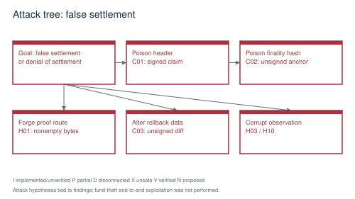

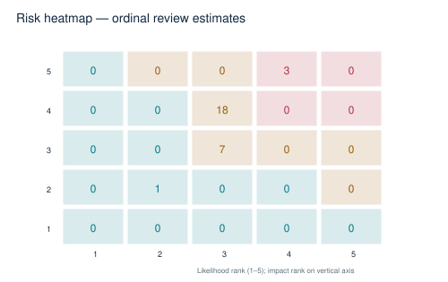

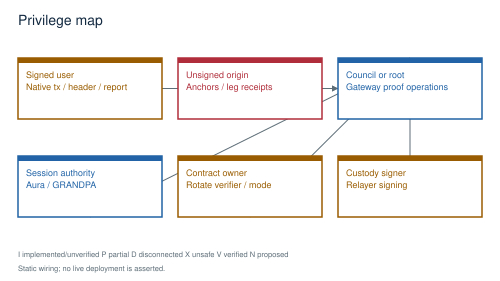

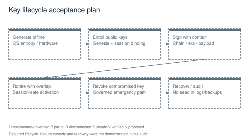

Security controls and remaining exposure
| Boundary | Existing control | Unmitigated risk / required test |
|---|---|---|
| Client → runtime | SCALE signatures + nonce/genesis/era/weight | Custom Ethereum RPC/SDK encoders diverge (H08/H12); test canonical signed wire formats. |
| Unsigned → atomic kernel | Nonzero values, bundle state and recency | No authenticated finality/diff provenance (C02/C03); unauthorized pool and dispatch tests. |
| External chain → header store | Structural checks and byte counts | No authenticated roots or validators (C01); real negative proof vectors. |
| Relayer → gateway | Root/half-council origin | Privileged trust hides broken verifier behavior (H01–H03); proof verification must remain independent. |
| Validator → consensus | Standard Aura/GRANDPA wiring | Custom offence and rotation defects (H04/H05); bond/session tests. |
| Owner → EVM verifier | Ownable administration | Structural mode bypass and incomplete verification (H17); cannot permit on funded deployment. |
| Code → release | CI workflows and gates | Suppressed failures/stale artifacts/advisories (H13–H15); mutation tests for gates. |
| Process → recovery | systemd hardening, archive helper | No observed restore drill; authenticated manifest and state-root verification required. |

Key lifecycle evidence is limited to source wiring: local keystore insertion, configured authority keys, signing libraries and custody-related code. No production key material was read or exported. Development seeds must never silently substitute for custody identities. The relayer builder fallback is a concrete violation (H09). Known test identities in source are development fixtures, not evidence of protected production custody.

## 7  Consensus, Transactions and State Integrity

INVARIANTS / CONSERVATION / RECOVERY

The standard consensus substrate is real code, but project-specific integrations determine whether the system is safe. Block inclusion and finality are separate observations. A local event or a returned transaction hash is not a finalized receipt.

Protocol invariant register
| Invariant | Enforcement evidence | Failure and missing proof |
|---|---|---|
| One finalized history | Aura import + GRANDPA voter, service.rs:601/:1136 | Run partition, equivocation, restart and catch-up; ignored finality tests do not satisfy it. |
| Only authorized validator changes | Root set_validators; runtime SessionManager=X3Consensus | Activation delay ignored by new_session (H05); prove keys and session transition together. |
| Penalty requires an offence | OnOffenceHandler exists | Public report lacks evidence; metadata slash is not currency slash (H04). |
| Replay cannot debit twice | SignedExtra includes genesis/era/nonce | Run duplicates/concurrent nonces through real RPC/pool/finality. |
| Fees conserve balances | ChargeTransactionPayment and CurrencyAdapter | Prove treasury/burn/refund deltas on success and failure with exact runtime. |
| Represented supply ≤ canonical supply | Supply ledger checked arithmetic and on_finalize verification | Bound work (H16); authenticate every credited external leg (C01/H01). |
| Atomic failure restores pre-state | Storage-layer transactions and CompositeReverter | Untrusted prior-state diffs break provenance (C03); restore exact root under induced failure. |
| No fabricated execution/finality proof | Atomic finalization compares anchor and commitment | Anchor is attacker-submittable (C02); nonzero values/public metadata are not proofs. |
| Timed-out escrow is recoverable | Settlement timeout/claim/refund branches | Verify timeout unit conversions, exact boundaries, one-time refund and failure after every leg. |
| Upgrades preserve state meaning | Executive migration tuple | No successful old-schema migration or restoration execution in this audit. |

Genesis constructors distinguish development and live configurations and reject several missing live inputs. Public setup still needs a ceremony with real operator public keys, verified authority uniqueness, council/treasury separation, bootnode identities, chain ID and exact WASM hash. Generated or historical JSON alone is insufficient. Raw and plain chain specs must encode the same intended state.

State is committed through the Substrate backend and runtime execution. Gateway PostgreSQL data is derived/indexed data, not the consensus authority. Reconstructing an index is different from restoring validator state; both need drills. Reorganization handling must distinguish best-head observations from finalized events, including relayer cursor rollback.

## 8  Smart Contracts, VM and Cross-Chain Systems

ATOMICITY / FINALITY / AUTHENTICATION

Internal representation movement, VM opcode execution and asynchronous cross-chain settlement are different capabilities. An atomic FRAME storage transaction can restore local state; it cannot synchronously undo an already-finalized transfer on an external chain. Cross-chain HTLC safety also depends on authenticated observation, timeout ordering, replay protection and eventual refund availability.

Trustless, trusted or unsupported claim?
| Capability | Actual trust / status | Evidence |
|---|---|---|
| Internal representation router | Implemented, runtime proof outstanding | pallets/x3-cross-vm-router; local ledger conservation is not external asset proof. |
| Mini-EVM adapter | Disposable interpreter state; incomplete production execution | H07: synthetic account funding/zero caller and no persisted state changes. |
| SVM / X3 adapters | Partial contexts / unverified runtime semantics | wasm_adapters.rs:86/:182; prove account state and native/WASM parity. |
| Quorum / Solana proof routes | Structural acceptance, currently privileged gateway admission | H01 confirmed arbitrary-byte acceptance. |
| EVM receipt route | Partial inclusion implementation, unauthenticated head/root | H02; canonical independent fixtures required. |
| Bitcoin route | Header PoW helper present, complete chain/output proof absent | H03; asserted depth and missing asset binding. |
| EVM external verifier | Production mode fails closed; owner can enable unverified structural mode | H17; not an operating trustless bridge. |
| EVM/SVM HTLC contracts | Real source, deployment/runtime proof unavailable | Foundry/Anchor tools absent; no on-chain state checked. |
| Atomic proof ledger | PoAE records are not independently authenticated finality/execution | C02/C03 plus public-field receipt commitment. |

Contract review priorities include reentrancy, access control, pause/rotation rights, fee-on-transfer token accounting, refunds at the exact expiry boundary, duplicate claims, integer limits and mismatched chain/domain encodings. AtlasHTLC uses SafeERC20 and ReentrancyGuard in source, but receives a nominal token amount without an observed balance-delta proof. That is a review/test requirement here, not a demonstrated exploit finding. SVM programs need account ownership, signer/PDA constraints, CPI restrictions and proof-instruction binding checks under a local validator.

The Ethereum settlement helper separately derives a block number from tx_hash bytes and equates a transaction hash to a receipt hash (pallets/x3-settlement-engine/src/lib.rs:2124). Those are not canonical Ethereum identifiers. This corroborates C01/H02 interoperability failure, rather than adding duplicate severity counts. Ethereum transaction/receipt conventions are referenced in Appendix E.

## 9  Performance and Scaling

MEASURED / UNMEASURED / TEST DESIGN

No sustained blockchain TPS, network finality latency, recovery time or hardware resource profile was measured. Compiler sample throughput is not blockchain throughput (M07). The benchmark plan below is proposed acceptance work; all metric cells intentionally remain unmeasured.

Benchmark measurements to produce
| Metric | Current measurement | Required experiment |
|---|---|---|
| Finalized unique TPS | NOT MEASURED | Count distinct successful transfers finalized in a stable interval; exclude retries, setup and query-only calls. |
| Latency p50/p95/p99 | NOT MEASURED | Track signed submission → pool admission → inclusion → finality with monotonic timestamps. |
| Mempool capacity | NOT MEASURED | Sweep bounded queue occupancy, fees, invalid nonces and oversized input; measure drops and memory. |
| Validator scaling | NOT MEASURED | Repeat identical workload over 4, then larger authority sets with fixed hardware and latency. |
| State growth | NOT MEASURED | Track database size / finalized transaction and retained proof volume across a long soak. |
| RPC throughput | NOT MEASURED | Separate read-only requests, submission, subscriptions and abusive clients; include error rates. |
| Recovery time | NOT MEASURED | Crash and restore an isolated validator; compare finalized hash/root and catch-up time. |
| CPU/RAM/disk/network | NOT MEASURED | Record node, database, relayer and load-generator resources with sampled raw telemetry. |

Known candidate bottlenecks are whole-asset finalization scans (H16), HashMap relayer event retention/rescan behavior (H10), blocking RPC work in async paths, serialized shared-state access, proof/receipt payload sizes and mandatory hook work that escapes transaction fee limits. These are static candidates, not measured hotspots. Rate-limiter unit tests do not establish whole-node DoS resistance.

### Reproducible experimental protocol

Use four validator processes, separate non-signing load generators, disposable balances, fixed chain spec and exact binary/WASM/lockfile hashes. State CPU model, cores, RAM, disk model, kernel, network delay/loss profile and feature flags. Warm up, execute a fixed transaction mix, record a sustained interval and cool down; repeat enough runs to show variability. Report offered load, accepted load, finalized goodput and failures separately. Do not extrapolate compiler throughput or a single burst.

Failure-under-load scenarios: malformed/oversized input; two clients competing on a nonce; a lost relayer response; disk full in disposable storage; unavailable database; one validator killed; temporary partition; subscription churn; and reconnect during a runtime upgrade. Acceptance requires no supply drift or divergent finalized history. Restore/refund liveness must recover within an explicitly adopted operator SLO.

```text
# Existing compiler-only measurement, not network TPS:
cargo run -p x3-bench -- --baseline
# Network/load harness must be implemented and reviewed first.
# Retain benchmark-results.csv using the schema in this artifact package.
```

## 10  Test and Verification Strategy

OBSERVED RESULTS / MISSING ADVERSARIAL PROOF

Current execution results are in evidence/verification-ledger.json. Failure is retained as evidence; tests that were blocked before execution are not counted as passed or failed test cases. New adversarial proof-router tests intentionally express the safe behavior and currently fail, demonstrating defects in unchanged source.

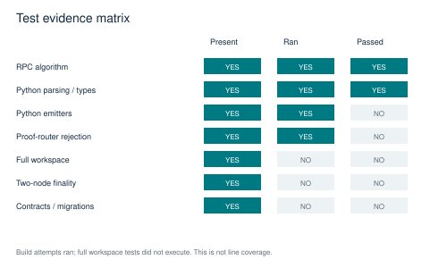

Executed test and build outcomes
| Check | Observed outcome | Limit |
|---|---|---|
| Root check/test/clippy | All exit 101 (continued runs) | E0152 duplicate core in WASM build; no full workspace test result. |
| Release mainnet-rc1 / testnet check | Both exit 101 | Same WASM build blocker. |
| Formatting | Exit 1 | Formatting differences; logs retained. |
| RPC source harness | 4 passed; 0 failed | Unchanged middleware module only. |
| Proof-router adversarial harness | 0 passed; 3 failed | Invalid proofs accepted with production feature. |
| Selected Python DSL tests | 6 passed; 4 failed | Emitter ProofRequiredError; not a live trade test. |
| npm / pnpm / Python alias commands | Unavailable tools/dependencies | pnpm/python absent on PATH; isolated JS installation omitted node_modules. |
| Contracts | forge/anchor not found | No contract build/test/deploy. |
| Python migration collection | 1 collection error | alembic missing; no DB mutation. |
| Configured / unsuppressed audit | 0 / 53 vulnerability matches | Cached DB freshness unknown; runtime reachability not established. |
| Fake-code scan | 54,017 matching locations; grep exit 2 | Traversal/read errors; candidate matches include tests/vendor/docs, not all defects. |

### Unit tests

What could break: Exact function boundaries and arithmetic. Fixtures/environment and procedure: Small deterministic inputs plus error cases; reject malformed lengths, overflow and unauthorized origin.

Pass/fail: All new regression cases pass; retain named test log. CI placement: Per PR. Evidence: logs, source/feature hashes, fixture digests and relevant state roots in a per-run immutable directory.

```text
cargo test -p <affected-package>
```

### Property tests

What could break: Supply/fee/escrow conservation. Fixtures/environment and procedure: Generate transfer/lock/claim/refund sequences over bounded assets, nonces and limits.

Pass/fail: Invariant holds after each successful or failed operation; minimize failing seeds. CI placement: Per PR + nightly. Evidence: logs, source/feature hashes, fixture digests and relevant state roots in a per-run immutable directory.

```text
Proposed property harness in runtime/pallet test modules
```

### Fuzz tests

What could break: Parser/VM/proof malformed input. Fixtures/environment and procedure: Corpus of RLP/SCALE/bytecode/header boundary cases; no production credentials.

Pass/fail: No crash, uncontrolled allocation or acceptance of invalid proof. CI placement: Nightly. Evidence: logs, source/feature hashes, fixture digests and relevant state roots in a per-run immutable directory.

```text
Use inventoried pallet fuzz manifests after dependency/build repair
```

### Integration tests

What could break: RPC to real runtime state. Fixtures/environment and procedure: Fresh node and ephemeral keys; signed transaction through network RPC.

Pass/fail: Inclusion/finality receipt and cross-node persisted state agree. CI placement: Required gate. Evidence: logs, source/feature hashes, fixture digests and relevant state roots in a per-run immutable directory.

```text
cargo test -p x3-chain-node --lib
```

### Migration tests

What could break: Old schema to current state. Fixtures/environment and procedure: Disposable database/runtime snapshots for every supported prior version.

Pass/fail: No loss/duplication; pre/post invariants and replayed roots agree. CI placement: Required upgrade gate. Evidence: logs, source/feature hashes, fixture digests and relevant state roots in a per-run immutable directory.

```text
Runtime try-runtime path + SQL/Alembic upgrade tests
```

### Multi-node tests

What could break: Consensus and finality. Fixtures/environment and procedure: 4 distinct validator processes and keys with isolated ports/data.

Pass/fail: All honest nodes finalize same hash/root; no ignored critical case. CI placement: Required gate. Evidence: logs, source/feature hashes, fixture digests and relevant state roots in a per-run immutable directory.

```text
Repair node service tests and Zombienet config
```

### Partition tests

What could break: Split and reconnect. Fixtures/environment and procedure: Introduce bounded network partitions without external peers.

Pass/fail: No conflicting finality; majority recovery and catch-up demonstrated. CI placement: Nightly/release. Evidence: logs, source/feature hashes, fixture digests and relevant state roots in a per-run immutable directory.

```text
Proposed network-fault harness
```

### Consensus adversary tests

What could break: Equivocation, outsider votes. Fixtures/environment and procedure: Valid authority fixture and distinct unauthorized keys.

Pass/fail: Unauthorized/duplicate/wrong-set evidence rejected; honest liveness preserved. CI placement: Required gate. Evidence: logs, source/feature hashes, fixture digests and relevant state roots in a per-run immutable directory.

```text
cargo test -p x3-chain-node --lib
```

### Contract tests

What could break: HTLC and verifier semantics. Fixtures/environment and procedure: Foundry fuzz/invariant tests; Anchor local validator with funded test accounts.

Pass/fail: Invalid proofs never release; claim/refund once only; accounting conserved. CI placement: Required contract gate. Evidence: logs, source/feature hashes, fixture digests and relevant state roots in a per-run immutable directory.

```text
forge test --root X3-contracts/evm; Anchor workspace local tests
```

### Cross-chain tests

What could break: Authenticated deposit/release. Fixtures/environment and procedure: Local chains or recorded independent proofs; relayer isolated from live keys.

Pass/fail: Exact asset/sender/recipient/amount and finality verified at each leg. CI placement: Required bridge gate. Evidence: logs, source/feature hashes, fixture digests and relevant state roots in a per-run immutable directory.

```text
Audit proof harness + real gateway runtime tests
```

### Load / soak tests

What could break: Sustained resource pressure. Fixtures/environment and procedure: Fixed workload; resource telemetry and unique finalized transaction IDs.

Pass/fail: No unbounded growth/supply drift; adopted latency/error SLO met. CI placement: Release/nightly. Evidence: logs, source/feature hashes, fixture digests and relevant state roots in a per-run immutable directory.

```text
Proposed load harness; schema in benchmark-results.csv
```

### Chaos tests

What could break: Disk/DB/process failure. Fixtures/environment and procedure: Disposable services, controllable storage quotas and process supervision.

Pass/fail: No corrupted accepted state; bounded recovery and correct retries. CI placement: Release. Evidence: logs, source/feature hashes, fixture digests and relevant state roots in a per-run immutable directory.

```text
Proposed isolated chaos harness
```

### Upgrade tests

What could break: Runtime and authority transition. Fixtures/environment and procedure: Old and new binaries with pinned state snapshots and session schedule.

Pass/fail: Migration invariants and one finalized history; compatible rollback defined. CI placement: Required upgrade gate. Evidence: logs, source/feature hashes, fixture digests and relevant state roots in a per-run immutable directory.

```text
cargo test -p x3-chain-runtime --features try-runtime
```

### Backup / restore tests

What could break: Data reconstruction. Fixtures/environment and procedure: Authenticated snapshot plus independent finalized root and off-host copy.

Pass/fail: Tamper rejected; restored node reaches recorded root and catches up. CI placement: Release + periodic. Evidence: logs, source/feature hashes, fixture digests and relevant state roots in a per-run immutable directory.

```text
Review then exercise scripts/snapshot-restore.sh on disposable paths
```

### Security tests

What could break: Critical regression suite. Fixtures/environment and procedure: The C01–C03/H01–H18 acceptance cases and source-bound evidence.

Pass/fail: Zero open applicable Critical/High; no waived fund-safety tests. CI placement: Required gate. Evidence: logs, source/feature hashes, fixture digests and relevant state roots in a per-run immutable directory.

```text
Affected package tests and independent review retest
```

### End-to-end tests

What could break: Wallet to finalized settlement. Fixtures/environment and procedure: Real SDK/wallet encoding, pool, node, receipt, indexing and restart.

Pass/fail: User-visible success only after required finality; failures/refunds displayed honestly. CI placement: Required gate. Evidence: logs, source/feature hashes, fixture digests and relevant state roots in a per-run immutable directory.

```text
Implement scoped e2e flow in tests/e2e
```

## 11  Operations and Deployment

FRESH MACHINE / VALIDATOR / RECOVERY

A new operator cannot be told that this source state safely launches a public validator: audited build commands fail, no signed release/genesis was verified, and critical runtime defects remain. Installation and local launch commands below are inferred from the repository and are blocked procedures, not instructions to activate a live network now.

```text
# In a fresh isolated checkout matching provenance + dirty-source hashes:
rustc --version
cargo --version
protoc --version
clang --version
cargo check --workspace
cargo test --workspace
cargo clippy --workspace --all-targets -- -D warnings
cargo build --locked --release -p x3-chain-node --features mainnet-rc1
# BLOCKED by H18 in this audit. After repair, local-only smoke:
./target/release/x3-chain-node --chain dev --tmp --rpc-port 9933 --validator --alice --no-telemetry
```

Repository Rust pin is 1.90.0 with rust-src/clippy/rustfmt and wasm32-unknown-unknown. The build also needs native compiler/protobuf/LLVM tooling and cached or approved locked dependencies. Root package.json specifies pnpm 10.15.1; no pnpm installation was available on audit PATH. The JS copy deliberately excluded node_modules, so missing tsc/vitest is an isolated-install blocker, not proof that the original installed applications cannot build. Python 3.10 with pytest was usable as /usr/bin/python3; python alias was absent. Foundry/Anchor were unavailable. Do not download and execute installer scripts without reviewing/pinning them.

### Production deployment checklist

Require source-bound signed artifacts; verify chain/genesis/WASM identity; use least-privilege user; isolate DB/metrics/admin ports; configure TLS RPC and rate limits; verify dependency readiness; keep documented rollback and on-call ownership. Status: NOT PROVEN for this audited state; checklist text earns no readiness credit.

### Validator launch checklist

Generate separate session/custody keys; validate authority public-key uniqueness and balances; confirm correct spec and distinct data path; expose only P2P; verify peers, authoring and finalized head; prove restart without key leakage. Status: NOT PROVEN for this audited state; checklist text earns no readiness credit.

### Public testnet launch checklist

Close P0s; run 4-node fault tests; publish exact scope and disabled routes; establish telemetry/alerts, abuse controls, faucet limits, incident channel and restore proof; require accountable sign-off. Status: NOT PROVEN for this audited state; checklist text earns no readiness credit.

### Mainnet launch checklist

Zero applicable Critical/High; independent retest; reproducible release/WASM/genesis; custody rotation/recovery; supply/fee audit; validated upgrade/rollback; nonwaivable safety gates; approve exact hashes. Status: NOT PROVEN for this audited state; checklist text earns no readiness credit.

### Emergency shutdown checklist

Pause affected route/module through documented authorized control; avoid halting refunds unnecessarily; stop compromised signers; preserve logs/state evidence; coordinate validators; verify balances and finalized history before resuming. Status: NOT PROVEN for this audited state; checklist text earns no readiness credit.

### Upgrade and rollback checklist

Replay old snapshot into candidate; run migrations and invariant checks; verify session boundary; canary under identical spec; retain prior binary/state; never blindly run an old binary over a changed schema. Status: NOT PROVEN for this audited state; checklist text earns no readiness credit.

### Backup restoration drill checklist

Stop only the disposable validator; hash/authenticate archive and manifest; restore to empty isolated path; verify genesis, schema and recorded finalized root; reconnect to isolated peers and prove catch-up; record RPO/RTO measurements. Status: NOT PROVEN for this audited state; checklist text earns no readiness credit.

packaging/systemd/x3-validator.service uses an unprivileged user and filesystem/process hardening, providing a useful starting point. Inspect actual effective service configuration before use. Some infra assets are development scaffolding (including dev-mode secret service and unpinned image tags); these must not be promoted wholesale to production. No infrastructure secrets were copied into this package.

## 12  The Completion Blueprint

DEPENDENCIES / OWNERS / ACCEPTANCE

Each confirmed finding becomes an engineering work item with a unique ID, exact affected files, dependencies, acceptance criteria, test command, owner and rollback plan. The task register is machine-readable in recovery-plan.json. Ordinal S/M/L/XL estimates communicate relative complexity only. Team capacity and unknown protocol decisions make calendar commitments unjustified.

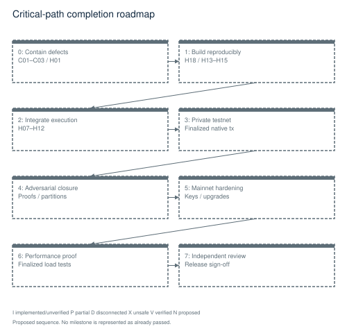

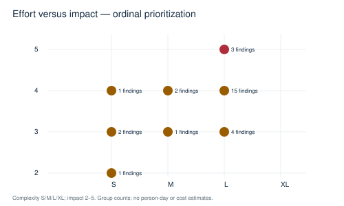


Engineering phases
| Phase / purpose | Work items | Exit condition |
|---|---|---|
| 0 Stop-the-line security and integrity | C01,C02,C03,H01,H03,H04,H06 | Contain unsigned/structural trust paths and validate their replacements. |
| 1 Restore core build and proof controls | H18,H13,H14,H15 | Produce a clean build and gates that cannot hide failed evidence. |
| 2 Complete runtime integration | H02,H05,H07,H08,H09,H10,H11,H12,H17,M05 | Wire persistent execution and authenticated submission; no path-existence credit. |
| 3 Public testnet prerequisites | M02,L01 | Require isolated multi-node finality/recovery and reproducible operator setup. |
| 4 Adversarial stabilization | All safety finding retests | Run partitions, malformed proofs, replay, rollback and unauthorized-origin tests. |
| 5 Mainnet hardening | H16,M03,M04,M06 | Bound resources; prove event delivery, key lifecycle and restore/upgrade. |
| 6 Performance optimization | M07 | Measure genuine finalized workloads before optimization. |
| 7 Independent review and approval | M01 + complete gate register | Retest closure independently and approve exact release/spec hashes. |

Parallelization potential: SDK repairs, gateway startup, CI corrections and independent proof-verifier implementations can proceed once interfaces and source state are fixed. Final integration must serialize around runtime metadata, proof envelope format, genesis and storage migrations. Do not run multiple independent writers against custody state or shared migration databases.

### FIX-C01 / External header validation accepts unproved claims

P0 | Protocol security | Complexity L | Risk Critical. Dependencies: None specific; H18 controls runtime execution proof.

Files: pallets/cross-chain-validator/src/lib.rs:181; pallets/cross-chain-validator/src/lib.rs:332; pallets/cross-chain-validator/src/lib.rs:279; runtime/src/lib.rs:2412; runtime/src/lib.rs:980

Implementation: Use authenticated chain-specific finalized-header clients with trusted validator/checkpoint transitions, verified signatures, bounded proofs, and authenticated parent links. Reject unsupported chains.

Acceptance: Arbitrary hashes, duplicate signers, self-selected validator sets, future heights and invalid membership proofs are rejected without writes; canonical external fixtures pass.

```text
cargo test -p pallet-cross-chain-validator --features std
```

Retain: closure/C01/manifest.json with exact source/features, raw test logs and relevant roots/receipts. Rollback: Retain the previous signed binary and state snapshot; never downgrade across changed storage without a tested reverse migration. Keep affected entrypoints disabled if rollback cannot preserve state.

### FIX-C02 / Unsigned finality anchors make certificate checks circular

P0 | Protocol security | Complexity L | Risk Critical. Dependencies: None specific; H18 controls runtime execution proof.

Files: pallets/x3-atomic-kernel/src/lib.rs:884; pallets/x3-atomic-kernel/src/lib.rs:1118; pallets/x3-atomic-kernel/src/lib.rs:1416

Implementation: Validate an actual GRANDPA justification or authenticated authority certificate bound to block hash, number, set ID and chain ID; remove arbitrary unsigned anchor admission.

Acceptance: Forged and conflicting anchors cannot enter pool or dispatch; independently verified justification anchors the exact finalized block; late legitimate anchors remain recoverable.

```text
cargo test -p pallet-x3-atomic-kernel --features std
```

Retain: closure/C02/manifest.json with exact source/features, raw test logs and relevant roots/receipts. Rollback: Retain the previous signed binary and state snapshot; never downgrade across changed storage without a tested reverse migration. Keep affected entrypoints disabled if rollback cannot preserve state.

### FIX-C03 / Unsigned rollback receipts trust attacker-selected prior state

P0 | Protocol security | Complexity L | Risk Critical. Dependencies: FIX-C02

Files: pallets/x3-atomic-kernel/src/lib.rs:1030; pallets/x3-atomic-kernel/src/lib.rs:1150; pallets/x3-atomic-kernel/src/lib.rs:1289; pallets/x3-atomic-kernel/src/vm_revert.rs:342; runtime/src/lib.rs:2675

Implementation: Generate diffs inside transactional execution, bind them to executor/leg/pre-state/access set, and validate both old and current values. Roll back in reverse dependency order with complete failure propagation.

Acceptance: Unrelated caller/diff and stale pre-state are rejected; injected rollback failure leaves no partial state; reverse-order replay restores exact pre-root.

```text
cargo test -p pallet-x3-atomic-kernel --features std
```

Retain: closure/C03/manifest.json with exact source/features, raw test logs and relevant roots/receipts. Rollback: Retain the previous signed binary and state snapshot; never downgrade across changed storage without a tested reverse migration. Keep affected entrypoints disabled if rollback cannot preserve state.

### FIX-H01 / Production proof-router alternatives accept arbitrary bytes

P0 | Protocol security | Complexity L | Risk High. Dependencies: FIX-C01

Files: crates/x3-verification-router/src/lib.rs:323; crates/x3-verification-router/src/lib.rs:355; crates/x3-verification-router/src/lib.rs:276; pallets/x3-crosschain-gateway/src/lib.rs:1162; runtime/src/lib.rs:2479

Implementation: Remove structural verifiers from production and implement signature membership, unique quorum, chain binding and event inclusion; retain governance admission only as defense in depth.

Acceptance: All three isolated rejection tests pass; actual signed finalized fixtures pass through the runtime gateway, not only the helper.

```text
cargo test --manifest-path audit-harness/proof/Cargo.toml
```

Retain: closure/H01/manifest.json with exact source/features, raw test logs and relevant roots/receipts. Rollback: Retain the previous signed binary and state snapshot; never downgrade across changed storage without a tested reverse migration. Keep affected entrypoints disabled if rollback cannot preserve state.

### FIX-H02 / EVM receipt verifier lacks trusted roots and misbinds inclusion

P0 | Protocol security | Complexity L | Risk High. Dependencies: FIX-C01

Files: crates/x3-verification-router/src/evm_receipt.rs:737; crates/x3-verification-router/src/evm_receipt.rs:593; crates/x3-verification-router/src/evm_receipt.rs:335

Implementation: Use canonical typed receipts and RLP(index), verify the exact receipt value under an authenticated receiptsRoot, bind gateway/event/amount/sender/recipient/chain, and verify finality separately.

Acceptance: Cross-check independent execution-client proof vectors, tampered receipt values and false heads; require both authentic root and exact inclusion.

```text
cargo test -p x3-verification-router --features production
```

Retain: closure/H02/manifest.json with exact source/features, raw test logs and relevant roots/receipts. Rollback: Retain the previous signed binary and state snapshot; never downgrade across changed storage without a tested reverse migration. Keep affected entrypoints disabled if rollback cannot preserve state.

### FIX-H03 / Bitcoin verification uses asserted confirmations and incomplete vault approval

P0 | Protocol security | Complexity L | Risk High. Dependencies: FIX-H01

Files: crates/x3-verification-router/src/lib.rs:557; crates/x3-verification-router/src/lib.rs:617; crates/x3-bitcoin-vault/src/lib.rs:324; crates/x3-bitcoin-vault/src/lib.rs:450

Implementation: Implement persistent best-work header validation with checkpoints/difficulty rules and transaction output proofs; verify distinct authorized signatures over exact deposit/withdrawal payloads.

Acceptance: Reject invented tips, wrong outputs, wrong recipient/value, repeated approvals and forged signatures; restart and reorg tests preserve accounting.

```text
cargo test -p x3-bitcoin-vault && cargo test -p x3-verification-router --features production
```

Retain: closure/H03/manifest.json with exact source/features, raw test logs and relevant roots/receipts. Rollback: Retain the previous signed binary and state snapshot; never downgrade across changed storage without a tested reverse migration. Keep affected entrypoints disabled if rollback cannot preserve state.

### FIX-H04 / Public misbehavior report has no evidence and does not slash currency

P0 | Protocol security | Complexity L | Risk High. Dependencies: None specific; H18 controls runtime execution proof.

Files: pallets/x3-consensus/src/lib.rs:263; pallets/x3-consensus/src/lib.rs:381; pallets/x3-consensus/src/tests/slashing.rs:31; runtime/src/lib.rs:1063

Implementation: Route offenses through validated equivocation/unavailability evidence with unique offence IDs; reserve real stake, slash it atomically and coordinate session removal.

Acceptance: Invalid/replayed evidence cannot slash; total reserved balances and treasury/burn conservation reconcile after each valid offence; removed keys cannot author/vote.

```text
cargo test -p pallet-x3-consensus --features std
```

Retain: closure/H04/manifest.json with exact source/features, raw test logs and relevant roots/receipts. Rollback: Retain the previous signed binary and state snapshot; never downgrade across changed storage without a tested reverse migration. Keep affected entrypoints disabled if rollback cannot preserve state.

### FIX-H05 / Validator rotation ignores requested activation delay at session boundary

P0 | Protocol security | Complexity L | Risk High. Dependencies: FIX-H04

Files: pallets/x3-consensus/src/lib.rs:229; pallets/x3-consensus/src/lib.rs:412; runtime/src/lib.rs:1042

Implementation: Use one activation state machine for queued keys, session selection and metadata. Reject empty/duplicate/unkeyed sets and enforce the same scheduled boundary.

Acceptance: A change delayed over several sessions is not activated early; restart and session transition preserve identical authority sets on all nodes.

```text
cargo test -p pallet-x3-consensus --features std
```

Retain: closure/H05/manifest.json with exact source/features, raw test logs and relevant roots/receipts. Rollback: Retain the previous signed binary and state snapshot; never downgrade across changed storage without a tested reverse migration. Keep affected entrypoints disabled if rollback cannot preserve state.

### FIX-H06 / Flash-finality opt-in disables GRANDPA without a proven replacement

P0 | Protocol security | Complexity L | Risk High. Dependencies: None specific; H18 controls runtime execution proof.

Files: node/src/service.rs:656; node/src/service.rs:962; node/src/service.rs:1937; crates/flash-finality/src/lib.rs:389

Implementation: Keep GRANDPA mandatory until a separately audited finality engine proves authority membership, safety and liveness; reject incompatible flags or missing keys at startup.

Acceptance: Wrong keys/sets cannot form certificates; missing keys fail startup; partition, equivocation and recovery tests establish one finalized history.

```text
cargo test -p x3-chain-node --lib
```

Retain: closure/H06/manifest.json with exact source/features, raw test logs and relevant roots/receipts. Rollback: Retain the previous signed binary and state snapshot; never downgrade across changed storage without a tested reverse migration. Keep affected entrypoints disabled if rollback cannot preserve state.

### FIX-H07 / Default mini-EVM executes against disposable synthetic state

P0 | Protocol security | Complexity L | Risk High. Dependencies: FIX-C03

Files: crates/evm-integration/src/mini_evm.rs:102; crates/evm-integration/src/mini_evm.rs:148; pallets/x3-kernel/src/wasm_adapters.rs:34; runtime/src/lib.rs:1564

Implementation: Connect actual runtime state, caller/value, logs, state commitment and gas charging through a transactional interpreter; run canonical EVM conformance tests.

Acceptance: A contract SSTORE persists across blocks/restart, a second user cannot impersonate the first, out-of-gas fully reverts and fees reconcile.

```text
cargo test -p x3-chain-runtime --features frontier
```

Retain: closure/H07/manifest.json with exact source/features, raw test logs and relevant roots/receipts. Rollback: Retain the previous signed binary and state snapshot; never downgrade across changed storage without a tested reverse migration. Keep affected entrypoints disabled if rollback cannot preserve state.

### FIX-H08 / Ethereum submission RPC bypasses the transaction-pool lifecycle

P0 | Protocol security | Complexity L | Risk High. Dependencies: FIX-H07

Files: node/src/rpc_frontier.rs:457; runtime/src/lib.rs:3425; node/src/rpc.rs:341

Implementation: Decode and verify canonical signed transactions and submit an appropriate runtime extrinsic through the pool; report receipts only after inclusion and finality.

Acceptance: Submit a signed transfer over RPC, observe pool admission, block inclusion, finality and persisted balance change on another node; reject replay/wrong chain ID.

```text
cargo test -p x3-chain-node --features frontier --lib
```

Retain: closure/H08/manifest.json with exact source/features, raw test logs and relevant roots/receipts. Rollback: Retain the previous signed binary and state snapshot; never downgrade across changed storage without a tested reverse migration. Keep affected entrypoints disabled if rollback cannot preserve state.

### FIX-H09 / Relayer manual extrinsic encoding and signing do not match runtime

P0 | Protocol security | Complexity L | Risk High. Dependencies: FIX-H01, FIX-H08

Files: crates/x3-relayer/src/submitter.rs:437; crates/x3-relayer/src/submitter.rs:568; runtime/src/lib.rs:850

Implementation: Use metadata-derived typed calls and the exact signed extensions, chain/genesis versions and custody signer; introduce an explicit governed relayer authorization model.

Acceptance: Exact production runtime decodes, authenticates, includes and finalizes generated deposit/release transactions; no fallback signer or zero-chain context.

```text
cargo test -p x3-relayer
```

Retain: closure/H09/manifest.json with exact source/features, raw test logs and relevant roots/receipts. Rollback: Retain the previous signed binary and state snapshot; never downgrade across changed storage without a tested reverse migration. Keep affected entrypoints disabled if rollback cannot preserve state.

### FIX-H10 / Relayer checkpoints can skip failed events and are not durable

P0 | Protocol security | Complexity L | Risk High. Dependencies: FIX-H09

Files: crates/x3-relayer/src/main.rs:535; crates/x3-relayer/src/main.rs:795; crates/x3-relayer/src/main.rs:827

Implementation: Persist transactional inbox/outbox and per-event delivery state; checkpoint only a contiguous completed finalized range with reorg rollback and idempotent retries.

Acceptance: Fail submission for an early event, process later events, restart and recover the failed event exactly once; bound RPC scans and memory.

```text
cargo test -p x3-relayer
```

Retain: closure/H10/manifest.json with exact source/features, raw test logs and relevant roots/receipts. Rollback: Retain the previous signed binary and state snapshot; never downgrade across changed storage without a tested reverse migration. Keep affected entrypoints disabled if rollback cannot preserve state.

### FIX-H11 / Gateway binary never starts its REST/GraphQL implementation

P1 | Backend / SRE | Complexity L | Risk High. Dependencies: None specific; H18 controls runtime execution proof.

Files: crates/x3-gateway/src/main.rs:1; crates/x3-gateway/Cargo.toml:12; crates/x3-gateway/src/rest.rs:85

Implementation: Implement validated configuration loading, database migrations, cache setup, router binding and graceful shutdown; expose dependency readiness separately from liveness.

Acceptance: Start the built binary against disposable services, serve actual API/GraphQL data, fail readiness when DB is down, and recover after restart.

```text
cargo test -p x3-gateway && cargo run -p x3-gateway
```

Retain: closure/H11/manifest.json with exact source/features, raw test logs and relevant roots/receipts. Rollback: Retain the previous signed binary and state snapshot; never downgrade across changed storage without a tested reverse migration. Keep affected entrypoints disabled if rollback cannot preserve state.

### FIX-H12 / SDK EVM and SVM encoding contains production placeholders

P1 | SDK engineer | Complexity L | Risk High. Dependencies: None specific; H18 controls runtime execution proof.

Files: packages/ts-sdk/src/evm.ts:140; packages/ts-sdk/src/evm.ts:154; packages/ts-sdk/src/evm.ts:440; packages/ts-sdk/src/svm.ts:230

Implementation: Use canonical Keccak address/selector derivation and canonical Solana message compilation with real account metas and program indices.

Acceptance: Match independent reference vectors for EVM selectors/addresses and multi-account SVM messages, then finalize one transaction per advertised protocol.

```text
npm --prefix packages/ts-sdk test -- --runInBand
```

Retain: closure/H12/manifest.json with exact source/features, raw test logs and relevant roots/receipts. Rollback: Retain the previous signed binary and state snapshot; never downgrade across changed storage without a tested reverse migration. Keep affected entrypoints disabled if rollback cannot preserve state.

### FIX-H13 / CI make recipes swallow failures and reference missing targets

P0 | Release engineering | Complexity S | Risk High. Dependencies: None specific; H18 controls runtime execution proof.

Files: Makefile:19; Makefile:29; Makefile:38; .github/workflows/production-gate.yml:25

Implementation: Preserve exit codes, use exact package names and define/reconcile workflow targets; test gates against a deliberately failing test in disposable fixtures.

Acceptance: Cargo failure produces nonzero make/CI exit; every workflow command resolves; mainnet-required aggregate cannot pass with skipped/missing jobs.

```text
make test-x3-wallet; make -n test-node-build
```

Retain: closure/H13/manifest.json with exact source/features, raw test logs and relevant roots/receipts. Rollback: Retain the previous signed binary and state snapshot; never downgrade across changed storage without a tested reverse migration. Keep affected entrypoints disabled if rollback cannot preserve state.

### FIX-H14 / Release gate accepts stale build artifacts without source binding

P0 | Release engineering | Complexity M | Risk High. Dependencies: FIX-H13

Files: scripts/mainnet_release_gate.py:84; scripts/mainnet_release_gate.py:118

Implementation: Build from a clean locked commit, verify compiler/runtime/features, regenerate genesis, sign a source-bound manifest and reject dirty or stale evidence.

Acceptance: Mutating source or substituting a binary/spec invalidates evidence and blocks release; two builders reproduce the same WASM.

```text
python3 scripts/mainnet_release_gate.py
```

Retain: closure/H14/manifest.json with exact source/features, raw test logs and relevant roots/receipts. Rollback: Retain the previous signed binary and state snapshot; never downgrade across changed storage without a tested reverse migration. Keep affected entrypoints disabled if rollback cannot preserve state.

### FIX-H15 / Dependency audit pass masks unresolved advisory matches

P0 | Security / dependency engineering | Complexity L | Risk High. Dependencies: FIX-H13

Files: .cargo/audit.toml:1; Cargo.lock:1; evidence/advisories-unfiltered.json

Implementation: Triage each advisory against shipped binaries/features; upgrade affected paths and narrowly justify time-limited exceptions with technical evidence. Verify fresh official advisory data before release.

Acceptance: No reachable unmitigated critical/high advisories; exceptions have owners, expiry, exact dependency paths and regression evidence.

```text
cargo audit --no-fetch --stale --no-yanked --file Cargo.lock --json
```

Retain: closure/H15/manifest.json with exact source/features, raw test logs and relevant roots/receipts. Rollback: Retain the previous signed binary and state snapshot; never downgrade across changed storage without a tested reverse migration. Keep affected entrypoints disabled if rollback cannot preserve state.

### FIX-H16 / Supply invariant finalization work is unbounded by asset count

P0 | Runtime performance | Complexity L | Risk High. Dependencies: FIX-C01

Files: pallets/x3-supply-ledger/src/lib.rs:158; pallets/x3-supply-ledger/src/lib.rs:166

Implementation: Bound asset cardinality/work or use an incremental authenticated aggregate; benchmark and reserve hook weight with proof size accounting.

Acceptance: Worst-case asset count fits declared block budget; adversarial asset creation cannot make next-block mandatory work unbounded.

```text
cargo test -p pallet-x3-supply-ledger --features std
```

Retain: closure/H16/manifest.json with exact source/features, raw test logs and relevant roots/receipts. Rollback: Retain the previous signed binary and state snapshot; never downgrade across changed storage without a tested reverse migration. Keep affected entrypoints disabled if rollback cannot preserve state.

### FIX-H17 / EVM external verifier is blocked in production and bypassable by mode

P0 | Smart-contract security | Complexity L | Risk High. Dependencies: FIX-H01

Files: X3-contracts/evm/contracts/EvmReceiptVerifier.sol:205; X3-contracts/evm/contracts/EvmReceiptVerifier.sol:183; X3-contracts/evm/contracts/EvmReceiptVerifier.sol:73

Implementation: Deploy a real supported verifier with domain/set binding and unique quorum; remove bypass from funded deployments and govern rotations with delays.

Acceptance: Real proof accepted, zero/duplicate/forged signatures rejected; funded deployment cannot enable structural bypass; owner rotation preserves trust policy.

```text
forge test --root X3-contracts/evm
```

Retain: closure/H17/manifest.json with exact source/features, raw test logs and relevant roots/receipts. Rollback: Retain the previous signed binary and state snapshot; never downgrade across changed storage without a tested reverse migration. Keep affected entrypoints disabled if rollback cannot preserve state.

### FIX-M01 / Readiness documentation contradicts executable evidence

P2 | Release / technical writing | Complexity S | Risk Medium. Dependencies: None specific; H18 controls runtime execution proof.

Files: CURRENT_MAINNET_STATUS.md:3; CURRENT_MAINNET_STATUS.md:63; FEATURE_REGISTRY.toml:18; evidence/consistency.log

Implementation: Generate status from commit-bound feature proof criteria and preserve blocked/failed results. Remove operational claims that only have path-existence evidence.

Acceptance: Any failed core proof lowers its status; stale commit evidence is rejected; readiness prose and matrix derive from the same data.

```text
bash scripts/check-readiness-consistency.sh
```

Retain: closure/M01/manifest.json with exact source/features, raw test logs and relevant roots/receipts. Rollback: Retain the previous signed binary and state snapshot; never downgrade across changed storage without a tested reverse migration. Keep affected entrypoints disabled if rollback cannot preserve state.

### FIX-M02 / Finality and multi-node proof tests are ignored

P1 | Distributed-systems QA | Complexity L | Risk Medium. Dependencies: FIX-H13

Files: node/src/service.rs:2429; node/src/service.rs:2580; node/src/service.rs:2664

Implementation: Run each node in a separate process with isolated logger/ports/data; hard-gate finalized transaction and reconnect recovery tests.

Acceptance: At least four validators agree on finalized hash/root through restart and one-node failure; ignored critical tests count as release failure.

```text
cargo test -p x3-chain-node two_validator_nodes_submit_on_first_observe_finalized_bridge_state_on_second -- --ignored --nocapture
```

Retain: closure/M02/manifest.json with exact source/features, raw test logs and relevant roots/receipts. Rollback: Retain the previous signed binary and state snapshot; never downgrade across changed storage without a tested reverse migration. Keep affected entrypoints disabled if rollback cannot preserve state.

### FIX-M03 / Gateway health and event spines do not prove dependencies

P2 | Observability / SRE | Complexity L | Risk Medium. Dependencies: FIX-H11

Files: crates/x3-gateway/src/rest.rs:248; runtime/src/lib.rs:11; runtime/src/lib.rs:24

Implementation: Separate liveness/readiness, probe DB/indexer lag and durable event delivery, and make missing required consumers explicit startup/readiness failures.

Acceptance: Stop database/event sink and see readiness fail; replay missed events exactly once after recovery.

```text
cargo test -p x3-gateway
```

Retain: closure/M03/manifest.json with exact source/features, raw test logs and relevant roots/receipts. Rollback: Retain the previous signed binary and state snapshot; never downgrade across changed storage without a tested reverse migration. Keep affected entrypoints disabled if rollback cannot preserve state.

### FIX-M04 / Restore validates archive shape, not trusted checksum or chain state

P2 | SRE / storage | Complexity L | Risk Medium. Dependencies: FIX-H14

Files: scripts/snapshot-restore.sh:130; scripts/snapshot-restore.sh:141

Implementation: Verify authenticated manifest, confined archive paths, chain/genesis/schema identity and finalized state before activation.

Acceptance: Tampered archive fails before extraction; restored node catches up and matches independently recorded finalized state.

```text
bash -n scripts/snapshot-restore.sh
```

Retain: closure/M04/manifest.json with exact source/features, raw test logs and relevant roots/receipts. Rollback: Retain the previous signed binary and state snapshot; never downgrade across changed storage without a tested reverse migration. Keep affected entrypoints disabled if rollback cannot preserve state.

### FIX-M05 / Python DSL emitter tests fail under the current proof contract

P1 | Language / SDK | Complexity L | Risk Medium. Dependencies: FIX-H01

Files: x3-lang/emitter/x3.py:60; x3-lang/tests/test_emitter.py:1; evidence/dsl-tests.log

Implementation: Supply real verification fixtures and reconcile emitters, runner and CLI contracts without weakening fail-closed proof checks.

Acceptance: All emitter tests pass with independently validated proof fixtures and reject empty/tampered bundles; one local end-to-end emission is consumed by the real runtime.

```text
/usr/bin/python3 -m pytest -q x3-lang/tests/test_emitter.py
```

Retain: closure/M05/manifest.json with exact source/features, raw test logs and relevant roots/receipts. Rollback: Retain the previous signed binary and state snapshot; never downgrade across changed storage without a tested reverse migration. Keep affected entrypoints disabled if rollback cannot preserve state.

### FIX-M06 / Desktop defaults select an unregistered chain

P2 | Desktop / wallet | Complexity S | Risk Medium. Dependencies: None specific; H18 controls runtime execution proof.

Files: apps/x3-desktop/src/blockchain/ChainManager.ts:59; apps/x3-desktop/src/blockchain/ChainManager.ts:117

Implementation: Register configured enabled adapters and select an initialized network by verified chain/genesis identity; use secure transport for public endpoints.

Acceptance: Default startup obtains the intended adapter, missing network fails clearly, and wrong genesis cannot be signed against.

```text
npm --prefix apps/x3-desktop test
```

Retain: closure/M06/manifest.json with exact source/features, raw test logs and relevant roots/receipts. Rollback: Retain the previous signed binary and state snapshot; never downgrade across changed storage without a tested reverse migration. Keep affected entrypoints disabled if rollback cannot preserve state.

### FIX-M07 / Optimizer throughput is not network TPS evidence

P3 | Performance engineering | Complexity M | Risk Medium. Dependencies: None specific; H18 controls runtime execution proof.

Files: crates/x3-bench/src/main.rs:3; crates/x3-bench/src/runner.rs:251

Implementation: Keep compiler metrics labeled; add finalized unique transaction load tests with latency histograms and resource/recovery evidence.

Acceptance: Publish reproducible sustained finalized TPS, rejection rate, p50/p95/p99 finality latency and hardware/profile/commit details; no synthetic metric substitution.

```text
cargo run -p x3-bench -- --baseline
```

Retain: closure/M07/manifest.json with exact source/features, raw test logs and relevant roots/receipts. Rollback: Retain the previous signed binary and state snapshot; never downgrade across changed storage without a tested reverse migration. Keep affected entrypoints disabled if rollback cannot preserve state.

### FIX-L01 / Fresh-machine helper does not verify the required environment

P2 | Developer experience | Complexity S | Risk Low. Dependencies: None specific; H18 controls runtime execution proof.

Files: scripts/fresh_machine_check.sh:5; Makefile:61; rust-toolchain.toml:3

Implementation: Validate exact tools/versions, native libraries and lockfile installs; distinguish unavailable tool from failed project test.

Acceptance: Clean image builds all intended targets and runs real smoke tests with explicit offline/cache prerequisites.

```text
bash scripts/fresh_machine_check.sh
```

Retain: closure/L01/manifest.json with exact source/features, raw test logs and relevant roots/receipts. Rollback: Retain the previous signed binary and state snapshot; never downgrade across changed storage without a tested reverse migration. Keep affected entrypoints disabled if rollback cannot preserve state.

### FIX-H18 / Workspace verification fails in WASM runtime build

P1 | Rust build / release engineering | Complexity M | Risk High. Dependencies: None specific; H18 controls runtime execution proof.

Files: runtime/build.rs:1; rust-toolchain.toml:3; evidence/check-complete.log; evidence/test-complete.log; evidence/clippy-complete.log

Implementation: Reconcile pinned rust-src/target/build-std configuration and dependency build graph in a fresh build directory; preserve both native and WASM validation without skip-WASM workarounds.

Acceptance: From the frozen source state, all required workspace checks and release/testnet feature builds exit zero and produce source-bound artifacts.

```text
cargo check --workspace && cargo test --workspace && cargo clippy --workspace --all-targets -- -D warnings
```

Retain: closure/H18/manifest.json with exact source/features, raw test logs and relevant roots/receipts. Rollback: Retain the previous signed binary and state snapshot; never downgrade across changed storage without a tested reverse migration. Keep affected entrypoints disabled if rollback cannot preserve state.

### Kanban and risk retirement

Current board: all findings are Open; no implementation repairs were authorized by the read-only audit. Ready-for-work means scope, owner and acceptance are agreed. In-progress means code/tests exist in an isolated branch. Review-ready requires current passing evidence. Closed requires independent retest and integrated runtime proof. Risk burn-down is the count of independently closed findings over time; no invented falling curve is plotted.

Testnet definition of done: safe disabled scope, clean build, four-validator finalized transaction proof, replay/rollback/supply closure, network/restart/recovery tests and operational readiness. Mainnet adds independent audit closure, authenticated enabled external routes, custody/genesis ceremony, upgrade/disaster-recovery drills, measured capacity and exact artifact sign-off. A calendar date cannot substitute for either definition.

## 13  Funding and Partnership Readiness

HONEST MILESTONES / TECHNICAL PROOF

The technically compelling opportunity is a unified native execution and asset-accounting platform with explicit cross-VM intent/settlement abstractions. The investable engineering case is a milestone program that closes verified gaps, not a claim of a finished high-throughput trustless network. No market size, valuation, partnership or endorsement is asserted.

Milestone-based funding packages
| Milestone / sponsor value | Deliverable and technical proof | Resources / success / risk |
|---|---|---|
| Reproducible foundation | Repair H18/H13/H14; clean locked builds, signed manifests and failure-preserving gates. | Rust/release engineer + CI runners; every required command passes; dependency compatibility risk. |
| Authenticated proof boundary | Close C01/C02/H01–H03/H17 with independent canonical proof fixtures and rejection tests. | Protocol/crypto + contract security expertise; zero forged proof acceptance; high protocol complexity. |
| Atomic execution integrity | Close C03/H07/H08; persisted VM state and exact rollback under injected failure. | Runtime/VM engineer + adversarial QA; root/balance conservation across failure; integration risk. |
| Private validator network | Four-node signed transfer/finality/restart/partition demonstration with raw evidence. | Isolated hosts/processes, monitoring and storage; no divergent finalized roots; operational uncertainty. |
| Usable developer path | Canonical SDK encoders, real gateway startup, repaired emitter contract and honest receipts. | SDK/backend/language engineers; one real end-to-end user flow; metadata/version alignment risk. |
| Launch assurance | Independent review, custody/upgrade/restore drills and public gate decision for exact release. | External auditors, operator time, testnet infrastructure and incentive budget determined after scope; no unresolved nonwaivable safety issue. |

Sponsors should request exact commit plus dirty-state provenance, independent build reproduction, test logs with skipped counts, canonical proof vectors, finalized transaction receipts from multiple nodes, resource measurements and independent security retest. Hardware needs cannot be honestly priced without a sustained-load baseline. Budget testnet incentives only after abuse controls and fund-safety gates are demonstrably effective.

> Claims to avoid today: mainnet-ready, 100% complete, trustless external bridges, proven public-network TPS, audited cryptographic security, fully Ethereum/Solana-compatible execution, or a working gateway inferred solely from dependencies.

## 14  Final Launch Gates

HARD THRESHOLDS / RESPONSIBILITY / FAILURE

These are proposed objective release requirements, not retroactive evidence that a gate passed. All six stages are currently unproven or blocked for the audited state. High-risk safety gates are nonwaivable. Hosted branch protection, deployed ownership and operator identities were not available to verify.

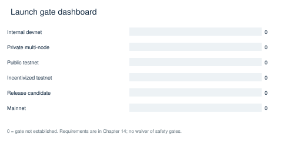

### Internal devnet

Requirement: Current locked node/runtime build, correct local genesis and basic signed transfer. Measurement / pass threshold: All required local build/format checks pass; one transfer included and persisted after restart. Responsible role: Build/release engineer. Evidence artifact: build logs, binary/WASM hashes, genesis hash, receipt and restart state.

Failure response: stop promotion, retain evidence, contain the affected path, repair and independently re-run the failing acceptance cases. Waiver policy: no waiver for fund safety, consensus, key management or state integrity; non-safety deviations require a signed scope reduction with owner and expiry, never a falsified pass. Current status: BLOCKED / NOT ESTABLISHED.

### Private multi-node testnet

Requirement: Four distinct validators; replay, partition and crash tests. Measurement / pass threshold: One finalized hash/root across honest nodes; no double debit; recovery succeeds; no ignored critical test. Responsible role: Consensus lead. Evidence artifact: topology/config hashes, per-node logs, finalized roots, fault timeline.

Failure response: stop promotion, retain evidence, contain the affected path, repair and independently re-run the failing acceptance cases. Waiver policy: no waiver for fund safety, consensus, key management or state integrity; non-safety deviations require a signed scope reduction with owner and expiry, never a falsified pass. Current status: BLOCKED / NOT ESTABLISHED.

### Public testnet

Requirement: All applicable Critical/High closure plus operational readiness. Measurement / pass threshold: Zero open Critical/High in enabled paths; audited scope/keys; resource limits; restore and incident drills pass. Responsible role: Security lead + operator lead. Evidence artifact: closure manifests, load/fault tests, alerts, backup recovery proof.

Failure response: stop promotion, retain evidence, contain the affected path, repair and independently re-run the failing acceptance cases. Waiver policy: no waiver for fund safety, consensus, key management or state integrity; non-safety deviations require a signed scope reduction with owner and expiry, never a falsified pass. Current status: BLOCKED / NOT ESTABLISHED.

### Incentivized testnet

Requirement: Public-testnet gates plus abuse-resistant reward accounting. Measurement / pass threshold: Every reward/slash reconciles; replay/Sybil abuse limits proven; no unresolved economic safety defect. Responsible role: Economic/security lead. Evidence artifact: ledger reconciliation, abuse test corpus and published reward policy.

Failure response: stop promotion, retain evidence, contain the affected path, repair and independently re-run the failing acceptance cases. Waiver policy: no waiver for fund safety, consensus, key management or state integrity; non-safety deviations require a signed scope reduction with owner and expiry, never a falsified pass. Current status: BLOCKED / NOT ESTABLISHED.

### Release candidate

Requirement: Exact artifact reproducibility and independent review. Measurement / pass threshold: Two independent builders reproduce runtime WASM; clean source; all tests/gates pass; no stale evidence. Responsible role: Release manager + independent reviewer. Evidence artifact: signed source/build/feature/spec manifest and reviewer retest.

Failure response: stop promotion, retain evidence, contain the affected path, repair and independently re-run the failing acceptance cases. Waiver policy: no waiver for fund safety, consensus, key management or state integrity; non-safety deviations require a signed scope reduction with owner and expiry, never a falsified pass. Current status: BLOCKED / NOT ESTABLISHED.

### Mainnet

Requirement: All previous gates, funded-route proof, custody and governance readiness. Measurement / pass threshold: Zero unresolved nonwaivable findings; genesis/keys/upgrade/restore approved; capacity SLO proven on final release. Responsible role: Accountable protocol/security/operator signers. Evidence artifact: signed launch decision covering exact binary/WASM/genesis hashes.

Failure response: stop promotion, retain evidence, contain the affected path, repair and independently re-run the failing acceptance cases. Waiver policy: no waiver for fund safety, consensus, key management or state integrity; non-safety deviations require a signed scope reduction with owner and expiry, never a falsified pass. Current status: BLOCKED / NOT ESTABLISHED.

### Final truth statement

Demonstrably working today: source inventory/metadata extraction; four RPC middleware algorithm tests; Python intent parsing and selected typechecking/simulation tests. The adversarial router harness demonstrably reveals invalid-proof acceptance, and the Makefile experiment demonstrably reveals swallowed failure. These are bounded observations, not operating-network proof.

What only appears complete: a gateway dependency graph without a serving binary; proof names without authentic evidence; EVM-shaped RPC without canonical signed pool submission; synthetic mini-EVM state and SDK encoders; validator metadata penalties described as economic slashing; readiness gates satisfied by stale artifacts or masked statuses. Missing evidence includes finalized multi-node execution, authenticated enabled external settlement, full build/test success, contract runtime tests, restore/upgrade drills, custody validation and sustained network performance.

Before public testnet: close nonwaivable defects in enabled scope and execute the private-network gates. Before mainnet: add independent retest, reproducible signed artifacts, genesis/custody ceremony, operational and economic assurance, authenticated external routes if enabled, measured capacity and accountable approval. This audit changes no protocol code and grants no launch authorization.

## Appendix A  Detailed Feature Acceptance Cards

64 SCOPED CAPABILITIES

Each card corresponds exactly to a CSV/scorecard row. The completion figure is evidence-criteria coverage. Effort and dependency fields are planning estimates; commands identify where acceptance tests belong and do not imply that all proposed tests already exist.

### FT01  Aura block production

IMPLEMENTED BUT UNVERIFIED | 40% | Consensus | P1

Evidence / entrypoint: node/src/service.rs:1059

Missing work / acceptance: Prove real multi-node authoring and partition recovery.

Tests: No passing production-path evidence in this audit. Criteria [implemented, wired, tested, executed, reproducible] = [1, 1, 0, 0, 0]. Security: Safety critical. Dependencies: H18 build closure; relevant finding dependencies. Effort: L (ordinal estimate; not a delivery promise).

```text
cargo test -p x3-chain-node --lib
```

### FT02  GRANDPA finality and fork choice

IMPLEMENTED BUT UNVERIFIED | 40% | Consensus | P1

Evidence / entrypoint: node/src/service.rs:601; node/src/service.rs:1136

Missing work / acceptance: Run finality, equivocation and restart tests.

Tests: No passing production-path evidence in this audit. Criteria [implemented, wired, tested, executed, reproducible] = [1, 1, 0, 0, 0]. Security: Safety critical. Dependencies: H18 build closure; relevant finding dependencies. Effort: L (ordinal estimate; not a delivery promise).

```text
cargo test --workspace
```

### FT03  Validator rotation

PARTIAL | 20% | Consensus | P1

Evidence / entrypoint: pallets/x3-consensus/src/lib.rs:412

Missing work / acceptance: Fix activation-delay/session mismatch (H05).

Tests: No passing production-path evidence in this audit. Criteria [implemented, wired, tested, executed, reproducible] = [0, 1, 0, 0, 0]. Security: Safety critical. Dependencies: H18 build closure; relevant finding dependencies. Effort: L (ordinal estimate; not a delivery promise).

```text
cargo test --workspace
```

### FT04  Validator bonded stake and slashing

PARTIAL | 20% | Consensus | P1

Evidence / entrypoint: pallets/x3-consensus/src/lib.rs:263

Missing work / acceptance: Authenticate offences and debit real stake; prove session removal (H04).

Tests: No passing production-path evidence in this audit. Criteria [implemented, wired, tested, executed, reproducible] = [0, 1, 0, 0, 0]. Security: Safety critical. Dependencies: H18 build closure; relevant finding dependencies. Effort: L (ordinal estimate; not a delivery promise).

```text
cargo test --workspace
```

### FT05  Flash finality

PARTIAL | 0% | Consensus | P1

Evidence / entrypoint: crates/flash-finality/src/lib.rs:389; node/src/service.rs:656

Missing work / acceptance: Authority membership and a working replacement finalizer are required (H06).

Tests: No passing production-path evidence in this audit. Criteria [implemented, wired, tested, executed, reproducible] = [0, 0, 0, 0, 0]. Security: Safety critical. Dependencies: H18 build closure; relevant finding dependencies. Effort: L (ordinal estimate; not a delivery promise).

```text
cargo test --workspace
```

### FT06  Genesis construction and live-seed validation

IMPLEMENTED BUT UNVERIFIED | 40% | Consensus | P1

Evidence / entrypoint: node/src/chain_spec.rs:760

Missing work / acceptance: Generate and independently validate production spec with actual operator public identities.

Tests: No passing production-path evidence in this audit. Criteria [implemented, wired, tested, executed, reproducible] = [1, 1, 0, 0, 0]. Security: Safety critical. Dependencies: H18 build closure; relevant finding dependencies. Effort: L (ordinal estimate; not a delivery promise).

```text
cargo test --workspace
```

### FT07  Signed native transaction path

IMPLEMENTED BUT UNVERIFIED | 40% | Transactions | P1

Evidence / entrypoint: runtime/src/lib.rs:850; node/src/rpc.rs:1050

Missing work / acceptance: Execute wallet-to-pool-to-finalized-receipt transfer on two nodes.

Tests: No passing production-path evidence in this audit. Criteria [implemented, wired, tested, executed, reproducible] = [1, 1, 0, 0, 0]. Security: Safety critical. Dependencies: H18 build closure; relevant finding dependencies. Effort: L (ordinal estimate; not a delivery promise).

```text
cargo test --workspace
```

### FT08  Nonce, genesis, era replay checks

IMPLEMENTED BUT UNVERIFIED | 40% | Transactions | P1

Evidence / entrypoint: runtime/src/lib.rs:850

Missing work / acceptance: Exercise wrong-chain, stale era, duplicate and concurrent nonces.

Tests: No passing production-path evidence in this audit. Criteria [implemented, wired, tested, executed, reproducible] = [1, 1, 0, 0, 0]. Security: Safety critical. Dependencies: H18 build closure; relevant finding dependencies. Effort: L (ordinal estimate; not a delivery promise).

```text
cargo test --workspace
```

### FT09  Transaction pool limits and ordering

PARTIAL | 20% | Transactions | P1

Evidence / entrypoint: node/src/service.rs:589; node/src/service.rs:371

Missing work / acceptance: Preserve operator limits and measure spam/eviction behavior.

Tests: No passing production-path evidence in this audit. Criteria [implemented, wired, tested, executed, reproducible] = [0, 1, 0, 0, 0]. Security: Safety critical. Dependencies: H18 build closure; relevant finding dependencies. Effort: L (ordinal estimate; not a delivery promise).

```text
cargo test --workspace
```

### FT10  Fee charging and refunds

IMPLEMENTED BUT UNVERIFIED | 40% | Transactions | P1

Evidence / entrypoint: runtime/src/lib.rs:1091

Missing work / acceptance: Reconcile charged fee, treasury credit, burn and failed-call refunds.

Tests: No passing production-path evidence in this audit. Criteria [implemented, wired, tested, executed, reproducible] = [1, 1, 0, 0, 0]. Security: Safety critical. Dependencies: H18 build closure; relevant finding dependencies. Effort: L (ordinal estimate; not a delivery promise).

```text
cargo test --workspace
```

### FT11  Ethereum raw transaction RPC

PARTIAL | 20% | Transactions | P1

Evidence / entrypoint: node/src/rpc_frontier.rs:457

Missing work / acceptance: Replace custom query execution with signed pool submission (H08).

Tests: No passing production-path evidence in this audit. Criteria [implemented, wired, tested, executed, reproducible] = [0, 1, 0, 0, 0]. Security: Safety critical. Dependencies: H18 build closure; relevant finding dependencies. Effort: L (ordinal estimate; not a delivery promise).

```text
cargo test --workspace
```

### FT12  Canonical FRAME storage

IMPLEMENTED BUT UNVERIFIED | 40% | State | P1

Evidence / entrypoint: node/src/service.rs:567; runtime/src/lib.rs:834

Missing work / acceptance: Crash/restart, state-root reconstruction and corrupted database drills.

Tests: No passing production-path evidence in this audit. Criteria [implemented, wired, tested, executed, reproducible] = [1, 1, 0, 0, 0]. Security: Safety critical. Dependencies: H18 build closure; relevant finding dependencies. Effort: L (ordinal estimate; not a delivery promise).

```text
cargo test --workspace
```

### FT13  Storage upgrade migrations

BLOCKED | 40% | State | P1

Evidence / entrypoint: runtime/src/lib.rs:826

Missing work / acceptance: Run ordered old-schema upgrade and reverse/recovery proofs; full build blocked.

Tests: No passing production-path evidence in this audit. Criteria [implemented, wired, tested, executed, reproducible] = [1, 1, 0, 0, 0]. Security: Safety critical. Dependencies: H18 build closure; relevant finding dependencies. Effort: L (ordinal estimate; not a delivery promise).

```text
cargo test --workspace
```

### FT14  Supply conservation ledger

PARTIAL | 20% | State | P1

Evidence / entrypoint: pallets/x3-supply-ledger/src/lib.rs:158

Missing work / acceptance: Bound finalization work and run cross-domain conservation properties (H16).

Tests: No passing production-path evidence in this audit. Criteria [implemented, wired, tested, executed, reproducible] = [0, 1, 0, 0, 0]. Security: Safety critical. Dependencies: H18 build closure; relevant finding dependencies. Effort: L (ordinal estimate; not a delivery promise).

```text
cargo test --workspace
```

### FT15  Snapshot backup and restoration

PARTIAL | 20% | State | P1

Evidence / entrypoint: scripts/snapshot-restore.sh:130

Missing work / acceptance: Authenticate snapshot and validate restored finalized state (M04).

Tests: No passing production-path evidence in this audit. Criteria [implemented, wired, tested, executed, reproducible] = [0, 1, 0, 0, 0]. Security: Safety critical. Dependencies: H18 build closure; relevant finding dependencies. Effort: L (ordinal estimate; not a delivery promise).

```text
cargo test --workspace
```

### FT16  Atomic rollback state provenance

PARTIAL | 20% | State | P1

Evidence / entrypoint: pallets/x3-atomic-kernel/src/lib.rs:1030

Missing work / acceptance: Reject unauthenticated diffs and demonstrate complete rollback (C03).

Tests: No passing production-path evidence in this audit. Criteria [implemented, wired, tested, executed, reproducible] = [0, 1, 0, 0, 0]. Security: Safety critical. Dependencies: H18 build closure; relevant finding dependencies. Effort: L (ordinal estimate; not a delivery promise).

```text
cargo test --workspace
```

### FT17  Signature primitives and key custody

IMPLEMENTED BUT UNVERIFIED | 40% | Crypto | P1

Evidence / entrypoint: node/src/service.rs:323; runtime/src/lib.rs:141

Missing work / acceptance: Prove hardware/custody signing and key rotation without dev fallback.

Tests: No passing production-path evidence in this audit. Criteria [implemented, wired, tested, executed, reproducible] = [1, 1, 0, 0, 0]. Security: Safety critical. Dependencies: H18 build closure; relevant finding dependencies. Effort: L (ordinal estimate; not a delivery promise).

```text
cargo test --workspace
```

### FT18  Dependency advisory handling

PARTIAL | 20% | Crypto | P1

Evidence / entrypoint: .cargo/audit.toml:1; evidence/advisories-unfiltered.json

Missing work / acceptance: Triage all 53 advisory/package matches against shipped binaries (H15).

Tests: No passing production-path evidence in this audit. Criteria [implemented, wired, tested, executed, reproducible] = [0, 1, 0, 0, 0]. Security: Safety critical. Dependencies: H18 build closure; relevant finding dependencies. Effort: L (ordinal estimate; not a delivery promise).

```text
cargo test --workspace
```

### FT19  P2P networking and sync

IMPLEMENTED BUT UNVERIFIED | 40% | Networking | P1

Evidence / entrypoint: node/src/service.rs:881

Missing work / acceptance: Four-node discovery, catch-up, reconnection and resource-exhaustion tests.

Tests: No passing production-path evidence in this audit. Criteria [implemented, wired, tested, executed, reproducible] = [1, 1, 0, 0, 0]. Security: Operational integrity. Dependencies: H18 build closure; relevant finding dependencies. Effort: L (ordinal estimate; not a delivery promise).

```text
cargo test --workspace
```

### FT20  Bootstrap helper configuration

DISCONNECTED | 20% | Networking | P1

Evidence / entrypoint: node/src/network.rs:9

Missing work / acceptance: Prove helper configuration is consumed by service; service uses sc_network configuration.

Tests: No passing production-path evidence in this audit. Criteria [implemented, wired, tested, executed, reproducible] = [1, 0, 0, 0, 0]. Security: Operational integrity. Dependencies: H18 build closure; relevant finding dependencies. Effort: L (ordinal estimate; not a delivery promise).

```text
cargo test --workspace
```

### FT21  PoH import verification

PARTIAL | 0% | Networking | P1

Evidence / entrypoint: node/src/service.rs:943

Missing work / acceptance: Prove all peer import paths validate consistent PoH rules before opting in.

Tests: No passing production-path evidence in this audit. Criteria [implemented, wired, tested, executed, reproducible] = [0, 0, 0, 0, 0]. Security: Operational integrity. Dependencies: H18 build closure; relevant finding dependencies. Effort: L (ordinal estimate; not a delivery promise).

```text
cargo test --workspace
```

### FT22  RPC limiter algorithm (narrow scope)

VERIFIED | 100% | Networking | P1

Evidence / entrypoint: node/src/rpc_middleware.rs:395; evidence/rpc-harness.log

Missing work / acceptance: Retain unit evidence; whole-node abuse resistance remains separate.

Tests: Observed passing for scoped behavior. Criteria [implemented, wired, tested, executed, reproducible] = [1, 1, 1, 1, 1]. Security: Operational integrity. Dependencies: H18 build closure; relevant finding dependencies. Effort: L (ordinal estimate; not a delivery promise).

```text
cargo test --manifest-path audit-harness/rpc/Cargo.toml
```

### FT23  WASM mini-EVM persistent execution

PARTIAL | 20% | VM | P1

Evidence / entrypoint: crates/evm-integration/src/mini_evm.rs:102

Missing work / acceptance: Use actual accounts/state/caller/gas persistence (H07).

Tests: No passing production-path evidence in this audit. Criteria [implemented, wired, tested, executed, reproducible] = [0, 1, 0, 0, 0]. Security: Safety critical. Dependencies: H18 build closure; relevant finding dependencies. Effort: L (ordinal estimate; not a delivery promise).

```text
cargo test --workspace
```

### FT24  SVM execution and account context

PARTIAL | 20% | VM | P1

Evidence / entrypoint: pallets/x3-kernel/src/wasm_adapters.rs:86

Missing work / acceptance: Pass real account input, slot, blockhash and signer context; prove CPI and persistence.

Tests: No passing production-path evidence in this audit. Criteria [implemented, wired, tested, executed, reproducible] = [0, 1, 0, 0, 0]. Security: Safety critical. Dependencies: H18 build closure; relevant finding dependencies. Effort: L (ordinal estimate; not a delivery promise).

```text
cargo test --workspace
```

### FT25  X3 VM runtime

IMPLEMENTED BUT UNVERIFIED | 40% | VM | P1

Evidence / entrypoint: pallets/x3-kernel/src/wasm_adapters.rs:182

Missing work / acceptance: Prove runtime adapter semantics and differential native/WASM determinism.

Tests: No passing production-path evidence in this audit. Criteria [implemented, wired, tested, executed, reproducible] = [1, 1, 0, 0, 0]. Security: Safety critical. Dependencies: H18 build closure; relevant finding dependencies. Effort: L (ordinal estimate; not a delivery promise).

```text
cargo test --workspace
```

### FT26  X3 Python parser and typechecker

VERIFIED | 100% | VM | P1

Evidence / entrypoint: x3-lang/cli.py:1; evidence/dsl-tests.log; evidence/dsl-cli.log

Missing work / acceptance: Parsing/typing only: does not prove trade execution.

Tests: Observed passing for scoped behavior. Criteria [implemented, wired, tested, executed, reproducible] = [1, 1, 1, 1, 1]. Security: Safety critical. Dependencies: H18 build closure; relevant finding dependencies. Effort: L (ordinal estimate; not a delivery promise).

```text
/usr/bin/python3 -m pytest x3-lang/tests/test_parser.py x3-lang/tests/test_typechecker.py
```

### FT27  X3 emitter and execution pipeline

PARTIAL | 20% | VM | P1

Evidence / entrypoint: x3-lang/emitter/x3.py:60

Missing work / acceptance: Fix four failed emitter tests with authentic proof fixtures (M05).

Tests: No passing production-path evidence in this audit. Criteria [implemented, wired, tested, executed, reproducible] = [0, 1, 0, 0, 0]. Security: Safety critical. Dependencies: H18 build closure; relevant finding dependencies. Effort: L (ordinal estimate; not a delivery promise).

```text
cargo test --workspace
```

### FT28  Rust compiler tracks

IMPLEMENTED BUT UNVERIFIED | 20% | VM | P1

Evidence / entrypoint: crates/x3-compiler/Cargo.toml:1; x3-lang/compiler/src/lib.rs:1

Missing work / acceptance: Reconcile separate workspaces and verify bytecode parity against actual VM.

Tests: No passing production-path evidence in this audit. Criteria [implemented, wired, tested, executed, reproducible] = [1, 0, 0, 0, 0]. Security: Safety critical. Dependencies: H18 build closure; relevant finding dependencies. Effort: L (ordinal estimate; not a delivery promise).

```text
cargo test --workspace
```

### FT29  Internal cross-VM representation router

IMPLEMENTED BUT UNVERIFIED | 40% | Cross-chain | P1

Evidence / entrypoint: pallets/x3-cross-vm-router/src/lib.rs:1

Missing work / acceptance: Run six-route conservation/rollback matrix through full runtime.

Tests: No passing production-path evidence in this audit. Criteria [implemented, wired, tested, executed, reproducible] = [1, 1, 0, 0, 0]. Security: Safety critical. Dependencies: H18 build closure; relevant finding dependencies. Effort: L (ordinal estimate; not a delivery promise).

```text
cargo test --workspace
```

### FT30  Atomic bundle orchestration / Atomic Lock

PARTIAL | 20% | Cross-chain | P1

Evidence / entrypoint: pallets/x3-atomic-kernel/src/lib.rs:839

Missing work / acceptance: Close C02/C03 before treating a PoAE hash as proof.

Tests: No passing production-path evidence in this audit. Criteria [implemented, wired, tested, executed, reproducible] = [0, 1, 0, 0, 0]. Security: Safety critical. Dependencies: H18 build closure; relevant finding dependencies. Effort: L (ordinal estimate; not a delivery promise).

```text
cargo test --workspace
```

### FT31  Settlement timeout and refund engine

PARTIAL | 20% | Cross-chain | P1

Evidence / entrypoint: pallets/x3-settlement-engine/src/lib.rs:1350

Missing work / acceptance: Authenticate receipt/finality inputs; prove timely refunds under load.

Tests: No passing production-path evidence in this audit. Criteria [implemented, wired, tested, executed, reproducible] = [0, 1, 0, 0, 0]. Security: Safety critical. Dependencies: H18 build closure; relevant finding dependencies. Effort: L (ordinal estimate; not a delivery promise).

```text
cargo test --workspace
```

### FT32  External header finality oracle

PLACEHOLDER | 20% | Cross-chain | P1

Evidence / entrypoint: pallets/cross-chain-validator/src/lib.rs:332

Missing work / acceptance: Replace structural header and byte-count quorum checks (C01).

Tests: No passing production-path evidence in this audit. Criteria [implemented, wired, tested, executed, reproducible] = [0, 1, 0, 0, 0]. Security: Safety critical. Dependencies: H18 build closure; relevant finding dependencies. Effort: L (ordinal estimate; not a delivery promise).

```text
cargo test --workspace
```

### FT33  Production EVM receipt proof route

PARTIAL | 20% | Cross-chain | P1

Evidence / entrypoint: crates/x3-verification-router/src/evm_receipt.rs:737

Missing work / acceptance: Trusted receipts root and canonical inclusion/receipt-value binding (H02).

Tests: No passing production-path evidence in this audit. Criteria [implemented, wired, tested, executed, reproducible] = [0, 1, 0, 0, 0]. Security: Safety critical. Dependencies: H18 build closure; relevant finding dependencies. Effort: L (ordinal estimate; not a delivery promise).

```text
cargo test --workspace
```

### FT34  Solana finalized proof route

PLACEHOLDER | 20% | Cross-chain | P1

Evidence / entrypoint: crates/x3-verification-router/src/lib.rs:355

Missing work / acceptance: Replace nonempty check with authenticated finality and event proofs (H01).

Tests: No passing production-path evidence in this audit. Criteria [implemented, wired, tested, executed, reproducible] = [0, 1, 0, 0, 0]. Security: Safety critical. Dependencies: H18 build closure; relevant finding dependencies. Effort: L (ordinal estimate; not a delivery promise).

```text
cargo test --workspace
```

### FT35  Validator quorum proof route

PLACEHOLDER | 20% | Cross-chain | P1

Evidence / entrypoint: crates/x3-verification-router/src/lib.rs:323

Missing work / acceptance: Verify distinct authorized signatures over exact envelope (H01).

Tests: No passing production-path evidence in this audit. Criteria [implemented, wired, tested, executed, reproducible] = [0, 1, 0, 0, 0]. Security: Safety critical. Dependencies: H18 build closure; relevant finding dependencies. Effort: L (ordinal estimate; not a delivery promise).

```text
cargo test --workspace
```

### FT36  Bitcoin SPV route

PARTIAL | 20% | Cross-chain | P1

Evidence / entrypoint: crates/x3-verification-router/src/lib.rs:545

Missing work / acceptance: Verify best-work chain, correct confirmation height and locked output (H03).

Tests: No passing production-path evidence in this audit. Criteria [implemented, wired, tested, executed, reproducible] = [0, 1, 0, 0, 0]. Security: Safety critical. Dependencies: H18 build closure; relevant finding dependencies. Effort: L (ordinal estimate; not a delivery promise).

```text
cargo test --workspace
```

### FT37  Bitcoin vault approvals

PLACEHOLDER | 0% | Cross-chain | P1

Evidence / entrypoint: crates/x3-bitcoin-vault/src/lib.rs:324

Missing work / acceptance: Replace call-count progression and unverified signatures (H03).

Tests: No passing production-path evidence in this audit. Criteria [implemented, wired, tested, executed, reproducible] = [0, 0, 0, 0, 0]. Security: Safety critical. Dependencies: H18 build closure; relevant finding dependencies. Effort: L (ordinal estimate; not a delivery promise).

```text
cargo test --workspace
```

### FT38  Relayer binary delivery

PARTIAL | 20% | Cross-chain | P1

Evidence / entrypoint: crates/x3-relayer/src/main.rs:1442

Missing work / acceptance: Persist retries/cursors and prove finalized proof submission (H09/H10).

Tests: No passing production-path evidence in this audit. Criteria [implemented, wired, tested, executed, reproducible] = [0, 1, 0, 0, 0]. Security: Safety critical. Dependencies: H18 build closure; relevant finding dependencies. Effort: L (ordinal estimate; not a delivery promise).

```text
cargo test --workspace
```

### FT39  Relayer typed submission library

PARTIAL | 20% | Cross-chain | P1

Evidence / entrypoint: crates/x3-relayer/src/submitter.rs:568

Missing work / acceptance: Use correct metadata/custody/signed-extension serialization (H09).

Tests: No passing production-path evidence in this audit. Criteria [implemented, wired, tested, executed, reproducible] = [0, 1, 0, 0, 0]. Security: Safety critical. Dependencies: H18 build closure; relevant finding dependencies. Effort: L (ordinal estimate; not a delivery promise).

```text
cargo test --workspace
```

### FT40  EVM HTLC contract

IMPLEMENTED BUT UNVERIFIED | 20% | Cross-chain | P1

Evidence / entrypoint: X3-contracts/evm/contracts/AtlasHTLC.sol:99

Missing work / acceptance: Run claim/refund/expiry/reentrancy and nonstandard-token accounting tests.

Tests: No passing production-path evidence in this audit. Criteria [implemented, wired, tested, executed, reproducible] = [1, 0, 0, 0, 0]. Security: Safety critical. Dependencies: H18 build closure; relevant finding dependencies. Effort: L (ordinal estimate; not a delivery promise).

```text
forge test --root X3-contracts/evm
```

### FT41  SVM HTLC contract

IMPLEMENTED BUT UNVERIFIED | 20% | Cross-chain | P1

Evidence / entrypoint: X3-contracts/svm/programs/x3_htlc/src/lib.rs:1

Missing work / acceptance: Compile Anchor program and prove local validator claim/refund parity.

Tests: No passing production-path evidence in this audit. Criteria [implemented, wired, tested, executed, reproducible] = [1, 0, 0, 0, 0]. Security: Safety critical. Dependencies: H18 build closure; relevant finding dependencies. Effort: L (ordinal estimate; not a delivery promise).

```text
anchor test
```

### FT42  External EVM proof verifier contract

PARTIAL | 0% | Cross-chain | P1

Evidence / entrypoint: X3-contracts/evm/contracts/EvmReceiptVerifier.sol:205

Missing work / acceptance: Implement actual signature verification without mode bypass (H17).

Tests: No passing production-path evidence in this audit. Criteria [implemented, wired, tested, executed, reproducible] = [0, 0, 0, 0, 0]. Security: Safety critical. Dependencies: H18 build closure; relevant finding dependencies. Effort: L (ordinal estimate; not a delivery promise).

```text
cargo test --workspace
```

### FT43  Solver marketplace and intent routing

IMPLEMENTED BUT UNVERIFIED | 20% | Cross-chain | P1

Evidence / entrypoint: crates/x3-intent/Cargo.toml:1; pallets/atomic-trade-engine/src/lib.rs:1

Missing work / acceptance: Trace signed intent to competing solver selection and bonded settlement.

Tests: No passing production-path evidence in this audit. Criteria [implemented, wired, tested, executed, reproducible] = [1, 0, 0, 0, 0]. Security: Safety critical. Dependencies: H18 build closure; relevant finding dependencies. Effort: L (ordinal estimate; not a delivery promise).

```text
cargo test --workspace
```

### FT44  Validator attestation / proof ledger

PARTIAL | 20% | Cross-chain | P1

Evidence / entrypoint: crates/x3-validator-attestation/src/lib.rs:1; pallets/x3-atomic-kernel/src/lib.rs:1416

Missing work / acceptance: Bind signer set, execution evidence and finality to authenticated runtime state.

Tests: No passing production-path evidence in this audit. Criteria [implemented, wired, tested, executed, reproducible] = [0, 1, 0, 0, 0]. Security: Safety critical. Dependencies: H18 build closure; relevant finding dependencies. Effort: L (ordinal estimate; not a delivery promise).

```text
cargo test --workspace
```

### FT45  REST/GraphQL gateway

DISCONNECTED | 0% | Operations | P1

Evidence / entrypoint: crates/x3-gateway/src/main.rs:1

Missing work / acceptance: Wire executable configuration, DB/router/HTTP server (H11).

Tests: No passing production-path evidence in this audit. Criteria [implemented, wired, tested, executed, reproducible] = [0, 0, 0, 0, 0]. Security: Operational integrity. Dependencies: H18 build closure; relevant finding dependencies. Effort: L (ordinal estimate; not a delivery promise).

```text
cargo test --workspace
```

### FT46  SQL indexer and migrations

DISCONNECTED | 20% | Operations | P1

Evidence / entrypoint: crates/x3-gateway/src/db.rs:1

Missing work / acceptance: Activate indexer and migrate disposable DB end to end; gateway modules not compiled.

Tests: No passing production-path evidence in this audit. Criteria [implemented, wired, tested, executed, reproducible] = [1, 0, 0, 0, 0]. Security: Operational integrity. Dependencies: H18 build closure; relevant finding dependencies. Effort: L (ordinal estimate; not a delivery promise).

```text
cargo test --workspace
```

### FT47  Metrics / chain health monitoring

PARTIAL | 20% | Observability | P1

Evidence / entrypoint: node/src/metrics.rs:1; crates/x3-gateway/src/rest.rs:248

Missing work / acceptance: Measure dependency health, finality lag and sink delivery (M03).

Tests: No passing production-path evidence in this audit. Criteria [implemented, wired, tested, executed, reproducible] = [0, 1, 0, 0, 0]. Security: Operational integrity. Dependencies: H18 build closure; relevant finding dependencies. Effort: L (ordinal estimate; not a delivery promise).

```text
cargo test --workspace
```

### FT48  Security and accounting event consumers

DISCONNECTED | 0% | Observability | P1

Evidence / entrypoint: runtime/src/lib.rs:11

Missing work / acceptance: Implement durable consumer wiring; logs explicitly report dropped events.

Tests: No passing production-path evidence in this audit. Criteria [implemented, wired, tested, executed, reproducible] = [0, 0, 0, 0, 0]. Security: Operational integrity. Dependencies: H18 build closure; relevant finding dependencies. Effort: L (ordinal estimate; not a delivery promise).

```text
cargo test --workspace
```

### FT49  DEX, Forge and LP locker

IMPLEMENTED BUT UNVERIFIED | 40% | Governance | P1

Evidence / entrypoint: pallets/x3-dex/src/lib.rs:1; pallets/x3-token-factory/src/lib.rs:1; pallets/x3-lp-locker/src/lib.rs:1

Missing work / acceptance: Verify swaps/mints/locks/fees and EconomicHalt under full runtime.

Tests: No passing production-path evidence in this audit. Criteria [implemented, wired, tested, executed, reproducible] = [1, 1, 0, 0, 0]. Security: Operational integrity. Dependencies: H18 build closure; relevant finding dependencies. Effort: L (ordinal estimate; not a delivery promise).

```text
cargo test --workspace
```

### FT50  Sentinel and economic halt

PARTIAL | 20% | Governance | P1

Evidence / entrypoint: pallets/x3-sentinel/src/lib.rs:1; pallets/x3-invariants/src/lib.rs:618

Missing work / acceptance: Prove halt scope covers privileged/unsigned paths and refunds remain available.

Tests: No passing production-path evidence in this audit. Criteria [implemented, wired, tested, executed, reproducible] = [0, 1, 0, 0, 0]. Security: Operational integrity. Dependencies: H18 build closure; relevant finding dependencies. Effort: L (ordinal estimate; not a delivery promise).

```text
cargo test --workspace
```

### FT51  Council / treasury / upgrades

IMPLEMENTED BUT UNVERIFIED | 40% | Governance | P1

Evidence / entrypoint: runtime/src/lib.rs:543; runtime/src/lib.rs:826

Missing work / acceptance: Prove threshold, timelock, session/treasury separation and upgrade recovery.

Tests: No passing production-path evidence in this audit. Criteria [implemented, wired, tested, executed, reproducible] = [1, 1, 0, 0, 0]. Security: Operational integrity. Dependencies: H18 build closure; relevant finding dependencies. Effort: L (ordinal estimate; not a delivery promise).

```text
cargo test --workspace
```

### FT52  Wallet / biometric / recovery pallet

PARTIAL | 20% | Crypto | P1

Evidence / entrypoint: pallets/x3-wallet-pallet/src/lib.rs:263

Missing work / acceptance: Independently audit recovery authorization, privacy and biometric replay resistance.

Tests: No passing production-path evidence in this audit. Criteria [implemented, wired, tested, executed, reproducible] = [0, 1, 0, 0, 0]. Security: Safety critical. Dependencies: H18 build closure; relevant finding dependencies. Effort: L (ordinal estimate; not a delivery promise).

```text
cargo test --workspace
```

### FT53  TypeScript SDK encoding

PLACEHOLDER | 20% | Transactions | P1

Evidence / entrypoint: packages/ts-sdk/src/evm.ts:154; packages/ts-sdk/src/svm.ts:230

Missing work / acceptance: Canonical selectors, addresses and account-message compilation (H12).

Tests: No passing production-path evidence in this audit. Criteria [implemented, wired, tested, executed, reproducible] = [0, 1, 0, 0, 0]. Security: Safety critical. Dependencies: H18 build closure; relevant finding dependencies. Effort: L (ordinal estimate; not a delivery promise).

```text
cargo test --workspace
```

### FT54  Desktop / Tauri OS network integration

PARTIAL | 20% | Operations | P1

Evidence / entrypoint: apps/x3-desktop/src/blockchain/ChainManager.ts:59; apps/tauri-os/package.json:1

Missing work / acceptance: Repair default network lookup; render and verify real signing/receipt flows (M06).

Tests: No passing production-path evidence in this audit. Criteria [implemented, wired, tested, executed, reproducible] = [0, 1, 0, 0, 0]. Security: Operational integrity. Dependencies: H18 build closure; relevant finding dependencies. Effort: L (ordinal estimate; not a delivery promise).

```text
cargo test --workspace
```

### FT55  GPU / swarm orchestration

PARTIAL | 0% | Operations | P1

Evidence / entrypoint: node/src/service.rs:1244; crates/x3-swarm-core/Cargo.toml:1

Missing work / acceptance: Prove actual workload execution, required-feature startup failure and restart behavior.

Tests: No passing production-path evidence in this audit. Criteria [implemented, wired, tested, executed, reproducible] = [0, 0, 0, 0, 0]. Security: Operational integrity. Dependencies: H18 build closure; relevant finding dependencies. Effort: L (ordinal estimate; not a delivery promise).

```text
cargo test --workspace
```

### FT56  CI test quality and coverage

PARTIAL | 20% | Tests | P1

Evidence / entrypoint: Makefile:19; node/src/service.rs:2664

Missing work / acceptance: Stop swallowed failures and require real multi-node tests (H13/M02).

Tests: No passing production-path evidence in this audit. Criteria [implemented, wired, tested, executed, reproducible] = [0, 1, 0, 0, 0]. Security: Operational integrity. Dependencies: H18 build closure; relevant finding dependencies. Effort: L (ordinal estimate; not a delivery promise).

```text
cargo test --workspace
```

### FT57  Workspace build / release reproducibility

BLOCKED | 0% | Deployment | P1

Evidence / entrypoint: evidence/check-complete.log; rust-toolchain.toml:3

Missing work / acceptance: Resolve duplicate-core WASM failure and reproduce artifacts (H18).

Tests: No passing production-path evidence in this audit. Criteria [implemented, wired, tested, executed, reproducible] = [0, 0, 0, 0, 0]. Security: Operational integrity. Dependencies: H18 build closure; relevant finding dependencies. Effort: L (ordinal estimate; not a delivery promise).

```text
cargo test --workspace
```

### FT58  Fresh-machine bootstrap

BLOCKED | 0% | Deployment | P1

Evidence / entrypoint: scripts/fresh_machine_check.sh:5; Makefile:61

Missing work / acceptance: Pin toolchain/dependencies and correct package/target names (L01).

Tests: No passing production-path evidence in this audit. Criteria [implemented, wired, tested, executed, reproducible] = [0, 0, 0, 0, 0]. Security: Operational integrity. Dependencies: H18 build closure; relevant finding dependencies. Effort: L (ordinal estimate; not a delivery promise).

```text
cargo test --workspace
```

### FT59  Deployment isolation and validator services

IMPLEMENTED BUT UNVERIFIED | 40% | Operations | P1

Evidence / entrypoint: packaging/systemd/x3-validator.service:1

Missing work / acceptance: Run least-privilege validator installation and backup/restore rehearsal.

Tests: No passing production-path evidence in this audit. Criteria [implemented, wired, tested, executed, reproducible] = [1, 1, 0, 0, 0]. Security: Operational integrity. Dependencies: H18 build closure; relevant finding dependencies. Effort: L (ordinal estimate; not a delivery promise).

```text
cargo test --workspace
```

### FT60  Sustained finalized TPS evidence

MISSING | 0% | Performance | P3

Evidence / entrypoint: crates/x3-bench/src/runner.rs:251

Missing work / acceptance: Run controlled network workload; compiler throughput is not chain TPS (M07).

Tests: No passing production-path evidence in this audit. Criteria [implemented, wired, tested, executed, reproducible] = [0, 0, 0, 0, 0]. Security: Operational integrity. Dependencies: H18 build closure; relevant finding dependencies. Effort: L (ordinal estimate; not a delivery promise).

```text
cargo test --workspace
```

### FT61  Mainnet / ProofGate enforcement

PARTIAL | 20% | Proof gates | P1

Evidence / entrypoint: scripts/mainnet_release_gate.py:84; Makefile:19

Missing work / acceptance: Bind every gate to source/features/artifacts and propagate failures (H13/H14).

Tests: No passing production-path evidence in this audit. Criteria [implemented, wired, tested, executed, reproducible] = [0, 1, 0, 0, 0]. Security: Operational integrity. Dependencies: H18 build closure; relevant finding dependencies. Effort: L (ordinal estimate; not a delivery promise).

```text
cargo test --workspace
```

### FT62  Documentation accuracy / scoreboard

PARTIAL | 0% | Documentation | P1

Evidence / entrypoint: CURRENT_MAINNET_STATUS.md:3; FEATURE_REGISTRY.toml:18

Missing work / acceptance: Derive operational status from fresh executable proofs (M01).

Tests: No passing production-path evidence in this audit. Criteria [implemented, wired, tested, executed, reproducible] = [0, 0, 0, 0, 0]. Security: Operational integrity. Dependencies: H18 build closure; relevant finding dependencies. Effort: L (ordinal estimate; not a delivery promise).

```text
cargo test --workspace
```

### FT63  Public testnet recovery drill evidence

MISSING | 0% | Operations | P1

Evidence / entrypoint: node/src/service.rs:2664; scripts/snapshot-restore.sh:130

Missing work / acceptance: Produce four-validator partition/rejoin and restored finalized-state evidence.

Tests: No passing production-path evidence in this audit. Criteria [implemented, wired, tested, executed, reproducible] = [0, 0, 0, 0, 0]. Security: Operational integrity. Dependencies: H18 build closure; relevant finding dependencies. Effort: L (ordinal estimate; not a delivery promise).

```text
cargo test --workspace
```

### FT64  Independent launch approval evidence

MISSING | 0% | Proof gates | P1

Evidence / entrypoint: LAUNCH_SCOPE.md:1

Missing work / acceptance: Obtain external security review, closure retest and operator-signed release decision.

Tests: No passing production-path evidence in this audit. Criteria [implemented, wired, tested, executed, reproducible] = [0, 0, 0, 0, 0]. Security: Operational integrity. Dependencies: H18 build closure; relevant finding dependencies. Effort: L (ordinal estimate; not a delivery promise).

```text
cargo test --workspace
```

## Appendix B  Evidence Ledger and Repository Inventories

COMMANDS / EXIT CODES / ARTIFACTS

All verification attempts below are retained, including failed first attempts and interrupted/timed-out compilation. Initial 180-second attempts timed out; continued checks established E0152 failures. Test counts are only reported when an actual test runner emitted them. Read-only exploratory shell commands are also in the conversation tool transcript; the durable ledger below focuses on proof-producing checks and declared limitations.

Verification command ledger
| ID / exit | Command | Evidence |
|---|---|---|
| tools / 0 | rustc --version; cargo --version; node --version; npm --version; pnpm --version; python --version; python3 --version; /usr/bin/python3 --version; cargo audit --version; forge --version; anchor --version; protoc --version; clang --version | evidence/tools.log |
| metadata / 0 | cargo metadata --offline --locked --no-deps --format-version 1 | evidence/metadata.log |
| check / 124 | cargo check --workspace | evidence/check.log |
| test / 124 | cargo test --workspace | evidence/test.log |
| clippy / 124 | cargo clippy --workspace --all-targets -- -D warnings | evidence/clippy.log |
| pnpm-test / 127 | pnpm test | evidence/pnpm-test.log |
| pnpm-build / 127 | pnpm build | evidence/pnpm-build.log |
| npm-test / 127 | npm test | evidence/npm-test.log |
| pytest / 127 | python -m pytest | evidence/pytest.log |
| fmt / 1 | cargo fmt --all -- --check | evidence/fmt.log |
| rpc-unit / 1 | rustc --edition=2021 --test node/src/rpc_middleware.rs -o /tmp/x3-audit-20260905/rpc-tests && /tmp/x3-audit-20260905/rpc-tests --test-threads=1 | evidence/rpc-unit.log |
| dsl-tests / 1 | /usr/bin/python3 -m pytest -q x3-lang/tests/test_parser.py x3-lang/tests/test_typechecker.py x3-lang/tests/test_emitter.py x3-lang/tests/test_simulator.py | evidence/dsl-tests.log |
| dsl-cli / 0 | /usr/bin/python3 x3-lang/cli.py x3-lang/examples/arb_solana_eth.x3 | evidence/dsl-cli.log |
| fresh / 1 | bash scripts/fresh_machine_check.sh | evidence/fresh.log |
| consistency / 0 | bash scripts/check-readiness-consistency.sh | evidence/consistency.log |
| npm-build / 127 | npm run build | evidence/npm-build.log |
| audit-help / 0 | cargo audit --help | evidence/audit-help.log |
| python-collection / 2 | /usr/bin/python3 -m pytest --collect-only -q tests/test_migrations.py | evidence/python-collection.log |
| check-complete / 101 | cargo check --workspace | evidence/check-complete.log |
| test-complete / 101 | cargo test --workspace | evidence/test-complete.log |
| clippy-complete / 101 | cargo clippy --workspace --all-targets -- -D warnings | evidence/clippy-complete.log |
| release-complete / 101 | cargo build --locked --release -p x3-chain-node --features mainnet-rc1 | evidence/release-complete.log |
| testnet-complete / 101 | cargo check --locked -p x3-chain-node --features testnet | evidence/testnet-complete.log |
| contracts / 127 | forge test --root X3-contracts/evm --offline | evidence/contracts.log |
| anchor / 127 | anchor test --skip-deploy --skip-local-validator | evidence/anchor.log |
| rpc-harness / 0 | CARGO_NET_OFFLINE=true CARGO_TARGET_DIR=/tmp/x3-audit-20260905/rpc-target cargo test --manifest-path /tmp/x3-audit-20260905/rpc-harness/Cargo.toml | evidence/rpc-harness.log |
| proof-harness / 101 | CARGO_NET_OFFLINE=true CARGO_TARGET_DIR=/tmp/x3-audit-20260905/proof-target cargo test --manifest-path /tmp/x3-audit-20260905/proof-harness/Cargo.toml | evidence/proof-harness.log |
| gate-wallet / 0 | CARGO_NET_OFFLINE=true CARGO_TARGET_DIR=/tmp/x3-audit-20260905/gate-target make test-x3-wallet | evidence/gate-wallet.log |
| missing-target / 2 | make -n test-node-build | Conversation tool output / interrupted attempt |
| advisories-configured / 0 | cargo audit --no-fetch --stale --no-yanked --json | evidence/advisories.json |
| advisories-unsuppressed / 1 | cargo audit --no-fetch --stale --no-yanked --file /tmp/x3-audit-20260905/advisory-unfiltered/Cargo.lock --json (cwd /tmp) | evidence/advisories-unfiltered.json |
| advisories-copy-error / 1 | cp Cargo.lock /tmp/x3-audit-20260905/advisory-unfiltered/Cargo.lock (cwd /tmp) | Conversation tool output / interrupted attempt |
| initial-release-interrupted / 130 | cargo build --locked --release -p x3-chain-node --features mainnet-rc1 | Conversation tool output / interrupted attempt |
| fake-scan / 2 | grep -RIn TODO\ / FIXME\ / stub\ / mock\ / fake\ / placeholder\ / dummy\ / unimplemented!\ / todo!\ / panic!("not implemented . --exclude-dir=.git --exclude-dir=target --exclude-dir=node_modules | evidence/fake-scan-locations.jsonl |

Environment: rustc 1.90.0 (1159e78c4), cargo 1.90.0, Node v22.23.2, npm 10.9.8, Python 3.14.7 on python3 PATH and Python 3.10.12 at /usr/bin/python3; ReportLab 3.6.8; protobuf 36.0; clang 14.0.0. pnpm, python alias, forge and anchor were unavailable on PATH. System Python had pytest; Alembic was unavailable. Cargo ran offline against cached dependencies; advisory DB freshness was not established.

Durable inventory map
| Artifact | Purpose |
|---|---|
| evidence/component-map.json | 145 workspace package targets, features and dependencies. |
| evidence/inventory.json | First-party path/manifests/scripts/category inventory; 375 manifests. |
| evidence/dependency-inventory.json | 1,996 Cargo.lock package records; not a reachability map. |
| evidence/configuration-inventory.txt | Configuration paths; secret values intentionally excluded. |
| evidence/migrations-inventory.txt | Migration candidates across runtime, SQL and Python. |
| evidence/api-inventory.txt | RPC/gateway source inventory; route membership needs entrypoint context. |
| evidence/contracts-inventory.txt | EVM/SVM contract/program source inventory. |
| evidence/workflows-inventory.txt | CI workflow inventory; no hosted branch-protection assertion. |
| evidence/tests-inventory.txt | Test-path inventory, not coverage or passing status. |
| evidence/source-hashes.json | 6,909 inspected text-file hashes, excluding credential/build/vendor scopes. |
| evidence/working-tree-before.txt | Pre-existing dirty source state. Commit alone does not reproduce it. |

### Workspace package directory

Workspace package targets
| Package | Manifest / targets |
|---|---|
| pallet-x3-kernel | pallets/x3-kernel/Cargo.toml  /  pallet_x3_kernel (rlib) |
| pallet-x3-invariants | pallets/x3-invariants/Cargo.toml  /  pallet_x3_invariants (rlib) |
| x3-security-events | crates/x3-security-events/Cargo.toml  /  x3_security_events (rlib) |
| x3-cross-vm-bridge | crates/cross-vm-bridge/Cargo.toml  /  x3_cross_vm_bridge (rlib), integration (test) |
| x3-evm-integration | crates/evm-integration/Cargo.toml  /  x3_evm_integration (lib), erc20_integration (test), integration (test) |
| x3-packet-schema | crates/x3-packet-schema/Cargo.toml  /  x3_packet_schema (lib) |
| x3-svm-integration | crates/svm-integration/Cargo.toml  /  x3_svm_integration (lib), counter_integration (test) |
| svm_counter | crates/svm-counter/Cargo.toml  /  svm_counter (cdylib/rlib) |
| x3-x3-integration | crates/x3-integration/Cargo.toml  /  x3_x3_integration (lib), compiler_bridge (test) |
| x3-backend | crates/x3-backend/Cargo.toml  /  x3_backend (lib) |
| x3-ast | crates/x3-ast/Cargo.toml  /  x3_ast (lib) |
| x3-common | crates/x3-common/Cargo.toml  /  x3_common (lib) |
| x3-hir | crates/x3-hir/Cargo.toml  /  x3_hir (lib) |
| x3-typeck | crates/x3-typeck/Cargo.toml  /  x3_typeck (lib), golden (test) |
| x3-semantics | crates/x3-semantics/Cargo.toml  /  x3_semantics (lib), golden (test) |
| x3-parser | crates/x3-parser/Cargo.toml  /  x3_parser (lib), golden (test) |
| x3-lexer | crates/x3-lexer/Cargo.toml  /  x3_lexer (lib) |
| x3-mir | crates/x3-mir/Cargo.toml  /  x3_mir (lib) |
| x3-compiler | crates/x3-compiler/Cargo.toml  /  x3_compiler (lib), determinism (test), e2e_test (test), integration_test (test), schema_validator (test) |
| x3-opt | crates/x3-opt/Cargo.toml  /  x3_opt (lib), loop_pack_integration_bench (test), optimizer_yolo_smoke (test) |
| x3-vm | crates/x3-vm/Cargo.toml  /  x3_vm (lib), gpu_integration (test) |
| x3-verifier | crates/x3-verifier/Cargo.toml  /  x3_verifier (lib), integration (test) |
| invariant-macros | crates/invariant-macros/Cargo.toml  /  invariant_macros (proc-macro), registry_check (test), trybuild (test) |
| pallet-atomic-trade-engine | pallets/atomic-trade-engine/Cargo.toml  /  pallet_atomic_trade_engine (lib) |
| pallet-governance | pallets/governance/Cargo.toml  /  pallet_governance (rlib) |
| pallet-treasury | pallets/treasury/Cargo.toml  /  pallet_treasury (rlib) |
| pallet-agent-accounts | pallets/agent-accounts/Cargo.toml  /  pallet_agent_accounts (rlib) |
| pallet-agent-memory | pallets/agent-memory/Cargo.toml  /  pallet_agent_memory (rlib) |
| pallet-svm | pallets/svm-runtime/Cargo.toml  /  pallet_svm (lib) |
| pallet-evolution-core | pallets/evolution-core/Cargo.toml  /  pallet_evolution_core (lib) |
| pallet-x3-verifier | pallets/x3-verifier/Cargo.toml  /  pallet_x3_verifier (lib) |
| pallet-x3-domain-registry | pallets/x3-domain-registry/Cargo.toml  /  pallet_x3_domain_registry (lib) |
| pallet-x3-settlement-engine | pallets/x3-settlement-engine/Cargo.toml  /  pallet_x3_settlement_engine (lib), property_tests (test) |
| pallet-x3-atomic-kernel | pallets/x3-atomic-kernel/Cargo.toml  /  pallet_x3_atomic_kernel (lib), e2e_settlement (test), loom_concurrency (test), miri_tests (test), proptest_tests (test) |
| x3-asset-kernel-types | crates/x3-asset-kernel-types/Cargo.toml  /  x3_asset_kernel_types (rlib) |
| x3-crosschain-intent | crates/x3-crosschain-intent/Cargo.toml  /  x3_crosschain_intent (lib), compiler (test), end_to_end (test) |
| pallet-meme-overlord | pallets/meme-overlord/Cargo.toml  /  pallet_meme_overlord (lib) |
| pallet-swarm | pallets/swarm/Cargo.toml  /  pallet_swarm (rlib) |
| pallet-x3-wallet | pallets/x3-wallet-pallet/Cargo.toml  /  pallet_x3_wallet (lib) |
| x3-wallet | crates/x3-wallet/Cargo.toml  /  x3_wallet (lib) |
| x3-gateway | crates/x3-gateway/Cargo.toml  /  x3-gateway (bin), loom_mempool_concurrency (test), shuttle_validator_async (test) |
| x3-bridge | crates/x3-bridge/Cargo.toml  /  x3_bridge (lib) |
| x3-orchestra-control-plane | crates/x3-orchestra-control-plane/Cargo.toml  /  x3_orchestra_control_plane (lib), x3-orchestra-control-plane (bin) |
| x3-relayer | crates/x3-relayer/Cargo.toml  /  x3_relayer (lib), x3-relayer (bin) |
| x3-finality-oracle | crates/x3-finality-oracle/Cargo.toml  /  x3_finality_oracle (lib) |
| x3-gateway-risk-engine | crates/x3-gateway-risk-engine/Cargo.toml  /  x3_gateway_risk_engine (lib) |
| x3-proof-dispute | crates/x3-proof-dispute/Cargo.toml  /  x3_proof_dispute (lib) |
| x3-validator-attestation | crates/x3-validator-attestation/Cargo.toml  /  x3_validator_attestation (lib) |
| x3-verification-router | crates/x3-verification-router/Cargo.toml  /  x3_verification_router (lib) |
| x3-bitcoin-vault | crates/x3-bitcoin-vault/Cargo.toml  /  x3_bitcoin_vault (lib) |
| x3-rpc | crates/x3-rpc/Cargo.toml  /  x3_rpc (lib) |
| pallet-x3-crosschain-gateway | pallets/x3-crosschain-gateway/Cargo.toml  /  pallet_x3_crosschain_gateway (lib) |
| tps-tracker | crates/tps-tracker/Cargo.toml  /  tps_tracker (lib), tps-tracker (bin) |
| x3-chain-runtime | runtime/Cargo.toml  /  x3_chain_runtime (rlib), fraud_proofs_proptest (test), fraud_proofs_witness_v1 (test), build-script-build (custom-build) |
| pallet-cross-chain-validator | pallets/cross-chain-validator/Cargo.toml  /  pallet_cross_chain_validator (lib) |
| pallet-depin-marketplace | pallets/depin-marketplace/Cargo.toml  /  pallet_depin_marketplace (rlib) |
| pallet-northern-swarm | pallets/northern-swarm/Cargo.toml  /  pallet_northern_swarm (lib) |
| pallet-private-execution | pallets/private-execution/Cargo.toml  /  pallet_private_execution (rlib) |
| pallet-x3-account-registry | pallets/x3-account-registry/Cargo.toml  /  pallet_x3_account_registry (rlib) |
| pallet-x3-agent-law | pallets/x3-agent-law/Cargo.toml  /  pallet_x3_agent_law (lib) |
| pallet-x3-agent-registry | pallets/pallet-x3-agent-registry/Cargo.toml  /  pallet_x3_agent_registry (rlib) |
| x3-accounting-events | crates/x3-accounting-events/Cargo.toml  /  x3_accounting_events (rlib) |
| pallet-x3-asset-registry | pallets/x3-asset-registry/Cargo.toml  /  pallet_x3_asset_registry (rlib) |
| pallet-x3-auction | pallets/x3-auction/Cargo.toml  /  pallet_x3_auction (rlib) |
| pallet-x3-automation | pallets/x3-automation/Cargo.toml  /  pallet_x3_automation (lib) |
| x3-automation | crates/x3-automation/Cargo.toml  /  x3_automation (lib) |
| pallet-x3-coin | pallets/x3-coin/Cargo.toml  /  pallet_x3_coin (lib) |
| pallet-x3-compute-market | pallets/x3-compute-market/Cargo.toml  /  pallet_x3_compute_market (rlib) |
| pallet-x3-consensus | pallets/x3-consensus/Cargo.toml  /  pallet_x3_consensus (lib) |
| pallet-x3-cross-vm-router | pallets/x3-cross-vm-router/Cargo.toml  /  pallet_x3_cross_vm_router (rlib) |
| x3-ixl | crates/x3-ixl/Cargo.toml  /  x3_ixl (lib), properties (test) |
| x3-packet-standard | crates/x3-packet-standard/Cargo.toml  /  x3_packet_standard (lib), properties (test) |
| x3-liquidity-core | crates/x3-liquidity-core/Cargo.toml  /  x3_liquidity_core (rlib) |
| x3-dex | crates/x3-dex/Cargo.toml  /  x3_dex (lib) |
| pallet-x3-supply-ledger | pallets/x3-supply-ledger/Cargo.toml  /  pallet_x3_supply_ledger (rlib) |
| pallet-x3-custody | pallets/x3-custody/Cargo.toml  /  pallet_x3_custody (rlib) |
| pallet-x3-da | pallets/x3-da/Cargo.toml  /  pallet_x3_da (lib) |
| pallet-x3-dapp-hub | pallets/x3-dapp-hub/Cargo.toml  /  pallet_x3_dapp_hub (rlib) |
| x3-revenue-sharing | crates/x3-revenue-sharing/Cargo.toml  /  x3_revenue_sharing (lib) |
| pallet-x3-dex | pallets/x3-dex/Cargo.toml  /  pallet_x3_dex (lib) |
| pallet-x3-flashloan | pallets/x3-flashloan/Cargo.toml  /  pallet_x3_flashloan (rlib) |
| pallet-x3-inventory | pallets/x3-inventory/Cargo.toml  /  pallet_x3_inventory (lib) |
| pallet-x3-jury-anchor | pallets/x3-jury-anchor/Cargo.toml  /  pallet_x3_jury_anchor (lib) |
| pallet-x3-launchpad | pallets/x3-launchpad/Cargo.toml  /  pallet_x3_launchpad (rlib) |
| pallet-x3-lp-locker | pallets/x3-lp-locker/Cargo.toml  /  pallet_x3_lp_locker (rlib) |
| pallet-x3-oracle | pallets/x3-oracle/Cargo.toml  /  pallet_x3_oracle (lib) |
| pallet-x3-partner | pallets/x3-partner/Cargo.toml  /  pallet_x3_partner (lib) |
| pallet-x3-proof-carrying-agent | pallets/pallet-x3-proof-carrying-agent/Cargo.toml  /  pallet_x3_proof_carrying_agent (rlib) |
| pallet-x3-rebalance | pallets/x3-rebalance/Cargo.toml  /  pallet_x3_rebalance (lib) |
| pallet-x3-reconciliation | pallets/x3-reconciliation/Cargo.toml  /  pallet_x3_reconciliation (rlib) |
| pallet-x3-reservation | pallets/x3-reservation/Cargo.toml  /  pallet_x3_reservation (lib) |
| pallet-x3-sentinel | pallets/x3-sentinel/Cargo.toml  /  pallet_x3_sentinel (rlib) |
| pallet-x3-sequencer | pallets/x3-sequencer/Cargo.toml  /  pallet_x3_sequencer (lib) |
| pallet-x3-slash | pallets/x3-slash/Cargo.toml  /  pallet_x3_slash (lib) |
| x3-proof | crates/x3-proof/Cargo.toml  /  x3_proof (lib), x3-proof (bin) |
| x3-slash | crates/x3-slash/Cargo.toml  /  x3_slash (lib) |
| pallet-x3-solvency | pallets/x3-solvency/Cargo.toml  /  pallet_x3_solvency (lib) |
| pallet-x3-token-factory | pallets/x3-token-factory/Cargo.toml  /  pallet_x3_token_factory (rlib) |
| pallet-x3-treasury-policy | pallets/x3-treasury-policy/Cargo.toml  /  pallet_x3_treasury_policy (lib) |
| pallet-x3-vrf | pallets/x3-vrf/Cargo.toml  /  pallet_x3_vrf (lib) |
| x3-vrf | crates/x3-vrf/Cargo.toml  /  x3_vrf (lib) |
| pallet-x3-wrapped | pallets/x3-wrapped/Cargo.toml  /  pallet_x3_wrapped (rlib) |
| quantum-crypto | crates/quantum-crypto/Cargo.toml  /  quantum_crypto (lib) |
| x3-metrics-tracker | crates/x3-metrics-tracker/Cargo.toml  /  x3_metrics_tracker (rlib) |
| x3-staking-analytics | crates/x3-staking-analytics/Cargo.toml  /  x3_staking_analytics (lib) |
| x3-chain-node | node/Cargo.toml  /  x3_chain_node (lib), x3-chain-node (bin), flash_finality_network (test), node_requirements (test), rpc_dex_latency (bench) |
| contention-predictor | crates/contention-predictor/Cargo.toml  /  contention_predictor (lib), inference_latency (bench) |
| cross-chain-gpu-validator | crates/cross-chain-gpu-validator/Cargo.toml  /  cross_chain_gpu_validator (lib), cross-chain-gpu-validator (bin), integration_tests (test), gpu_kernels (bench) |
| x3-gpu-validator-swarm | crates/x3-gpu-validator-swarm/Cargo.toml  /  x3_gpu_validator_swarm (lib), wallet_sync (bin), x3-cpu-validator (bin), x3-swarm-bench (bin), x3-swarm-orchestrator (bin), x3-validator (bin), chaos_stress_test (test), metrics_sliding_window_integration (test), stress_harness (test), stress_with_real_time_metrics (test), test_x3_validator (test), tps_sliding_window_test (test), accel_sha256 (bench), e2e_tps (bench), swarm_tps (bench) |
| x3-accel | crates/x3-accel/Cargo.toml  /  x3_accel (lib) |
| x3-accel-wgpu | crates/x3-accel-wgpu/Cargo.toml  /  x3_accel_wgpu (lib) |
| x3-flash-finality | crates/flash-finality/Cargo.toml  /  x3_flash_finality (lib) |
| parallel-proposer | crates/parallel-proposer/Cargo.toml  /  parallel_proposer (lib), authoring_overhead (bench) |
| substrate-prometheus-endpoint | patches/substrate-prometheus-endpoint/Cargo.toml  /  substrate_prometheus_endpoint (lib) |
| x3-poh-generator | crates/poh-generator/Cargo.toml  /  x3_poh_generator (lib) |
| x3-atomic-trade | crates/x3-atomic-trade/Cargo.toml  /  x3_atomic_trade (lib) |
| x3-bridge-adapters | crates/x3-bridge-adapters/Cargo.toml  /  x3_bridge_adapters (lib) |
| analytics-service | apps/analytics/analytics-service/Cargo.toml  /  analytics-service (bin) |
| pallet-fraud-proofs | pallets/fraud-proofs/Cargo.toml  /  pallet_fraud_proofs (lib) |
| e2e_tests | tests/e2e/Cargo.toml  /  e2e_tests (lib), cross_vm_real_chain_test (test), gateway_integration_test (test), internal_mainnet_happy_path (test), live_internal_mainnet_e2e (test), mainnet_rc1 (test) |
| x3-fees | crates/x3-fees/Cargo.toml  /  x3_fees (lib), prop_fee_invariants (test) |
| x3-universal-contracts | crates/x3-universal-contracts/Cargo.toml  /  x3_universal_contracts (lib) |
| x3-intent | crates/x3-intent/Cargo.toml  /  x3_intent (lib) |
| launchops | tools/launchops/Cargo.toml  /  launchops (bin) |
| proof-forge | proof-forge/Cargo.toml  /  proof_forge (lib), x3-proof (bin) |
| x3-proving-harness | proving/Cargo.toml  /  x3-prove (bin) |
| x3-atomic-swap | crates/x3-atomic-swap/Cargo.toml  /  x3_atomic_swap (lib), gen_wallet (bin), atlas_htlc_deploy_test (test), atomic_swap_chaos (test), atomic_swap_integration (test), rpc_live_test (test) |
| x3-readiness | crates/x3-readiness/Cargo.toml  /  x3_readiness (lib), x3-readiness (bin) |
| x3-svm | crates/x3-svm/Cargo.toml  /  x3_svm (lib) |
| northern-swarm | crates/northern-swarm/Cargo.toml  /  northern_swarm (lib), northern-swarm (bin) |
| x3-circuit-breaker | crates/x3-circuit-breaker/Cargo.toml  /  x3_circuit_breaker (lib) |
| x3-external-route-registry | crates/x3-external-route-registry/Cargo.toml  /  x3_external_route_registry (lib) |
| x3-gateway-indexer | crates/x3-gateway-indexer/Cargo.toml  /  x3_gateway_indexer (lib) |
| x3-gateway-insurance | crates/x3-gateway-insurance/Cargo.toml  /  x3_gateway_insurance (lib) |
| x3-proof-envelope | crates/x3-proof-envelope/Cargo.toml  /  x3_proof_envelope (lib) |
| x3-crosschain-gateway | crates/x3-crosschain-gateway/Cargo.toml  /  x3_crosschain_gateway (lib) |
| x3-court | crates/x3-court/Cargo.toml  /  x3_court (lib) |
| x3-agent | crates/x3-agent/Cargo.toml  /  x3_agent (lib) |
| x3-bridge-security-council | crates/x3-bridge-security-council/Cargo.toml  /  x3_bridge_security_council (lib) |
| x3-genesis-builder | crates/x3-genesis-builder/Cargo.toml  /  x3_genesis_builder (lib), x3-genesis-builder (bin) |
| x3-foundry-core | crates/x3-foundry-core/Cargo.toml  /  x3_foundry_core (lib) |
| x3-foundry-auditor | crates/x3-foundry-auditor/Cargo.toml  /  x3_foundry_auditor (lib) |
| x3-foundry-revenue | crates/x3-foundry-revenue/Cargo.toml  /  x3_foundry_revenue (lib) |
| x3-foundry-indexer | crates/x3-foundry-indexer/Cargo.toml  /  x3_foundry_indexer (lib) |
| x3-chain-health-daemon | crates/x3-chain-health-daemon/Cargo.toml  /  x3-chain-health-daemon (bin) |

## Appendix C  Fake-Completeness and Unknowns

CONTEXTUAL FINDINGS / RAW CANDIDATES

A text match is not a defect. Test fixtures, comments, UI input placeholders, vendored examples and historical documents must be distinguished from reachable production behavior. The first-party context scan records 15,967 candidate lines. The requested recursive grep recorded 54,017 matching locations but returned exit 2; its stderr was not retained, so exhaustive successful traversal cannot be claimed.

Confirmed misleading or nonfunctional behavior
| Area | Finding / interpretation |
|---|---|
| Cross-chain header proof | C01: root ignored and quorum derived from bytes. |
| Finality/execution proof | C02/C03: untrusted anchors and rollback diffs; public-field commitment is not execution proof. |
| Proof-router alternatives | H01: actual production-feature tests accepted arbitrary bytes. |
| Bitcoin vault state machine | H03: confirmation/approval progression by calls; helper SPV code does not cure that path. |
| Mini EVM | H07: synthetic accounts/state, empty changes; real interpreter does not imply real persistent VM. |
| Gateway | H11: executable logs then exits; source API handlers do not run. |
| SDK | H12: rolling hash, sliced address and zero account indices. |
| External EVM verifier | H17: production signature path blocks; test mode checks structure only. |
| Observability | M03: liveness 200 and logged dropped events, not durable dependency health. |
| Performance/readiness | M01/M07: path/mode/compile metrics do not prove network readiness. |
| Intent simulator | Explicit heuristic simulator; legitimate planning tool, not execution/finality proof. |
| Test-only mocks | Not automatically production defects; do not award operational credit for mocked tests. |

Full candidate locations are shipped rather than falsely classifying all matches as confirmed findings. Manual contextual review prioritized runtime safety, bridge proof and accounting paths, startup wiring, SDK encoding and release gates. It did not manually review every line of all 11,620 inventoried paths or vendor source. Unreviewed code, unreachable historical copies, live deployments, credentials and external operator practices remain unknown. This limitation does not weaken the demonstrated NO-GO blockers, but prevents claiming a complete security certification.

No fresh network advisory fetch, independent cryptographic audit, mainnet balance observation, live database migration, fuzz campaign, full browser render of product UIs or multi-node runtime experiment completed. Those are explicit recovery tasks. A failed local build is environmental/source-integration evidence for this exact checkout, not proof that no alternate machine or existing binary has ever run X3.

## Appendix D  Glossary and Reading Guide

TERMS / STATUS LABELS / EVIDENCE QUALITY

Use status labels literally. VERIFIED applies only to the row scope and executed evidence. IMPLEMENTED BUT UNVERIFIED means meaningful code exists but its complete production behavior was not demonstrated. PARTIAL means a required part is missing or incorrect. PLACEHOLDER means structural/simulated/nonfunctional behavior stands in for the promised implementation. DISCONNECTED means code is not wired into the stated runtime. MISSING means no meaningful implementation/evidence of the scoped capability was found. BLOCKED means verification could not proceed, with its blocker recorded.

Glossary
| Term | Meaning in this report |
|---|---|
| Aura | Slot-based block-authoring consensus used by node service. |
| GRANDPA | Finality gadget wired as the default node finalizer. |
| Finality | A block commitment beyond mere head observation or local execution. |
| FRAME / pallet | Substrate runtime framework / runtime state-transition module. |
| Extrinsic / SignedExtra | Encoded runtime input / signed validation extensions including nonce, era, genesis and fees. |
| HTLC | Hash time-locked contract: claim by secret, refund after deadline under defined rules. |
| PoAE | Project proof-of-atomic-execution record; authenticity must be separately established. |
| SPV / MPT | Simplified payment verification / Merkle Patricia trie inclusion proof. |
| WASM / EVM / SVM | Runtime execution format / Ethereum virtual machine / Solana-style virtual machine. |
| RPO / RTO | Recovery point objective / recovery time objective; not measured here. |
| NO-GO | Do not promote the audited state to the named release scope. |
| Evidence score | Weighted coverage of explicit implementation/wiring/test/execution/reproduction criteria. |

Evidence quality labels: Confirmed by execution means a command/test directly observed behavior; Confirmed by static inspection means source establishes the property; Inferred means a stated consequence or planning estimate; Claimed by documentation is a proposition being evaluated; Not verified/Blocked earns no runtime credit. File references refer to the audited working tree, whose selected content hashes are retained.

## Appendix E  References, Regeneration and Integrity

REPRODUCTION / CHECKSUMS / SOURCE STATE

Audited base commit: 6a24d8cf38f2522ddf9ae0b47011fd59a9984208. Branch: master. Audit date: 2026-09-05. Existing tracked and untracked edits are part of the reviewed state. No repository remote URL was returned; manifest repository URLs are claims and were not substituted for a verified origin.

Primary protocol references consulted: Ethereum JSON-RPC specification https://ethereum.org/developers/docs/apis/json-rpc/ ; Ethereum transaction model https://ethereum.org/developers/docs/transactions ; Ethereum block/receiptsRoot model https://ethereum.org/developers/docs/blocks/ ; Polkadot runtime API documentation https://paritytech.github.io/polkadot-sdk/book/node/utility/runtime-api.html . These support protocol terminology and the distinction between query, signed submission, transaction and receipt. Repository findings remain tied to exact local source. Cached RustSec matches require fresh official advisory verification and binary-specific reachability analysis before release.

Regenerate the booklet from this source package with /usr/bin/python3 visuals.py, /usr/bin/python3 author_report.py, then /usr/bin/python3 render_report.py. The source builder consumes findings.json, scorecard.json, provenance.json and evidence inventories; it never fetches data or executes deployments. See README.md for safe harness commands, source-hash checks and prerequisites. A clean checkout of the commit alone is insufficient because pre-existing changes were audited.

manifest.json lists each generated deliverable, purpose, UTC creation time, audited commit and SHA-256. It deliberately does not hash itself to avoid a circular checksum. manifest.sha256 authenticates the manifest bytes; authenticity still requires a trusted distribution channel or signature by an accountable publisher. The final PDF hash cannot be embedded inside its own PDF without a circular dependency; use the external manifest.

Source and evidence files are durable project artifacts. Protocol implementation files were not edited. Audit completion means this evidence-based assessment and blueprint package was delivered; it does not mean the blockchain or every blocked experiment is complete.
