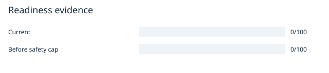
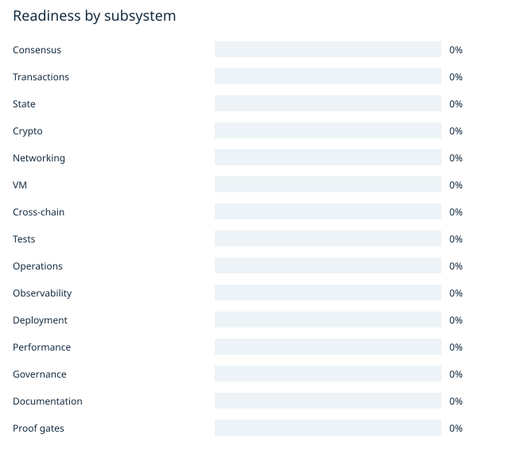
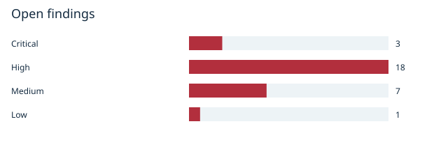
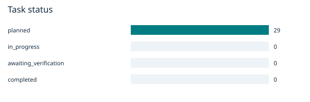
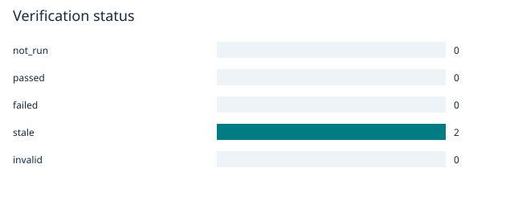

# X3: Live Readiness Report

2026-09-05T19:56:38.485898+00:00

0/100 evidence readiness. 0/29 tasks completed. Release decision: NO-GO.

Historical audit credit is absent or stale. Current credits require fresh evidence and reviews.

20 points for each implemented/wired/tested/executed/reproducible criterion; weighted subsystem mean; cap 20 while a Critical finding remains open.

A score of 100 never grants launch approval. Closing the tracked findings changes the automated decision to NOT ASSESSED; independent launch-gate approval is still required.

Source fingerprint: `a16502c9c3efa4d3ea174cdeb20879d4ba00288d36e5c30524aaace509b1db61`

Named local operator attestations, not authenticated independent security certification. Local writers can alter state and evidence; hashes detect accidental tampering, not a hostile store owner.

## Tasks and finding closure

| ID / severity | Task | Current status | Acceptance requirement |
|---|---|---|---|
| FIX-C01 / Critical | External header validation accepts unproved claims | planned | Arbitrary hashes, duplicate signers, self-selected validator sets, future heights and invalid membership proofs are rejected without writes; canonical external fixtures pass. |
| FIX-C02 / Critical | Unsigned finality anchors make certificate checks circular | planned | Forged and conflicting anchors cannot enter pool or dispatch; independently verified justification anchors the exact finalized block; late legitimate anchors remain recoverable. |
| FIX-C03 / Critical | Unsigned rollback receipts trust attacker-selected prior state | planned | Unrelated caller/diff and stale pre-state are rejected; injected rollback failure leaves no partial state; reverse-order replay restores exact pre-root. |
| FIX-H01 / High | Production proof-router alternatives accept arbitrary bytes | planned | All three isolated rejection tests pass; actual signed finalized fixtures pass through the runtime gateway, not only the helper. |
| FIX-H02 / High | EVM receipt verifier lacks trusted roots and misbinds inclusion | planned | Cross-check independent execution-client proof vectors, tampered receipt values and false heads; require both authentic root and exact inclusion. |
| FIX-H03 / High | Bitcoin verification uses asserted confirmations and incomplete vault approval | planned | Reject invented tips, wrong outputs, wrong recipient/value, repeated approvals and forged signatures; restart and reorg tests preserve accounting. |
| FIX-H04 / High | Public misbehavior report has no evidence and does not slash currency | planned | Invalid/replayed evidence cannot slash; total reserved balances and treasury/burn conservation reconcile after each valid offence; removed keys cannot author/vote. |
| FIX-H05 / High | Validator rotation ignores requested activation delay at session boundary | planned | A change delayed over several sessions is not activated early; restart and session transition preserve identical authority sets on all nodes. |
| FIX-H06 / High | Flash-finality opt-in disables GRANDPA without a proven replacement | planned | Wrong keys/sets cannot form certificates; missing keys fail startup; partition, equivocation and recovery tests establish one finalized history. |
| FIX-H07 / High | Default mini-EVM executes against disposable synthetic state | planned | A contract SSTORE persists across blocks/restart, a second user cannot impersonate the first, out-of-gas fully reverts and fees reconcile. |
| FIX-H08 / High | Ethereum submission RPC bypasses the transaction-pool lifecycle | planned | Submit a signed transfer over RPC, observe pool admission, block inclusion, finality and persisted balance change on another node; reject replay/wrong chain ID. |
| FIX-H09 / High | Relayer manual extrinsic encoding and signing do not match runtime | planned | Exact production runtime decodes, authenticates, includes and finalizes generated deposit/release transactions; no fallback signer or zero-chain context. |
| FIX-H10 / High | Relayer checkpoints can skip failed events and are not durable | planned | Fail submission for an early event, process later events, restart and recover the failed event exactly once; bound RPC scans and memory. |
| FIX-H11 / High | Gateway binary never starts its REST/GraphQL implementation | planned | Start the built binary against disposable services, serve actual API/GraphQL data, fail readiness when DB is down, and recover after restart. |
| FIX-H12 / High | SDK EVM and SVM encoding contains production placeholders | planned | Match independent reference vectors for EVM selectors/addresses and multi-account SVM messages, then finalize one transaction per advertised protocol. |
| FIX-H13 / High | CI make recipes swallow failures and reference missing targets | planned | Cargo failure produces nonzero make/CI exit; every workflow command resolves; mainnet-required aggregate cannot pass with skipped/missing jobs. |
| FIX-H14 / High | Release gate accepts stale build artifacts without source binding | planned | Mutating source or substituting a binary/spec invalidates evidence and blocks release; two builders reproduce the same WASM. |
| FIX-H15 / High | Dependency audit pass masks unresolved advisory matches | planned | No reachable unmitigated critical/high advisories; exceptions have owners, expiry, exact dependency paths and regression evidence. |
| FIX-H16 / High | Supply invariant finalization work is unbounded by asset count | planned | Worst-case asset count fits declared block budget; adversarial asset creation cannot make next-block mandatory work unbounded. |
| FIX-H17 / High | EVM external verifier is blocked in production and bypassable by mode | planned | Real proof accepted, zero/duplicate/forged signatures rejected; funded deployment cannot enable structural bypass; owner rotation preserves trust policy. |
| FIX-M01 / Medium | Readiness documentation contradicts executable evidence | planned | Any failed core proof lowers its status; stale commit evidence is rejected; readiness prose and matrix derive from the same data. |
| FIX-M02 / Medium | Finality and multi-node proof tests are ignored | planned | At least four validators agree on finalized hash/root through restart and one-node failure; ignored critical tests count as release failure. |
| FIX-M03 / Medium | Gateway health and event spines do not prove dependencies | planned | Stop database/event sink and see readiness fail; replay missed events exactly once after recovery. |
| FIX-M04 / Medium | Restore validates archive shape, not trusted checksum or chain state | planned | Tampered archive fails before extraction; restored node catches up and matches independently recorded finalized state. |
| FIX-M05 / Medium | Python DSL emitter tests fail under the current proof contract | planned | All emitter tests pass with independently validated proof fixtures and reject empty/tampered bundles; one local end-to-end emission is consumed by the real runtime. |
| FIX-M06 / Medium | Desktop defaults select an unregistered chain | planned | Default startup obtains the intended adapter, missing network fails clearly, and wrong genesis cannot be signed against. |
| FIX-M07 / Medium | Optimizer throughput is not network TPS evidence | planned | Publish reproducible sustained finalized TPS, rejection rate, p50/p95/p99 finality latency and hardware/profile/commit details; no synthetic metric substitution. |
| FIX-L01 / Low | Fresh-machine helper does not verify the required environment | planned | Clean image builds all intended targets and runs real smoke tests with explicit offline/cache prerequisites. |
| FIX-H18 / High | Workspace verification fails in WASM runtime build | planned | From the frozen source state, all required workspace checks and release/testnet feature builds exit zero and produce source-bound artifacts. |

## Verification runs

| Check | Command | Result | Evidence |
|---|---|---|---|
| rpc-unit | cargo test --locked --manifest-path audit-artifacts/mainnet-readiness/2026-09-05-6a24d8cf-audit/audit-harness/rpc/Cargo.toml | stale: Source or check definition changed | 7795cf968e0d4a129367ac81f926c246 / exit 0 |
| dsl-tests | /usr/bin/python3 -m pytest -q x3-lang/tests/test_parser.py x3-lang/tests/test_typechecker.py x3-lang/tests/test_emitter.py x3-lang/tests/test_simulator.py | stale: Source or check definition changed | 0b9afede8a2c4248b45280c62dc0cb42 / exit 1 |

## Feature evidence

| Feature | Score / status | Criterion provenance |
|---|---|---|
| FT01 Aura block production | 0% / UNVERIFIED | implemented: unverified; wired: unverified; tested: unverified; executed: unverified; reproducible: unverified |
| FT02 GRANDPA finality and fork choice | 0% / UNVERIFIED | implemented: unverified; wired: unverified; tested: unverified; executed: unverified; reproducible: unverified |
| FT03 Validator rotation | 0% / UNVERIFIED | implemented: unverified; wired: unverified; tested: unverified; executed: unverified; reproducible: unverified |
| FT04 Validator bonded stake and slashing | 0% / UNVERIFIED | implemented: unverified; wired: unverified; tested: unverified; executed: unverified; reproducible: unverified |
| FT05 Flash finality | 0% / UNVERIFIED | implemented: unverified; wired: unverified; tested: unverified; executed: unverified; reproducible: unverified |
| FT06 Genesis construction and live-seed validation | 0% / UNVERIFIED | implemented: unverified; wired: unverified; tested: unverified; executed: unverified; reproducible: unverified |
| FT07 Signed native transaction path | 0% / UNVERIFIED | implemented: unverified; wired: unverified; tested: unverified; executed: unverified; reproducible: unverified |
| FT08 Nonce, genesis, era replay checks | 0% / UNVERIFIED | implemented: unverified; wired: unverified; tested: unverified; executed: unverified; reproducible: unverified |
| FT09 Transaction pool limits and ordering | 0% / UNVERIFIED | implemented: unverified; wired: unverified; tested: unverified; executed: unverified; reproducible: unverified |
| FT10 Fee charging and refunds | 0% / UNVERIFIED | implemented: unverified; wired: unverified; tested: unverified; executed: unverified; reproducible: unverified |
| FT11 Ethereum raw transaction RPC | 0% / UNVERIFIED | implemented: unverified; wired: unverified; tested: unverified; executed: unverified; reproducible: unverified |
| FT12 Canonical FRAME storage | 0% / UNVERIFIED | implemented: unverified; wired: unverified; tested: unverified; executed: unverified; reproducible: unverified |
| FT13 Storage upgrade migrations | 0% / UNVERIFIED | implemented: unverified; wired: unverified; tested: unverified; executed: unverified; reproducible: unverified |
| FT14 Supply conservation ledger | 0% / UNVERIFIED | implemented: unverified; wired: unverified; tested: unverified; executed: unverified; reproducible: unverified |
| FT15 Snapshot backup and restoration | 0% / UNVERIFIED | implemented: unverified; wired: unverified; tested: unverified; executed: unverified; reproducible: unverified |
| FT16 Atomic rollback state provenance | 0% / UNVERIFIED | implemented: unverified; wired: unverified; tested: unverified; executed: unverified; reproducible: unverified |
| FT17 Signature primitives and key custody | 0% / UNVERIFIED | implemented: unverified; wired: unverified; tested: unverified; executed: unverified; reproducible: unverified |
| FT18 Dependency advisory handling | 0% / UNVERIFIED | implemented: unverified; wired: unverified; tested: unverified; executed: unverified; reproducible: unverified |
| FT19 P2P networking and sync | 0% / UNVERIFIED | implemented: unverified; wired: unverified; tested: unverified; executed: unverified; reproducible: unverified |
| FT20 Bootstrap helper configuration | 0% / UNVERIFIED | implemented: unverified; wired: unverified; tested: unverified; executed: unverified; reproducible: unverified |
| FT21 PoH import verification | 0% / UNVERIFIED | implemented: unverified; wired: unverified; tested: unverified; executed: unverified; reproducible: unverified |
| FT22 RPC limiter algorithm (narrow scope) | 0% / UNVERIFIED | implemented: unverified; wired: unverified; tested: unverified; executed: unverified; reproducible: unverified |
| FT23 WASM mini-EVM persistent execution | 0% / UNVERIFIED | implemented: unverified; wired: unverified; tested: unverified; executed: unverified; reproducible: unverified |
| FT24 SVM execution and account context | 0% / UNVERIFIED | implemented: unverified; wired: unverified; tested: unverified; executed: unverified; reproducible: unverified |
| FT25 X3 VM runtime | 0% / UNVERIFIED | implemented: unverified; wired: unverified; tested: unverified; executed: unverified; reproducible: unverified |
| FT26 X3 Python parser and typechecker | 0% / UNVERIFIED | implemented: unverified; wired: unverified; tested: unverified; executed: unverified; reproducible: unverified |
| FT27 X3 emitter and execution pipeline | 0% / UNVERIFIED | implemented: unverified; wired: unverified; tested: unverified; executed: unverified; reproducible: unverified |
| FT28 Rust compiler tracks | 0% / UNVERIFIED | implemented: unverified; wired: unverified; tested: unverified; executed: unverified; reproducible: unverified |
| FT29 Internal cross-VM representation router | 0% / UNVERIFIED | implemented: unverified; wired: unverified; tested: unverified; executed: unverified; reproducible: unverified |
| FT30 Atomic bundle orchestration / Atomic Lock | 0% / UNVERIFIED | implemented: unverified; wired: unverified; tested: unverified; executed: unverified; reproducible: unverified |
| FT31 Settlement timeout and refund engine | 0% / UNVERIFIED | implemented: unverified; wired: unverified; tested: unverified; executed: unverified; reproducible: unverified |
| FT32 External header finality oracle | 0% / UNVERIFIED | implemented: unverified; wired: unverified; tested: unverified; executed: unverified; reproducible: unverified |
| FT33 Production EVM receipt proof route | 0% / UNVERIFIED | implemented: unverified; wired: unverified; tested: unverified; executed: unverified; reproducible: unverified |
| FT34 Solana finalized proof route | 0% / UNVERIFIED | implemented: unverified; wired: unverified; tested: unverified; executed: unverified; reproducible: unverified |
| FT35 Validator quorum proof route | 0% / UNVERIFIED | implemented: unverified; wired: unverified; tested: unverified; executed: unverified; reproducible: unverified |
| FT36 Bitcoin SPV route | 0% / UNVERIFIED | implemented: unverified; wired: unverified; tested: unverified; executed: unverified; reproducible: unverified |
| FT37 Bitcoin vault approvals | 0% / UNVERIFIED | implemented: unverified; wired: unverified; tested: unverified; executed: unverified; reproducible: unverified |
| FT38 Relayer binary delivery | 0% / UNVERIFIED | implemented: unverified; wired: unverified; tested: unverified; executed: unverified; reproducible: unverified |
| FT39 Relayer typed submission library | 0% / UNVERIFIED | implemented: unverified; wired: unverified; tested: unverified; executed: unverified; reproducible: unverified |
| FT40 EVM HTLC contract | 0% / UNVERIFIED | implemented: unverified; wired: unverified; tested: unverified; executed: unverified; reproducible: unverified |
| FT41 SVM HTLC contract | 0% / UNVERIFIED | implemented: unverified; wired: unverified; tested: unverified; executed: unverified; reproducible: unverified |
| FT42 External EVM proof verifier contract | 0% / UNVERIFIED | implemented: unverified; wired: unverified; tested: unverified; executed: unverified; reproducible: unverified |
| FT43 Solver marketplace and intent routing | 0% / UNVERIFIED | implemented: unverified; wired: unverified; tested: unverified; executed: unverified; reproducible: unverified |
| FT44 Validator attestation / proof ledger | 0% / UNVERIFIED | implemented: unverified; wired: unverified; tested: unverified; executed: unverified; reproducible: unverified |
| FT45 REST/GraphQL gateway | 0% / UNVERIFIED | implemented: unverified; wired: unverified; tested: unverified; executed: unverified; reproducible: unverified |
| FT46 SQL indexer and migrations | 0% / UNVERIFIED | implemented: unverified; wired: unverified; tested: unverified; executed: unverified; reproducible: unverified |
| FT47 Metrics / chain health monitoring | 0% / UNVERIFIED | implemented: unverified; wired: unverified; tested: unverified; executed: unverified; reproducible: unverified |
| FT48 Security and accounting event consumers | 0% / UNVERIFIED | implemented: unverified; wired: unverified; tested: unverified; executed: unverified; reproducible: unverified |
| FT49 DEX, Forge and LP locker | 0% / UNVERIFIED | implemented: unverified; wired: unverified; tested: unverified; executed: unverified; reproducible: unverified |
| FT50 Sentinel and economic halt | 0% / UNVERIFIED | implemented: unverified; wired: unverified; tested: unverified; executed: unverified; reproducible: unverified |
| FT51 Council / treasury / upgrades | 0% / UNVERIFIED | implemented: unverified; wired: unverified; tested: unverified; executed: unverified; reproducible: unverified |
| FT52 Wallet / biometric / recovery pallet | 0% / UNVERIFIED | implemented: unverified; wired: unverified; tested: unverified; executed: unverified; reproducible: unverified |
| FT53 TypeScript SDK encoding | 0% / UNVERIFIED | implemented: unverified; wired: unverified; tested: unverified; executed: unverified; reproducible: unverified |
| FT54 Desktop / Tauri OS network integration | 0% / UNVERIFIED | implemented: unverified; wired: unverified; tested: unverified; executed: unverified; reproducible: unverified |
| FT55 GPU / swarm orchestration | 0% / UNVERIFIED | implemented: unverified; wired: unverified; tested: unverified; executed: unverified; reproducible: unverified |
| FT56 CI test quality and coverage | 0% / UNVERIFIED | implemented: unverified; wired: unverified; tested: unverified; executed: unverified; reproducible: unverified |
| FT57 Workspace build / release reproducibility | 0% / UNVERIFIED | implemented: unverified; wired: unverified; tested: unverified; executed: unverified; reproducible: unverified |
| FT58 Fresh-machine bootstrap | 0% / UNVERIFIED | implemented: unverified; wired: unverified; tested: unverified; executed: unverified; reproducible: unverified |
| FT59 Deployment isolation and validator services | 0% / UNVERIFIED | implemented: unverified; wired: unverified; tested: unverified; executed: unverified; reproducible: unverified |
| FT60 Sustained finalized TPS evidence | 0% / UNVERIFIED | implemented: unverified; wired: unverified; tested: unverified; executed: unverified; reproducible: unverified |
| FT61 Mainnet / ProofGate enforcement | 0% / UNVERIFIED | implemented: unverified; wired: unverified; tested: unverified; executed: unverified; reproducible: unverified |
| FT62 Documentation accuracy / scoreboard | 0% / UNVERIFIED | implemented: unverified; wired: unverified; tested: unverified; executed: unverified; reproducible: unverified |
| FT63 Public testnet recovery drill evidence | 0% / UNVERIFIED | implemented: unverified; wired: unverified; tested: unverified; executed: unverified; reproducible: unverified |
| FT64 Independent launch approval evidence | 0% / UNVERIFIED | implemented: unverified; wired: unverified; tested: unverified; executed: unverified; reproducible: unverified |

## Closure and criterion reviews

| Target / criterion | Reviewer / date | Rationale |
|---|---|---|
