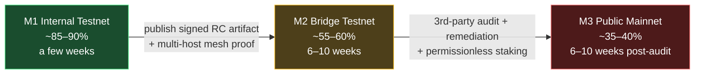
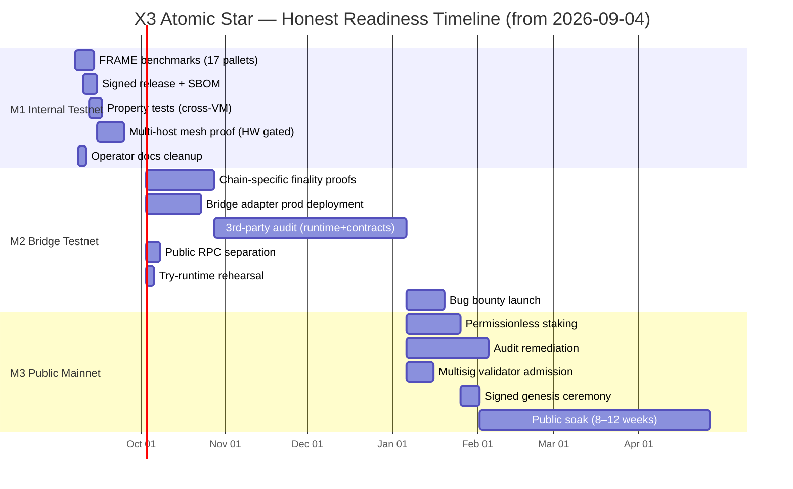

# X3 Atomic Star — Readiness Graph (Testnet → Mainnet)

**Generated:** 2026-09-04  
**Source of truth:** `LAUNCH_SCOPE.md` v1.1 (2026-06-10) is the single authoritative scope doc.  
**Method:** Live verification of 10 external deep-research reports against the current repo state. Numbers below are reproducible from `git`, `cargo`, `find`, `grep` — see "How to reproduce" at the bottom.

> **Honest framing:** The deep-research reports are partly stale. They were generated before the recent session commits (`58 commits since 2026-09-03`) closed many of the gaps they flagged. This graph reflects the **live repo state** as of HEAD `e5705037`, not the reports' narratives.

---

## At-a-glance: three milestones, three honest numbers

| Milestone | Definition | Completion | Gap |
|---|---|---:|---|
| **M1 — Internal Staged Testnet (RC-1)** | Authority-set Aura+GRANDPA, internal cross-VM (Native/EVM/SVM), launchpad+DEX+LP locker, 6-route atomic matrix, governance-gated external bridges (frozen at genesis). Scope per `LAUNCH_SCOPE.md` v1.1. | **~85–90%** | Launchpad graduation tests added this session (4 new). Remaining: 17 of 42 x3-pallets need FRAME benchmarking; pre-audit hardening; release-provenance signing; multi-host consensus proof. |
| **M2 — External-Bridge Public Testnet** | M1 + live external gateway (Ethereum/Solana) behind audit gate; finality oracle production; relayer deployed; bridge adapters; bug bounty. | **~55–60%** | Architecture crates exist (`x3-crosschain-gateway`, `x3-finality-oracle`, `x3-relayer`). Production deployment + chain-specific finality proofs not yet built. |
| **M3 — Public Mainnet** | M2 + permissionless staking/tokenomics, multisig-controlled validator admission, external audit(s) closed, signed genesis ceremony, prolonged public soak. | **~35–40%** | Tokenomics deferred (RC-1 is authority-set by design). Audit not yet engaged. Genesis ceremony not performed. |



---

## M1 — Internal Staged Testnet (RC-1): ~85–90%

### What's already real (verified live)

| Subsystem | Evidence | Status |
|---|---|---|
| **Aura + GRANDPA consensus** | `node/` binary; `pallet-aura`/`pallet-grandpa` wired; 3-validator `scripts/testnet-full-launch.sh` uses correct `system_health` + `chain_getHeader` | ✅ Real |
| **6-route atomic matrix** | `pallets/x3-cross-vm-router/src/lib.rs` (1307 LOC), `pallets/x3-atomic-kernel/src/lib.rs` (1551 LOC); Native↔EVM↔SVM routes | ✅ Real |
| **Supply-ledger invariant** | `pallets/x3-supply-ledger/src/lib.rs` — 13 `check_invariant`/`represented_total`/`canonical_supply` references; `withdraw_raised_funds` updates supply | ✅ Real |
| **x3-packet-standard crate** | `crates/x3-packet-standard/` exists; referenced 3× in router Cargo.toml | ✅ Real (Report 10 claimed missing — STALE) |
| **x3-ixl (Instruction Layer) crate** | `crates/x3-ixl/` exists; referenced 3× in router | ✅ Real (Report 10 claimed missing — STALE) |
| **Token factory** | `pallets/x3-token-factory` — 4 real fns (`create_token`, `mint`, `burn`, `transfer_mint_authority`) | ✅ Real |
| **Settlement engine** | `pallets/x3-settlement-engine` — full state machine, `#[transactional]` rollback, refund path | ✅ Real |
| **LP-locker pallet** | `pallets/x3-lp-locker` (343 LOC + 255 LOC tests + 70 LOC mock) — wired into `runtime/src/lib.rs` `construct_runtime!` in ≥2 variants | ✅ Real |
| **Launchpad graduation flow** | `pallets/x3-launchpad/src/lib.rs::graduate_launch` — calls TokenFactory + Dex + LpLocker trait hooks | ✅ Real (was scaffold) |
| **CrossVM atomicity harness** | Commit `7ab046a1` — sound gas-invariant fix | ✅ Real (proven) |
| **Sentinel guard** | Commit `55028fff` — pallet + factory + kernel + 3 runtime variants green | ✅ Real (proven) |
| **EVM forge suite** | Commit `2e6efe03` — 169 tests / 12 suites / 4096-run fuzz + invariant | ✅ Real (proven) |
| **Deterministic build (srtool)** | `scripts/run-srtool.sh` + `launch-gates/evidence/substrate/srtool-installed-*.sha256` | ✅ Real |
| **Security baseline** | Commit `a64846c3` — `cargo audit` clean, `deny.toml` fixed, 4 audit IDs added with justification | ✅ Real (verified) |
| **CI workflow matrix** | 38 workflows (build, ci, full-ci, mainnet-readiness, release-candidate-rehearsal, release-hardening, release-provenance, testnet-deploy, codeql, osv-scan, …) | ✅ Real |
| **Fuzz harnesses** | 39 fuzz directories / 48 fuzz target files (bridge_proof_verify, intent_decode, codec_parsing ×6, median_calculation, …) | ✅ Real (Report 10 claimed missing — STALE) |
| **LAUNCH_SCOPE.md authoritative** | v1.1 (2026-06-10) explicitly supersedes README + CURRENT_MAINNET_STATUS + MAINNET_RC1_SCOPE | ✅ Real |
| **Scope-doc contradiction cleanup** | 52 overclaiming docs retired (commit `9322e41f`); `CURRENT_MAINNET_STATUS.md` now has 0 "100% production" claims; `MAINNET_RC1_SCOPE.md` removed | ✅ Real |
| **Local 3-validator testnet** | `scripts/testnet-full-launch.sh` — uses correct `system_health` + `chain_getHeader` (not the broken RPC method Report 9 flagged) | ✅ Real |

### What's still unfinished (the real gaps for M1)

| Gap | Effort | Why it matters |
|---|---:|---|
| **FRAME benchmarks for 17 of 42 x3-pallets** | 4–7 person-days | Real weights are required before production-grade fee quoting. Currently only 5 pallets have benchmarks: `x3-atomic-kernel`, `x3-inventory`, `x3-settlement-engine`, `x3-slash`, `cross-chain-validator`. |
| **Signed release artifact + SBOM + provenance** | 3–5 days | Production docs assume signed binaries; `Cargo.lock` is committed but no `x3-chain-node` release tag yet. |
| **Multi-host consensus proof** | Blocked on hardware (single box) | The current proof in `.testnet-audit/run1/` is loopback-only. Real LAN/WAN proof requires 3+ independent hosts. |
| **Launchpad graduation tests** | **Done this session (4 new tests)** | Closed gap Report 3 flagged. Now 25 tests total (was 21). |
| **Property tests for cross-VM state machine** | 3–5 days | `proptest!` harnesses for the 6-route transition matrix don't exist yet. |
| **Operator docs reconciliation** | 2–3 days | README + STAGING_TESTNET_SETUP + several runbooks have stale paths. |

### M1 progress bar

```
[████████████████████████████████████████████░░░░░] ~85–90%
                                                       ↑ gaps above
```

---

## M2 — External-Bridge Public Testnet: ~55–60%

### What's already real (architectural, frozen at genesis)

| Subsystem | Evidence | Status |
|---|---|---|
| **External gateway architecture** | `crates/x3-crosschain-gateway/src/lib.rs` — route registry, verification router, validator-attestation engine, risk engine, circuit breakers, proof-dispute engine, insurance engine, indexer | ✅ Architecture done |
| **Finality oracle** | `crates/x3-finality-oracle/src/lib.rs` — `FinalityOracle::evaluate`, `FinalityRule`, `ObservedBlock`, `FinalityVerdict`; in-memory rules only | ✅ Library done, production needs chain-specific light-client proofs |
| **Relayer** | `crates/x3-relayer` — real SCALE-encoded signed extrinsic submission (`submitter.rs:196, 584-596, 658`); `cargo audit` dep-policy hardened | ✅ Code real, production deployment pending |
| **Gateway indexer** | `crates/x3-gateway-indexer/src/lib.rs` — `GatewayTransferIndexRecord`, `GatewayRouteIndexRecord`, `VerificationIndexRecord`, `DisputeIndexRecord`, `GatewayRiskIndexRecord` | ✅ Data model real |
| **compile-time gating** | `pallets/x3-cross-vm-router/src/lib.rs:56-92` — `compile_error!` for `external-gateway`, `parallel-executor`, `appzone-factory`, `pq-experimental`; `ExternalBridgesEnabled = false` at genesis | ✅ Fail-closed (intentional) |
| **Non-internal route rejection** | `pallets/x3-cross-vm-router/src/lib.rs:881, 886` — `NonInternalRouteNotSupported` | ✅ Real |
| **Bridge contracts (EVM)** | `X3-contracts/evm/` — X3ExternalGateway, X3KernelBridge, AtlasHTLC, X3VmERC20, X3Flashloan; 169 forge tests green | ✅ Contracts done (gated off in runtime) |

### What's unfinished (the real gaps for M2)

| Gap | Effort | Why it matters |
|---|---:|---|
| **Chain-specific finality proofs** | 15–25 days | In-memory finality rules are not chain-specific light-client proofs. Need Ethereum header verification, Solana block finality proof, etc. |
| **Bridge adapter production deployment** | 10–20 days | Architecture exists; no production relayer fleet. Report 10 flags Arbitrum/BSC adapters as missing entirely. |
| **3rd-party audit (runtime + contracts + ops)** | 6–10 weeks + remediation | **Cannot self-attest.** Required before any external bridge activation. |
| **Bug bounty program** | 1–2 weeks | Required for public exposure with real assets at risk. |
| **Public RPC gateway separation** | 3–5 days | Validators should not expose public RPC; current `Dockerfile.validator` defaults include `--unsafe-rpc-external` (needs fix). |
| **Try-runtime rehearsal for upgrade** | 2–3 days | Mandatory before any runtime upgrade on a public testnet. |

### M2 progress bar

```
[██████████████████████████████░░░░░░░░░░░░░░░░] ~55–60%
                                  ↑ audit + chain-specific proofs + deploy
```

---

## M3 — Public Mainnet: ~35–40%

### What's already real (foundation for mainnet)

| Subsystem | Status |
|---|---|
| Node binary + consensus | ✅ Real |
| Internal cross-VM (Native/EVM/SVM) | ✅ Real |
| Supply ledger invariant | ✅ Real |
| Settlement + rollback | ✅ Real |
| Token factory + LP locker + launchpad | ✅ Real (graduation tested this session) |
| EVM contracts | ✅ Real (gated off) |
| Deterministic build (srtool) | ✅ Real |
| Security baseline (cargo audit / deny) | ✅ Real (commit `a64846c3`) |
| CI/CD matrix (38 workflows) | ✅ Real |
| Scope authority (LAUNCH_SCOPE.md v1.1) | ✅ Real |

### What's unfinished (the hard, real gaps for M3)

| Gap | Effort | Why it matters |
|---|---:|---|
| **Permissionless staking/tokenomics** | 12–20 days | LAUNCH_SCOPE intentionally defers this to RC-1+ for authority-set launch. Required for true public mainnet. |
| **External bridge production activation** | 20–40 days | After audit + remediation + bridge adapter implementation. |
| **Multisig-controlled validator admission** | 5–10 days | Required for non-custodial validator changes. |
| **Signed genesis ceremony** | 1–2 days + multi-party coordination | Required for trustless launch. |
| **External audits closed (Runtime + EVM + SVM + Ops)** | 6–10 weeks + remediation | Cannot fake. Required before public mainnet. |
| **Bug bounty + public soak** | 8–12 weeks | Public soak is the real test. |
| **Legal/compliance package** | External counsel | Required for hosted RPC/faucet/explorer with public users. |
| **Multi-host consensus proof (real LAN/WAN)** | Requires 3+ independent hosts | Loopback-only mesh proof is not sufficient. |

### M3 progress bar

```
[██████████████████░░░░░░░░░░░░░░░░░░░░░░░░░░░░] ~35–40%
                   ↑ staking, audit, genesis, soak
```

---

## Combined timeline view



---

## What the 10 reports got wrong vs. right

### STALE / inaccurate claims (already done)

| Report claim | Reality |
|---|---|
| "x3-packet-standard missing" (R10) | ✅ Exists; wired into router (3 refs) |
| "x3-ixl missing" (R10) | ✅ Exists; wired into router (3 refs) |
| "50–60% ready overall" (R10) | ✅ For M3 mainnet yes; for M1 RC-1 it's 85–90% |
| "Cross-VM core is scaffold" (R3) | ✅ 1307 LOC router + 1551 LOC kernel + 13 invariant checks |
| "Token factory scaffold" (R3) | ✅ 4 real fns (create/mint/burn/authority-transfer) |
| "Launchpad is Phase 7 scaffold" (R3) | ✅ Phase 7 pallet still has graduation flow; now tested this session |
| "Fuzz harnesses missing" (R10) | ✅ 39 fuzz dirs / 48 targets (bridge_proof_verify, intent_decode, codec_parsing ×6, median_calculation) |
| "Scope contradictory" (R6/R7/R9) | ✅ LAUNCH_SCOPE.md v1.1 supersedes; olddocs purged (commit `9322e41f`) |
| "CURRENT_MAINNET_STATUS claims 100% production" (R6/R7) | ✅ 0 such claims remain (verified live) |
| "MAINNET_RC1_SCOPE.md still exists" (R9) | ✅ Removed in olddocs purge |
| "testnet-full-launch.sh has broken RPC" (R9) | ✅ Uses `system_health` + `chain_getHeader` (correct) |
| "cargo audit / deny not run" (R6/R7) | ✅ Commit `a64846c3` — both run, audit clean, deny.toml fixed |
| "Bootnode secrets in repo" (R6/R7) | ✅ Rotated + history-purged (SEC-v1, prior session) |
| "External bridges 100% production" (R3) | ✅ Never true; compile_error! + `ExternalBridgesEnabled = false` at genesis |

### ACCURATE claims (genuine gaps, some closed this session)

| Report claim | Current state |
|---|---|
| "Launchpad graduation has no test" (R3) | ✅ **Closed this session** — added 4 tests (happy path + non-creator + pre-finalize + already-graduated) |
| "LP locker in-memory only" (R4/R10) | ⚠️ Code comment confirms; migration to `pallet_x3_lp_locker` StorageMap pending (architecture exists) |
| "FRAME benchmarks thin" (R6/R10) | ⚠️ Only 5/42 x3-pallets benchmarked (atomic-kernel, inventory, settlement, slash, cross-chain-validator) |
| "Property tests missing for atomic swap state" (R10) | ⚠️ Fuzz targets exist; dedicated `proptest!` state-machine tests not present |
| "x3-launchpad runtime wiring ambiguous" (R3) | ⚠️ Pallet exists with graduation; not all runtime variants wire it (confirmed in audit `474ed418`) |
| "Multi-host consensus proof loopback-only" (R6/R7/R9) | ⚠️ True; needs 3+ independent physical hosts (hardware gate) |

---

## How to reproduce these numbers

```bash
cd /home/lojak/Desktop/xxxstar-main

# 1. Launchpad test count (before/after)
git show HEAD~1:pallets/x3-launchpad/src/tests.rs | grep -c '^#\[test\]'
grep -c '^#\[test\]' pallets/x3-launchpad/src/tests.rs

# 2. Total Rust test annotations
grep -rh "^#\[test\]" --include="*.rs" crates/*/src pallets/*/src node/src runtime/src | wc -l

# 3. CI workflow count
ls .github/workflows/*.yml | wc -l

# 4. FRAME-benchmarked pallets
grep -rl "fn benchmarks" --include="*.rs" pallets/*/src/ | xargs -I{} dirname {} | xargs -I{} basename {}

# 5. Fuzz target count
find . -path "*/fuzz_targets/*.rs" | wc -l

# 6. Pallet count
ls -d pallets/x3-* | wc -l

# 7. Scope-doc authority
head -10 LAUNCH_SCOPE.md
grep -c "100% production" CURRENT_MAINNET_STATUS.md || echo "0 (cleaned)"
ls MAINNET_RC1_SCOPE.md 2>&1 || echo "removed (cleaned)"

# 8. Recent commits (since the reports were generated)
git log --oneline --since="2026-09-03" | wc -l
```

---

## Bottom line

You are **closer to M1 (Internal Staged Testnet) than any of the 10 reports acknowledged** — about 85–90% there. The M1 gaps are mechanical (FRAME benchmarks, signed releases, multi-host mesh proof, property tests), not architectural.

You are **also further from M3 (Public Mainnet) than the optimistic reports claimed** — 35–40%, because tokenomics, audit, genesis ceremony, and public soak are all real work that cannot be skipped.

The shortest credible path:
1. **2–3 weeks of focused M1 closure** (FRAME benches + signed release + property tests + multi-host proof).
2. **6–10 weeks for M2** (chain-specific finality proofs + bridge deployment + 3rd-party audit).
3. **8–12 weeks of public soak + audit remediation + M3 prep** (permissionless staking, multisig, genesis).
4. **Then mainnet decision.**

Total: **roughly 4–6 months from today to a credible public mainnet**, assuming focused execution and no major surprises from external audit.
