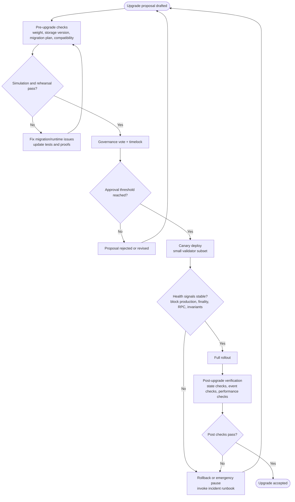
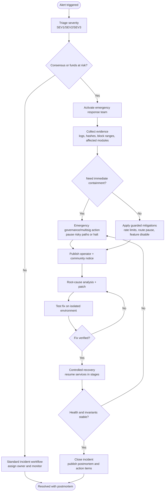
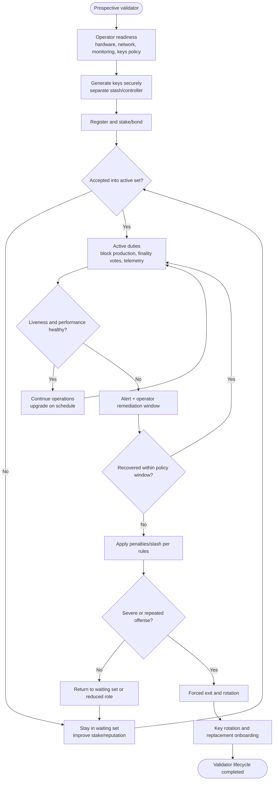

# X3 Critical Ops Flowcharts

This pack contains the top 3 high-value operational flows:
- Runtime Upgrade Safety
- Incident Response and Chain Halt
- Validator Lifecycle

Generated image assets:
- [runtime_upgrade_safety.svg](docs/diagrams/runtime_upgrade_safety.svg)
- [runtime_upgrade_safety.png](docs/diagrams/runtime_upgrade_safety.png)
- [incident_response_chain_halt.svg](docs/diagrams/incident_response_chain_halt.svg)
- [incident_response_chain_halt.png](docs/diagrams/incident_response_chain_halt.png)
- [validator_lifecycle.svg](docs/diagrams/validator_lifecycle.svg)
- [validator_lifecycle.png](docs/diagrams/validator_lifecycle.png)

---

## 1) Runtime Upgrade Safety Flow

---

## 2) Incident Response and Chain Halt Flow

---

## 3) Validator Lifecycle Flow

