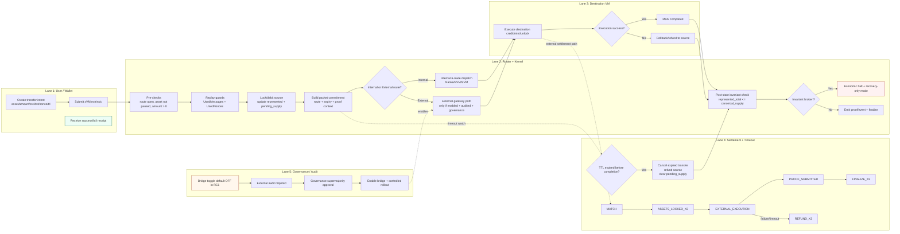
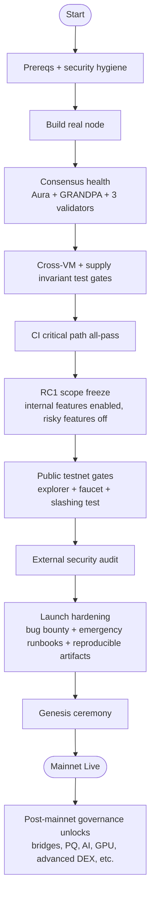

# X3 Mainnet + Atomic Cross-VM Flowcharts

This file includes diagrams in two forms:
- Mermaid diagrams for rich rendering
- Plain-text fallback for environments where Mermaid does not render

Exported image assets are available in [docs/diagrams](docs/diagrams):
- [atomic_crossvm_swimlane.svg](docs/diagrams/atomic_crossvm_swimlane.svg)
- [atomic_crossvm_swimlane.png](docs/diagrams/atomic_crossvm_swimlane.png)
- [full_features_launch_compact.svg](docs/diagrams/full_features_launch_compact.svg)
- [full_features_launch_compact.png](docs/diagrams/full_features_launch_compact.png)

---

## 1) Boardroom Swimlane Version (Atomic Cross-VM)

---

## 2) Full Features Launch Flow (Compact)

---

## 3) Plain-Text Fallback (Always Visible)

### Atomic Cross-VM (swimlane equivalent)

1. User/Wallet
- Create transfer intent (asset, amount, source VM, destination VM, nonce, TTL)
- Submit transfer extrinsic

2. Router/Kernel
- Validate route/asset/amount/origin
- Enforce replay protection (message + nonce uniqueness)
- Lock or debit source-side value
- Increase pending supply accounting
- Build message packet with expiry and proof context
- Branch to internal route (Native/EVM/SVM) or external route (if enabled)

3. Destination VM
- Execute destination-side credit/mint/unlock
- If success: mark completed
- If failure: trigger rollback/refund path

4. Settlement/Timeout
- Settlement states: MATCH -> ASSETS_LOCKED_X3 -> EXTERNAL_EXECUTION -> PROOF_SUBMITTED -> FINALIZE_X3
- Failure/timeout goes to REFUND_X3
- If TTL expires before completion: cancel expired transfer and refund source

5. Global Safety
- Re-check supply invariants after completion/refund
- If invariant fails: economic halt, block risky ops, allow recovery-only flows
- If invariant passes: finalize and emit receipts/events

6. Governance/Audit for external features
- RC1 default: external bridges disabled
- To enable later: external audit + governance approval + controlled rollout
